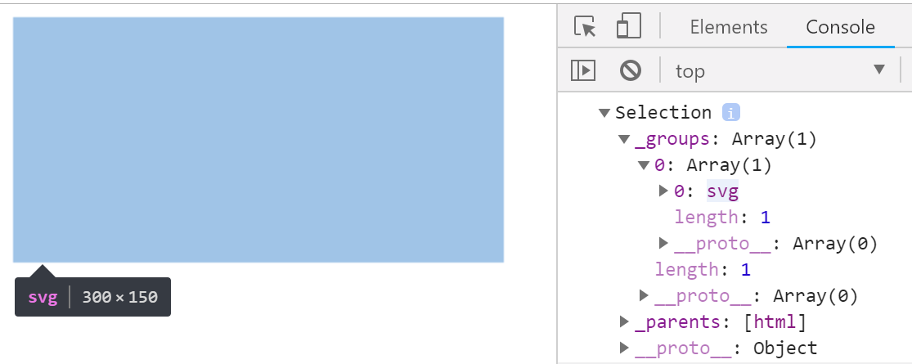

# Adding an SVG element

<CodeSandboxEmbed
  src="//codesandbox.io/s/wsib3?fontsize=14&hidenavigation=1&theme=dark&autoresize=1&module=/chart.js"
  style={{width: '100%', height: '35em'}}
/>


Our `wrapper` object also has methods for manipulating the linked DOM element — let's use its `append` method to add a new SVG element.

```javascript
const wrapper = d3.select("#wrapper")
const svg = wrapper.append("svg")
```

If we log `svg` to the console, we'll see that it looks like our `wrapper` object. However, if we expand the `_groups` key, we'll see that the linked element is our new `<svg>` element.

One trick to make sure we're grabbing the correct element is to hover the logged DOM element. If we expand the `_groups` object and hover over the `<svg>` element, the browser will highlight the corresponding DOM element on the webpage.



A>If you're working within CodeSandbox, you'll need to do this in your browser's native dev tools.

On hover, the browser will also show the element's size: 300px by 150px. This is the default size for SVG elements in Google Chrome, but it will vary between browsers and even browser versions. SVG elements don't scale the way most DOM elements do — there are many rules that will be unfamiliar to an experienced web developer.

To maintain control, let's tell our `<svg>` element what size we want it to be.

d3 selection objects have an `.attr()` method that will add or replace an attribute on the selected DOM element. The first argument is the attribute name and the second argument is the value.

T> The value argument to `.attr()` can either be a constant, which is all we need right now, or a function, which we'll cover later.

```javascript
const wrapper = d3.select("#wrapper")
const svg = wrapper.append("svg")
svg.attr("width", dimensions.width)
svg.attr("height", dimensions.height)
```

**Most `d3-selection` methods will return a selection object.**

- any method that selects or creates a new object will return the new selection
- any method that manipulates the current selection will return the same selection

This allows us to keep our code concise by chaining when we're using multiple methods. For example, we can rewrite the above code as:

```javascript
const wrapper = d3.select("#wrapper")
const svg = wrapper.append("svg")
    .attr("width", dimensions.width)
    .attr("height", dimensions.height)
```

In this book, we'll follow the common d3 convention of using 4 space indents for methods that return the same selection. This will make it easy to spot when our selection changes.

Since we're not going to re-use the `svg` variable, we can rewrite the above code as:

{lang=javascript,crop-query=.wrapper}
<<[code/01-making-your-first-chart/completed/chart.js](./protected/code/01-making-your-first-chart/completed/chart.js)

When we refresh our `index.html` page, we should now see that our `<svg>` element is the correct size. Great!

### Final code for this lesson

<CodeSandboxEmbed
  src="//codesandbox.io/s/buerf?fontsize=14&hidenavigation=1&theme=dark&autoresize=1&module=/chart.js"
  style={{width: '100%', height: '35em'}}
/>