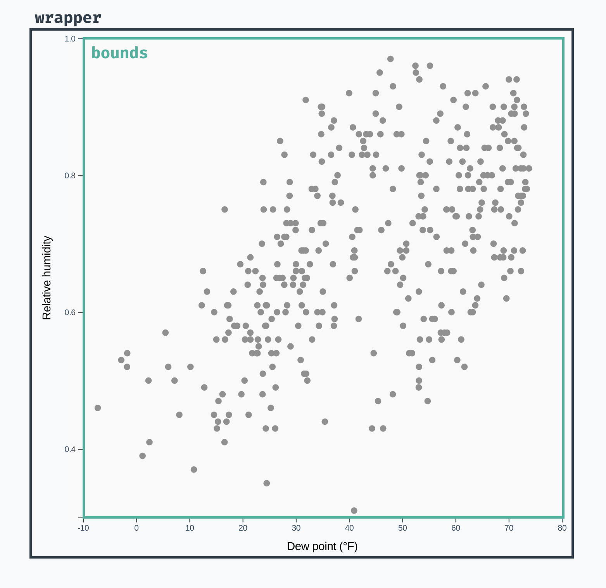

# Create chart dimensions

<CodeSandboxEmbed
  src="//codesandbox.io/s/4x2si?fontsize=14&hidenavigation=1&theme=dark&autoresize=1&module=/chart.js"
  style={{width: '100%', height: '35em'}}
/>

Next up, we need to define the dimensions of our chart. Typically, scatterplots are square, with the x axis as wide as the y axis is tall. This makes it easier to look at the overall shape of the data points once they're plotted by not stretching or squashing one of the scales.

To make a square chart, we want the height to be the same as the width. We could use the same width we used in **Module 1** (`window.innerWidth * 0.9`), but then the chart might extend down the page, out of view on horizontal screens.

Ideally, **the chart will be as large as possible while still fitting on our screen**.

To fix this problem, we want to use either the height or the width of the `window`, **whichever one is smaller**. And because we want to leave a _little_ bit of whitespace around the chart, we'll multiply the value by `0.9` (so 90% of the total width or height).

**d3-array** can help us out here with the `d3.min` method. `d3.min` takes two arguments:

1. an array of data points
2. an accessor function to grab the value from each data point

Though in this case we won't need to specify the second parameter because it defaults to an identity function and returns the value.

{lang=javascript,crop-query=.width}
<<[code/02-making-a-scatterplot/completed/chart.js](./protected/code/02-making-a-scatterplot/completed/chart.js)

{pagebreak}

A>There is a native browser method (`Math.min`) that will also find the lowest number — why wouldn't we use that? `Math.min` is great, but there are a few benefits to `d3.min`:
A>
A>- `Math.min` will count any `null`s in the array as `0`, whereas `d3.min` will ignore them
A>- `Math.min` will return `NaN` if there is a value in the array that is `undefined` or can't be converted into a number, whereas `d3.min` will ignore it
A>- `d3.min` will prevent the need to create another array of values if we need to use an accessor function
A>- `Math.min` will return `Infinity` if the dataset is empty, whereas `d3.min` will return `undefined`
A>- `Math.min` uses numeric order, whereas `d3.min` uses natural order, which allows it to handle strings. Make sure to convert your values to numbers beforehand
A>
A>You can see how `d3.min` would be preferable when creating charts, especially when using dynamic data.

Now let's use our `width` variable to define the chart dimensions:

```javascript
let dimensions = {
  width: width,
  height: width,
}
```

We were introduced to the concept of **wrapper** and **bounds** in **Chapter 1**. As a reminder:

- the **wrapper** is your entire SVG element, containing your axes, data elements, and legends
- the **bounds** live inside of the **wrapper**, containing just the data elements

Having margins around the **bounds** allows us to allocate space for our static chart elements (axes and legends) while allowing the charting area to be dynamically sized based on the available space.

{width=50%}


We want a small `top` and `right` margin to give the chart some space. Dots near the top or right of the chart or the y axis's topmost tick label might overflow our **bounds** (because the position of the dot is technically the _center_ of the dot, but the dot has a radius).

We'll want a larger `bottom` and `left` margin to create room for our axes.

{lang=javascript,crop-query=.dimensions}
<<[code/02-making-a-scatterplot/completed/chart.js](./protected/code/02-making-a-scatterplot/completed/chart.js)

Lastly, we want to define the width and height of our **bounds**, calculated from the space remaining after we add the margins.

{lang=javascript,crop-query=context(.dimensions.boundedWidth, 0, 6)}
<<[code/02-making-a-scatterplot/completed/chart.js](./protected/code/02-making-a-scatterplot/completed/chart.js)

A>You might be asking: why do we have to be explicit about the chart dimensions? Generally when developing for the web we can let elements size themselves to fit their contents or to fill the available space. That's not an option here for a few reasons:
A>
A>- SVG elements scale in an unfamiliar and inconsistent way
A>- we need to know the width and height of the chart in order to calculate the scale outputs
A>- we generally want more control over the size of our chart elements — in this example, we want the width and height to be the same size, we want our dots to be large enough to see, etc

### Final code for this lesson

<CodeSandboxEmbed
  src="//codesandbox.io/s/dogkn?fontsize=14&hidenavigation=1&theme=dark&autoresize=1&module=/chart.js"
  style={{width: '100%', height: '35em'}}
/>