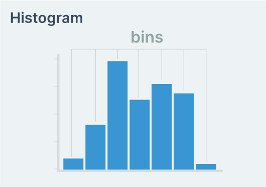

# Making a Bar Chart

We'll walk through one last "basic" chart — once finished, you'll feel very comfortable with each step and we'll move on to even more exciting concepts like animations and interactions.

# Deciding the chart type

Another type of question that we can ask our dataset is: what does the *distribution* of a metric look like? For example:

* What kinds of humidity values do we have?
* Does the humidity level generally stay around one value, with a few very humid days and a few very dry days?
* Does it vary consistently, with no standard value?
* Or are there really humid days and really dry days, with none in-between?

Looking at the scatter plot we just made, we can see the daily humidity values from the dots' vertical placement.

{width=50%}

But it's hard to answer our questions - do most of our dots fall close the middle of the chart? We're not entirely sure.

Instead, let's make a histogram.

# Histogram

A *histogram* is a bar chart that shows the *distribution* of one metric, with the metric **values** on the x axis and the **frequency of values** on the y axis.

{width=75%}

In order to show the frequency, **values are placed in equally-sized bins** (visualized as individual bars). For example, we could make bins for dew point temperatures that span 10 degrees - these would look something like `[0-10, 10-20, 20-30, ...]`. A dew point of 15 degrees would be counted in the second bin: `10-20`.

The number of and size of bins is up to the implementor - you could have a histogram with only 3 bins or one with 100 bins! There are standards that can be followed (feel free to [check out d3's built-in formulas](https://github.com/d3/d3-array#bin-thresholds)), but we can generally decide the number based on what suits the data and what's easy to read.

Our goal is to make a histogram of humidity values. This will show us the distribution of humidity values and help answer our questions. Do most days stay around the same level of humidity? Or are there two types of days: humid and dry? Are there crazy humid days?

{width=75%}

T> To interpret the above histogram, it shows that we have **48** days in our dataset with a humidity value between `0.55` and `0.6`

For extra credit, we'll generalize our histogram function and loop through eight metrics in our dataset - creating many histograms to compare!

Let's dig in.
