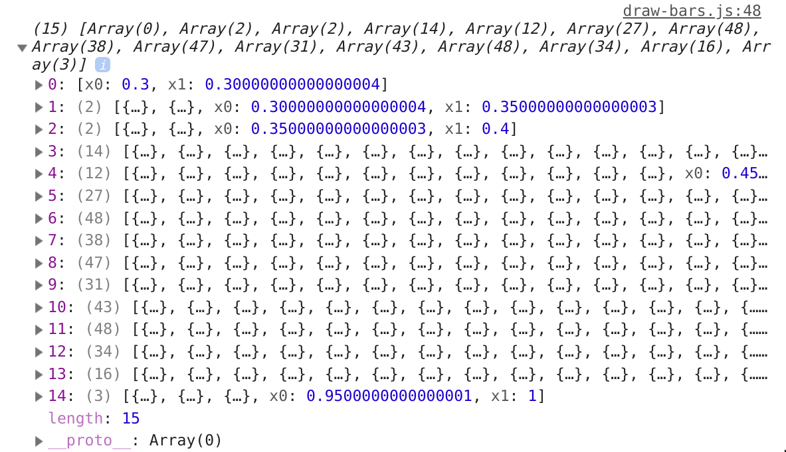

# Create scales

<CodeSandboxEmbed
  src="//codesandbox.io/s/s6m9c?fontsize=14&hidenavigation=1&theme=dark&autoresize=1&module=/chart.js"
  style={{width: '100%', height: '35em'}}
/>

Our x scale should look familiar to the ones we've made in the past. We need a scale that will convert humidity levels into pixels-to-the-right. Since both the **domain** and the **range** are continuous numbers, we'll use our friend `d3.scaleLinear()`.

Let's also use `.nice()`, which we learned in **Module 2**, to make sure our axis starts and ends on round numbers.

{lang=javascript,crop-query=.xScale}
<<[code/03-making-a-bar-chart/completed/draw-bars.js](./protected/code/03-making-a-bar-chart/completed/draw-bars.js)

Rad. Now we need to create our `yScale`.

But wait a minute! We can't make a y scale without knowing the range of frequencies we need to cover. Let's create our data bins first.

### Creating Bins

How can we split our data into bins, and what size should those bins be? We could do this manually by looking at the domain and organizing our days into groups, but that sounds tedious.

Thankfully, we can use **d3-array**'s `d3.bin()` method to create a bin generator. This generator will convert our dataset into an array of bins - we can even choose how many bins we want!

Let's create a new generator:

{lang=javascript,crop-query=context(.binsGenerator, 0, -3)}
<<[code/03-making-a-bar-chart/completed/draw-bars.js](./protected/code/03-making-a-bar-chart/completed/draw-bars.js)

Similar to making a scale, we'll pass a **domain** to the generator to tell it the range of numbers we want to cover.

{lang=javascript,crop-query=context(.binsGenerator, 0, -2)}
<<[code/03-making-a-bar-chart/completed/draw-bars.js](./protected/code/03-making-a-bar-chart/completed/draw-bars.js)

Next, we'll need to tell our generator how to get the the **humidity** value, since our dataset contains objects instead of values. We can do this by passing our `metricAccessor()` function to the `.value()` method.

{lang=javascript,crop-query=context(.binsGenerator, 0, -1)}
<<[code/03-making-a-bar-chart/completed/draw-bars.js](./protected/code/03-making-a-bar-chart/completed/draw-bars.js)

We can also tell our generator that we want it to aim for a specific number of bins. When we create our bins, we won't necessarily get this exact amount, but it should be close.

Let's aim for **13** bins — this should make sure we have enough granularity to see the shape of our distribution without too much noise. Keep in mind that the number of bins is the number of **thresholds + 1**.

{lang=javascript,crop-query=.binsGenerator}
<<[code/03-making-a-bar-chart/completed/draw-bars.js](./protected/code/03-making-a-bar-chart/completed/draw-bars.js)

Great! Our bin generator is ready to go. Let's create our bins by feeding it our data.

{lang=javascript,crop-query=.bins}
<<[code/03-making-a-bar-chart/completed/draw-bars.js](./protected/code/03-making-a-bar-chart/completed/draw-bars.js)

Let's take a look at these bins by logging them to the console: `console.log(bins)`.

Each bin is an array with the following structure:

- each item is a matching data point. For example, the first bin has no matching days — this is likely because we used `.nice()` to round out our x scale.
- there is an **x0** key that shows the lower bound of included humidity values (inclusive)
- there is an **x1** key that shows the upper bound of included humidity values (exclusive). For example, a bin with a **x1** value of **1** will include values **up to 1**, but not **1** itself

A>Note how there are 15 bins in my example — our bin generator was aiming for 13 bins but decided that 15 bins were more appropriate. This was a good decision, creating bins with a sensible size of `0.05`. If our bin generator had been more strict about the number of bins, our bins would have ended up with a size of `0.06666667`, which is harder to reason about. To extract insights from a chart, readers will mentally convert awkward numbers into rounder numbers to make sense of them. Let's do that work for them.

If we want, we can specify an exact number of bins by instead passing an array of **thresholds**. For example, we could specify 5 bins with `.thresholds([0, 0.2, 0.4, 0.6, 0.8, 1]`).

### Creating the y scale

Okay great, now we can use these bins to create our y scale. First, let's create a y accessor function and throw it at the top of our file. Now that we know the shape of the data that we'll use to create our data elements, we can specify how to access the y value in one place.

{lang=javascript,crop-query=.yAccessor}
<<[code/03-making-a-bar-chart/completed/draw-bars.js](./protected/code/03-making-a-bar-chart/completed/draw-bars.js)

Let's use our new accessor function and our bins to create that y scale. As usual, we'll want to make a linear scale. This time, however, **we'll want to start our y axis at zero**.

Previously, we wanted to represent the extent of our data since we were plotting metrics that had no logical bounds (temperature and humidity level). But the number of days that fall in a bin is bounded at 0 — you can't have negative days in a bin!

Instead of using `d3.extent()`, we can use another method from **d3-array**: `d3.max()`. This might sound familiar — we've used its counterpart, `d3.min()` in **Module 2**. `d3.max()` takes the same arguments: an array and an accessor function.

Note that we're passing `d3.max()` our `bins` instead of our original `dataset` — we want to find the maximum number of days in a bin, which is only available in our computed `bins` array.

{lang=javascript,crop-query=context(.yScale, 0, -1)}
<<[code/03-making-a-bar-chart/completed/draw-bars.js](./protected/code/03-making-a-bar-chart/completed/draw-bars.js)

Let's use `.nice()` here as well to give our bars a round top number.

{lang=javascript,crop-query=.yScale}
<<[code/03-making-a-bar-chart/completed/draw-bars.js](./protected/code/03-making-a-bar-chart/completed/draw-bars.js)

### Final code for this lesson

<CodeSandboxEmbed
  src="//codesandbox.io/s/rwyxi?fontsize=14&hidenavigation=1&theme=dark&autoresize=1&module=/chart.js"
  style={{width: '100%', height: '35em'}}
/>