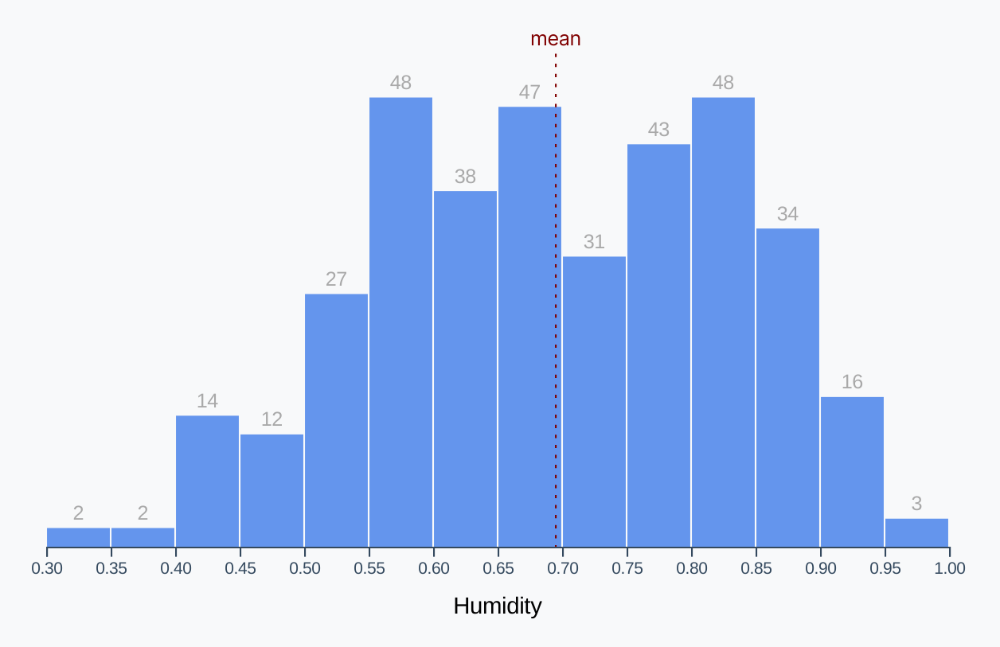

# Draw peripherals

<CodeSandboxEmbed
  src="//codesandbox.io/s/zqgss?fontsize=14&hidenavigation=1&theme=dark&autoresize=1&module=/chart.js"
  style={{width: '100%', height: '35em'}}
/>

When looking at the shape of a distribution, it can be helpful to know where the mean is.

The mean is just the average — the center of a set of numbers. To calculate the mean, you would divide the sum by the number of values. For example, the mean of `[1, 2, 3, 4, 5]` would be `(1 + 2 + 3 + 4 + 5) / 5 = 3`.

Instead of calculating the mean by hand, we can use `d3.mean()` to grab that value. Like many d3 methods we've used, we pass the dataset as the first parameter and an optional accessor function as the second.

{lang=javascript,crop-query=.mean}
<<[code/03-making-a-bar-chart/completed/draw-bars.js](./protected/code/03-making-a-bar-chart/completed/draw-bars.js)

Great! Let's see how comfortable we are with drawing an unfamiliar SVG element: `<line>`. A `<line>` element will draw a line between two points: `[x1, y1]` and `[x2, y2]`.  Using this knowledge, let's add a line to our bounds that is:

- at the mean humidity level,
- starting 15px above our chart, and
- ending at our x axis.

How close can you get before looking at the following code?

{lang=javascript,crop-query=context(.meanLine, 0, -2)}
<<[code/03-making-a-bar-chart/completed/draw-bars.js](./protected/code/03-making-a-bar-chart/completed/draw-bars.js)

Let's add some styles to the line so we can see it (by default, `<line>`s have no stroke color) and to distinguish it from an axis. SVG element strokes can be split into dashes with the `stroke-dasharray` attribute. The lines alternate between the stroke color and transparent, starting with transparent. We define the line lengths with a space-separated list of values (which will be repeated until the line is drawn).

Let's make our lines dashed with a 2px long maroon dash and a 4px long gap.

{lang=javascript,crop-query=.meanLine}
<<[code/03-making-a-bar-chart/completed/draw-bars.js](./protected/code/03-making-a-bar-chart/completed/draw-bars.js)

Give yourself a pat on the back for drawing your first `<line>` element!

{width=75%}


Let's label our line to clarify to readers what it represents. We'll want to add a `<text>` element in the same position as our line, but 5 pixels higher to give a little gap.

{lang=javascript,crop-query=context(.meanLabel, 0, -1)}
<<[code/03-making-a-bar-chart/completed/draw-bars.js](./protected/code/03-making-a-bar-chart/completed/draw-bars.js)

Hmm, we can see the text but it isn't horizontally centered with our line.

{width=75%}


Let's center our text by adding the CSS property `text-anchor: middle`. This is a property specifically for setting the horizontal alignment of text in SVG.

{lang=javascript,crop-query=.meanLabel}
<<[code/03-making-a-bar-chart/completed/draw-bars.js](./protected/code/03-making-a-bar-chart/completed/draw-bars.js)

Perfect! Now our mean line is clear to our readers.

{width=75%}


# Draw axes

As usual, our last task here is to draw our axes. But we're in for a treat! Since we're labeling the y value of each of our bars, we won't need a y axis. We just need an x axis and we're set!

We'll start by making our axis generator — our axis will be along the bottom of the chart so we'll be using `d3.axisBottom()`.

{lang=javascript,crop-query=.xAxisGenerator}
<<[code/03-making-a-bar-chart/completed/draw-bars.js](./protected/code/03-making-a-bar-chart/completed/draw-bars.js)

Then we'll use our new axis generator to create an axis, then shift it below our bounds.

{lang=javascript,crop-query=.xAxis}
<<[code/03-making-a-bar-chart/completed/draw-bars.js](./protected/code/03-making-a-bar-chart/completed/draw-bars.js)

And lastly, let's throw a label on there to make it clear what the tick labels represent.

```javascript
const xAxisLabel = xAxis.append("text")
    .attr("x", dimensions.boundedWidth / 2)
    .attr("y", dimensions.margin.bottom - 10)
    .attr("fill", "black")
    .style("font-size", "1.4em")
    .text("Humidity")
```

And voila, we're done drawing our peripherals!


# Set up interactions


Next, we would set up any chart interactions. We don't have any interactions for this chart, but stay tuned — we'll cover this in the next chapter.


# Looking at our chart


Chart finished! Let's take a look at our distribution.

{width=75%}


Our histogram looks somewhere in-between a normal and bimodal distribution. Don't worry if those terms make no sense right now — we cover distribution shapes in detail in **Chapter 8** of the book.

### Final code for this lesson

<CodeSandboxEmbed
  src="//codesandbox.io/s/6y1bz?fontsize=14&hidenavigation=1&theme=dark&autoresize=1&module=/chart.js"
  style={{width: '100%', height: '35em'}}
/>