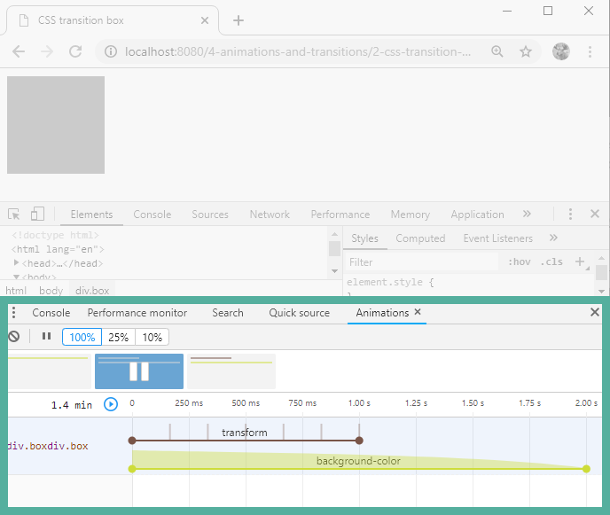

# CSS transitions

<CodeSandboxEmbed
  src="//codesandbox.io/s/f79sh?fontsize=14&hidenavigation=1&theme=dark&autoresize=1&module=/chart.js"
  style={{width: '100%', height: '35em'}}
/>

Many of our chart changes can be transitioned with the CSS `transition` property. When we update a `<rect>` to have a fill of **red** instead of **blue**, we can specify that the color change take 10 seconds instead of being instantaneous. During those 10 seconds, the `<rect>` will continuously re-draw with intermediate colors on the way to **red**.

Let's try out an example! In our example, you'll see a blue box that moves and turns green on hover.

{width=75%}


Let's open up the

`styles.css` file to take a look at what's going on. We can see our basic styles for the box.

```css
.box {
    background: cornflowerblue;
    height: 100px;
    width: 100px;
}
```

And our styles that apply to our box when it is hovered (change the background color and move it 30 pixels to the right).

```css
.box:hover {
    background: yellowgreen;
    transform: translateX(30px);
}
```

To create CSS a transition, we need to specify how long we want the animation to take with the `transition-duration` property. The property value accepts **time CSS data types** — a number followed by either `s` (seconds) or `ms` (milliseconds).

Let's make our box changes animate over one second.

```css
.box {
    background: cornflowerblue;
    height: 100px;
    width: 100px;
    transition-duration: 1s;
}
```

Now when we hover over the box, we can see it slowly move to the right and turn green. Smooth!

{width=75%}


Now let's say that we only want to animate our box's movement, but we want the color change to happen instantaneously. This is possible by specifying the `transition-property` CSS property. By default, `transition-property` is set to `all`, which animates all transitions. Instead, let's override the default and specify a specific CSS property name (`transform`).

```css
.box {
    background: cornflowerblue;
    height: 100px;
    width: 100px;
    transition-duration: 1s;
    transition-property: transform;
}
```

Now our box instantly turns green, but still animates to the right.

{width=75%}


Instead of setting `transition-duration` and `transition-property` separately, we can use the shorthand property: `transition`. Shorthand CSS properties let you set multiple properties in one line. When we give `transition` a CSS property name and duration (separated by a space), we are setting both `transition-duration` and `transition-property`. Let's try it out.

```css
.box {
    background: cornflowerblue;
    height: 100px;
    width: 100px;
    transition: transform 1s;
}
```

`transition` will accept a third property (`transition-timing-function`) that sets the acceleration curve for the animation. The animation could be linear (the default), slow then fast (`ease-in`), in steps (`steps(6)`), or even a custom function (`cubic-bezier(0.1, 0.7, 1.0, 0.1)`), among other options. Let's see what `steps(6)` looks like — it should break the animation into 6 discrete steps.

```css
.box {
    background: cornflowerblue;
    height: 100px;
    width: 100px;
    transition: transform 1s steps(6);
}
```

What if we wanted to animate the color change, but finish turning green *while* our box is shifting to the right? `transition` will accept multiple transition statements, we just need to separate them by a comma. Let's add a transition for the `background` color.

```css
.box {
    background: cornflowerblue;
    height: 100px;
    width: 100px;
    transition: transform 1s steps(6),
                background 2s ease-out;
}
```

Nice! Now our box transitions by stepping to the right, while turning green over two seconds. Chrome's dev tools have a great way to visualize this transition. Press `esc` when looking at the **Elements** panel to bring up the bottom panel. In the bottom panel, we can open up the **Animations** tab.

A>If you don't see the **Animations** tab, click on the kebab menu on the left and select it from the dropdown options.



Once we've triggered our box transition by hovering, we can inspect the animation.


We can see the `transform` transition on top, with six discrete changes, and the `background` animation on the bottom, easing gradually from one color to the next. The `background` transition diagram is twice as wide as the `transform` transition diagram, indicating that it takes twice as long.

This view can be very handy when inspecting, tweaking, and debugging transitions.

Now that we're comfortable with CSS `transition`, let's see how we might use it to animate our charts.

A>Not all properties can be animated. For example, how would you animate changing a label from **Humidity** to **Dew point**? However most properties can be animated, so feel free to operate under the assumption that a property can be animated until proven otherwise.

### Final code for this lesson

<CodeSandboxEmbed
  src="//codesandbox.io/s/zpl2b?fontsize=14&hidenavigation=1&theme=dark&autoresize=1&module=/chart.js"
  style={{width: '100%', height: '35em'}}
/>