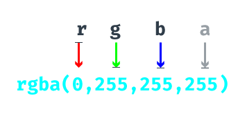
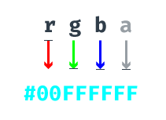
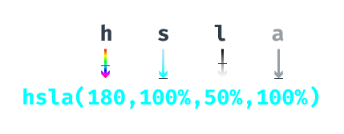
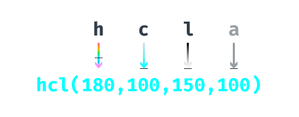
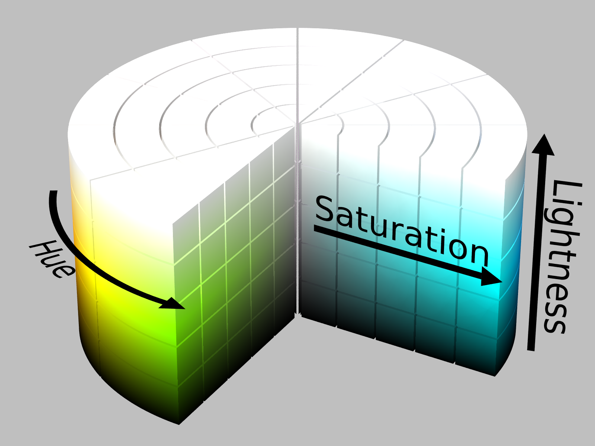
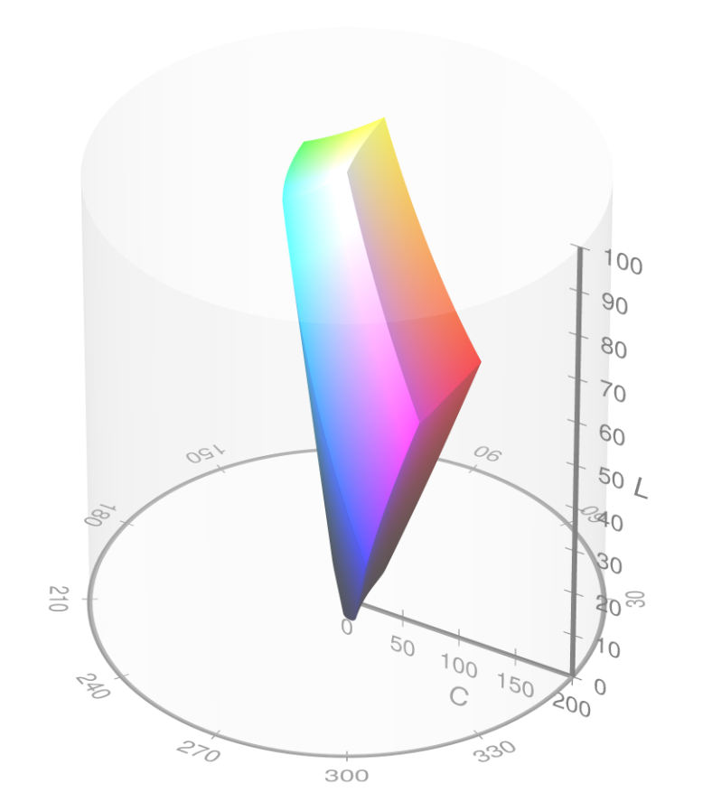

# Creating our own colors

Colors can be represented in various formats, each with different strengths. But creating our own colors requires care and the _color space_ we use affects how well our chart can be interpreted.

Below, we're going to look at three color spaces:

* rgb
* hsl and
* hcl

While rgb is generally the most familiar, there are good reasons to use _hcl_ when we're programmatically creating color scales. Read on to find out why.

### keywords

In our chart code, we've used a lot of **keywords** which map to specific, solid colors. For example, we made our histogram bars **cornflowerblue**.  Color keywords are great because they are easy to remember and mirror the way we refer to colors in natural language.

**currentColor**

Most color keywords are ways we would describe a color in English, but there is one handy special case: `currentColor`. `currentColor` will set the CSS property to the current `color` property. This is great for controlling one-color charts from outside a charting component. For example, we could make a line chart component whose `stroke` is `currentColor`. This way, we could easily create multiple line charts with different line colors, just by setting the `color` higher up in the DOM.

**transparent**

Another useful color keyword is `transparent`. This is great when creating invisible SVG elements that still capture mouse events, such as the listening rect we used to capture mouse movement in **Module 5**.

When creating data visualizations, we'll often need to manipulate colors. In this case, we can't use the color keywords because there is no way to make **cornflowerblue** 10% darker. In order to manipulate our colors, we'll need to learn about color spaces.

### rgb

The color space you're most likely to come across when developing for the web is **rgb**. **rgb** colors are composed of three values:

**r**: red

**g**: green

**b**: blue

For each of these values, a higher number uses more of the specified color. Then these values are combined to create one color.

This is essentially how LCD screens work: each pixel is made up of a red, green, and blue light. The values are combined in an additive fashion, starting at black and moving towards white with higher values. This may be counter-intuitive to anyone who's used paint on paper, where more paint = a darker color. For example, `rgb(0,0,0)` represents **black** and `rgb(255,255,255)` represents **white**.

There is another optional value for all of the color spaces we'll talk about:

**a**: alpha

The alpha value sets the opacity of the color — a color with an alpha value of `0` will be transparent. If the alpha value isn't specified, the color will be fully opaque.

**rgb** can be expressed in two formats. The first, **functional notation**, starts with `rgb` and lists each color value, in order, within parentheses. Each value will be within a range from `0` to `255`. If we wanted to specify an alpha value, we would switch the prefix to `rgba`.

For example, we would represent a **cyan** color as a combination of **green** and **blue** colors.

{width=80%}

**rgb** colors can also be expressed with **hexadecimal notation**, which begins with `#` and lists each value with two characters in a range from **00** to **FF**.

**rgb** can be an unintuitive color space to work in — if I have a blue color and want an orange of the same brightness, all of the values have to change.

Next, let's look at a color space that is closer to our mental model of color.

### hsl

In the **hsl** color space, the values don't refer to specific colors — instead, they refer to color properties:

**h**: hue. The hue represents the angle around a circular color wheel that starts at red (0 degrees) and cycles through orange, yellow, ...., back around to red (360 degrees).

**s**: saturation. The saturation value starts at gray (0%) and ramps up to a completely saturated color (100%).

**l**: lightness. The lightness value starts at white (0%) and ramps up to black (100%).

(**a**: alpha. Again, the alpha channel is optional and defaults to full opacity (100%))

In **hsl**, our cyan color would be partially around the color wheel, fully saturated, and of medium lightness.

**hsl** more closely matches our mental model of the relationship between colors — to switch from a blue to a similarly dark & saturated orange, we would only have to update the **hue** value.

### hcl

The **hcl** color space is similar to **hsl**, with the same values (**c** is for **chroma**, which is an alternative measure of colorfulness).

Instead of being spacially uniform, the values are **perceptually uniform**, so that a red and a blue with a lightness of 50% will _look_ the same amount of light. Let's look at the hue spectrum at 100% saturation and 50% lightness for both **hsl** (top) and **hcl** (bottom).

We can see bands of color in the **hsl** hues that look lighter than the other hues (even though they mathematically aren't). Those bands are not visible in the **hcl** spectrum.

If we create a 3d cylinder of the **hsl** color space, we would have a perfect cylinder. But when we visualize the **hcl** color space this way, we can see that it's not a perfect cylinder. This is because humans can't detect changes in saturation for all colors equally.

{width=50%}

{width=50%}

This makes **hcl** to ideal for creating color scales — if we're using color to represent different categories of precipitation, those colors should have the same amount of visibility. This will help prevent one color from  dominating and skewing our read of the data.
