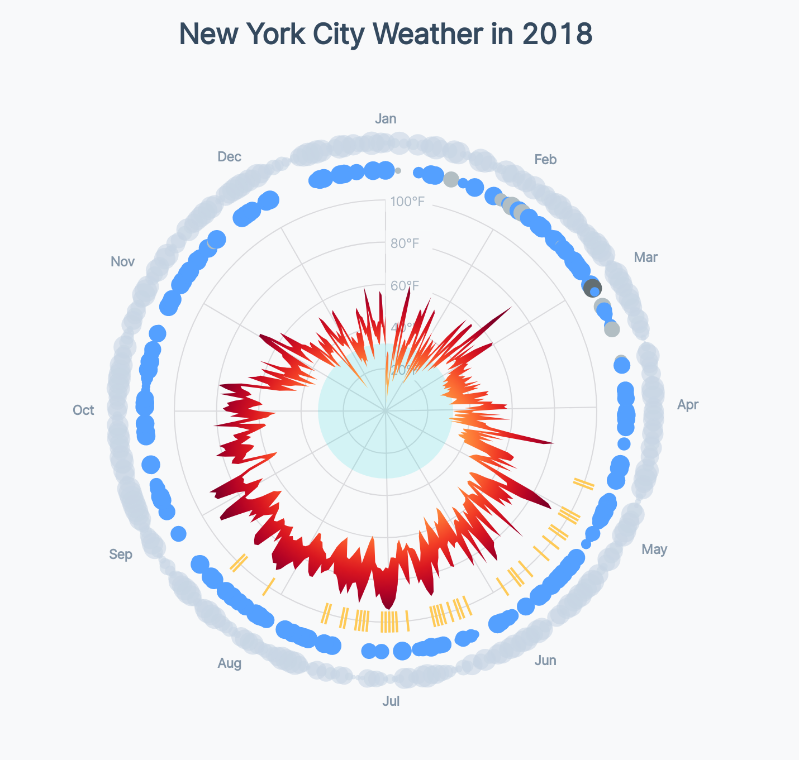

# Adding the precipitation bubbles

<CodeSandboxEmbed
  src="//codesandbox.io/s/u2yf6?fontsize=14&hidenavigation=1&theme=dark&autoresize=1&module=/chart.js"
  style={{width: '100%', height: '35em'}}
/>

Next, we want to add a row of bubbles corresponding to each day's precipitation. We have two relevant metrics: _probability_ of precipitation and _type_ of precipitation. Let's visualize the _probability_ with the size of the bubble and the _type_ with the color of the bubble. This way, we can play to both dimensions' strengths -- a large amount of _blue_ will correspond to _a high probability_ of rain. And we won't see a lot of a color if we're not confident that it did precipitate.

To start, we'll create a scale to convert the probability of precipitation to the radius of a bubble. We'll make these circles a little smaller than our cloud circles, since they're closer to the middle of our circle (and thus have less space).

A>This code will go at the end of our **Create scales** step.

{lang=javascript,crop-query=.precipitationRadiusScale}
<<[code/11-radar-weather-chart/completed/chart.js](./protected/code/11-radar-weather-chart/completed/chart.js)

Next, we'll list out the types of precipitation in our dataset, then create a color scale mapping those types to different colors. We'll want to use an **ordinal** scale, since this is an **ordinal** metric, and can be placed in categories with a natural order (remember the types of data we learned in **Module 6**?).

{lang=javascript,crop-query=.precipitationTypes-.precipitationTypeColorScale}
<<[code/11-radar-weather-chart/completed/chart.js](./protected/code/11-radar-weather-chart/completed/chart.js)

Scrolling back down to the end of our **Draw data** step, we'll draw our circles similarly to how we drew our cloud circles. This time, we'll use our `precipitationTypeColorScale` to set each circle's `fill` color.

{lang=javascript,crop-query=.precipitationGroup-.precipitationDots}
<<[code/11-radar-weather-chart/completed/chart.js](./protected/code/11-radar-weather-chart/completed/chart.js)

Great! Now we can see our inner circle of precipitation bubbles.

{width=75%}


Let's make these bubbles translucent as well, in our `styles.css` file:

```css
.precipitation-dot {
    opacity: 0.5;
}
```

That's better!

{width=75%}


### Final code for this lesson

<CodeSandboxEmbed
  src="//codesandbox.io/s/un93s?fontsize=14&hidenavigation=1&theme=dark&autoresize=1&module=/chart.js"
  style={{width: '100%', height: '35em'}}
/>