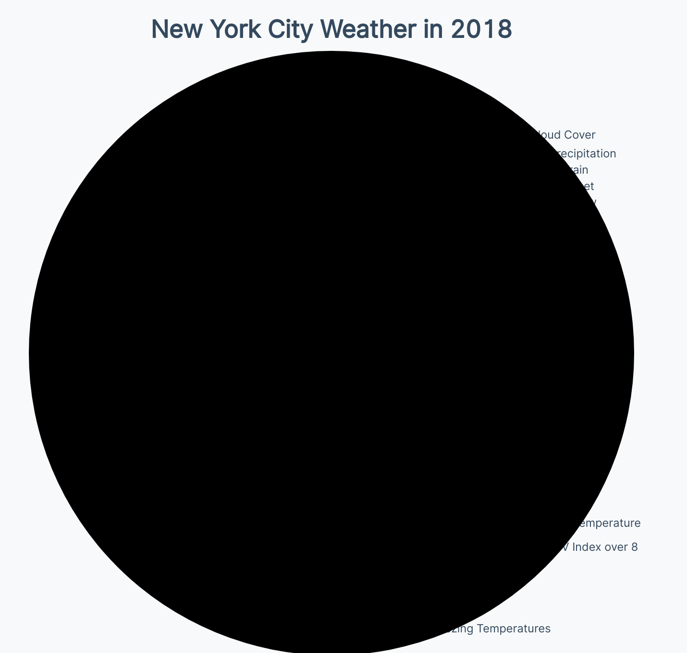
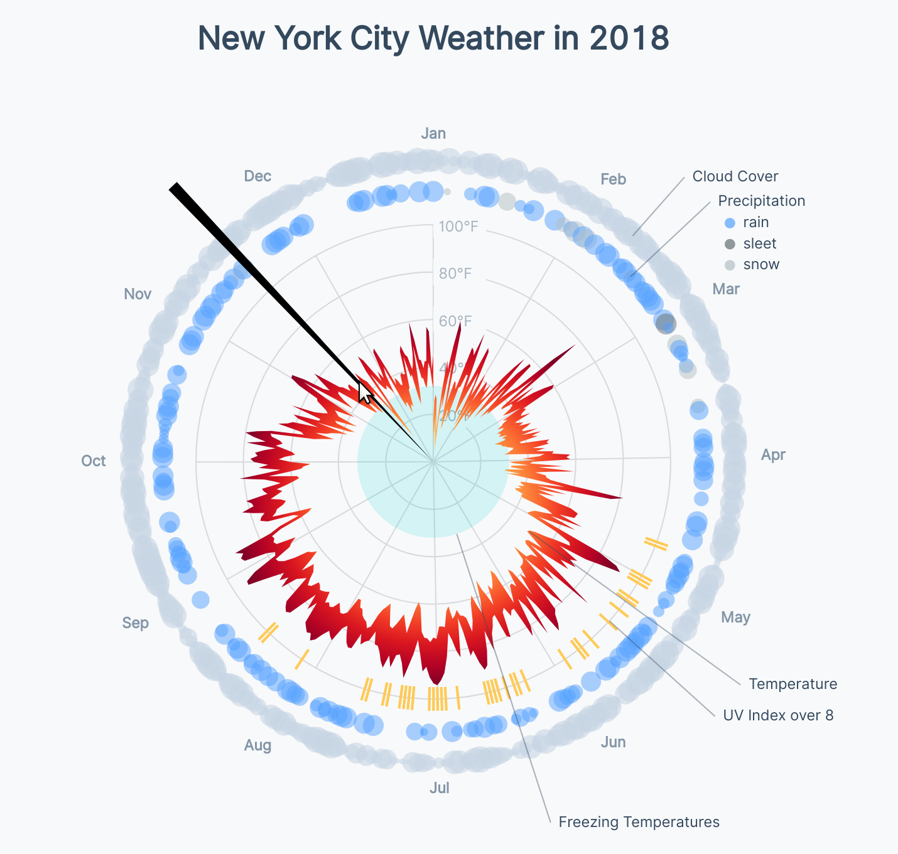
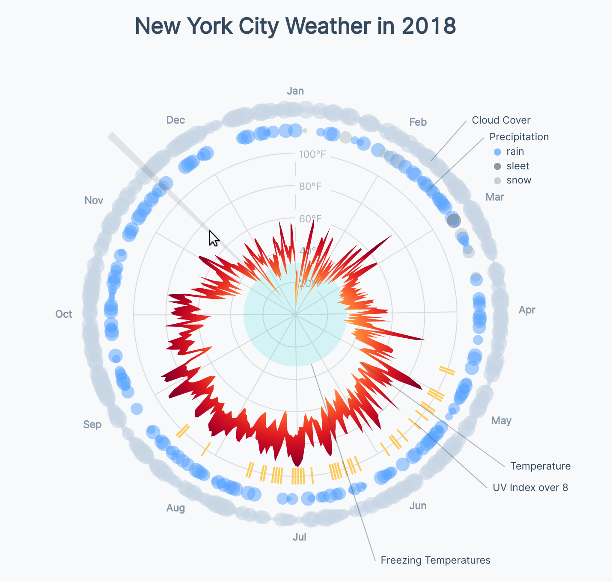
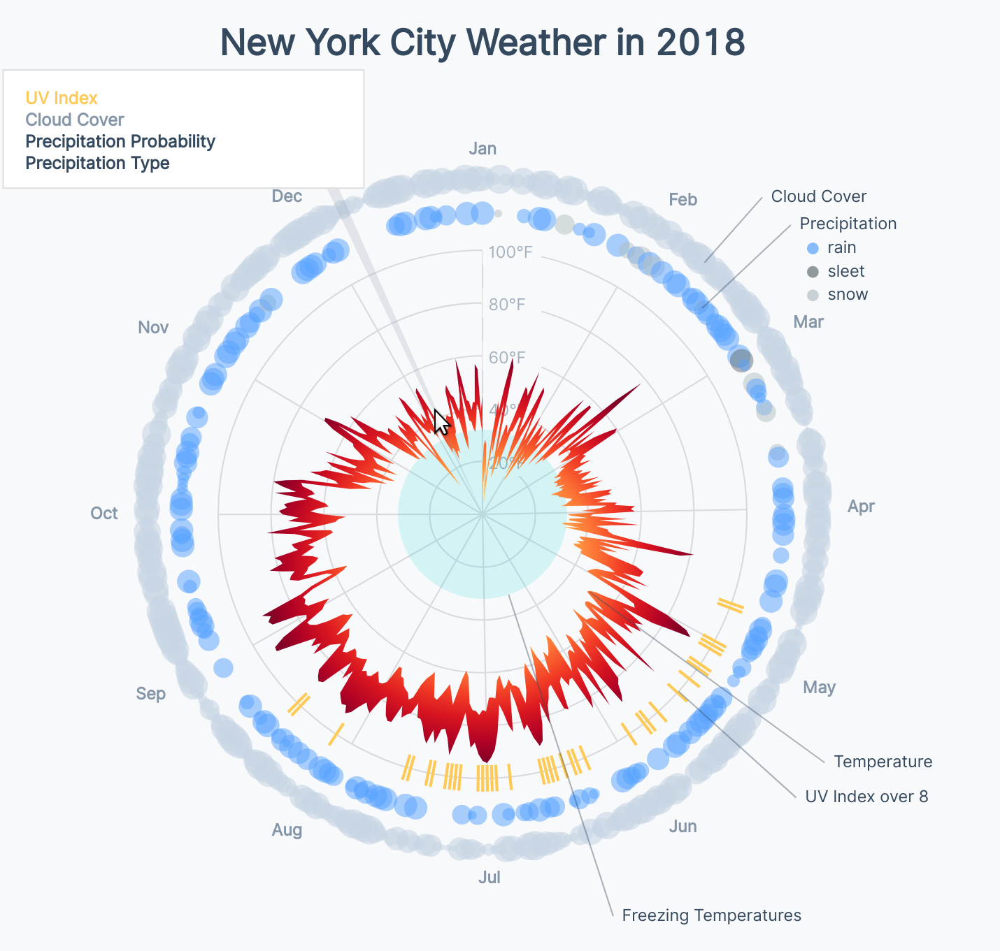
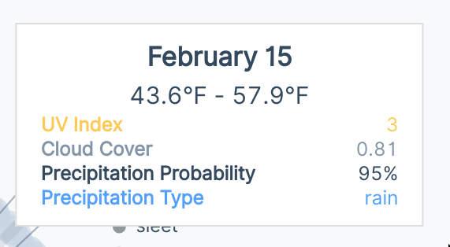
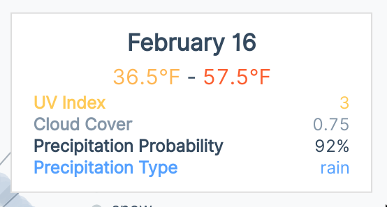

# Adding the tooltip

<CodeSandboxEmbed
  src="//codesandbox.io/s/t41w5?fontsize=14&hidenavigation=1&theme=dark&autoresize=1&module=/chart.js"
  style={{width: '100%', height: '35em'}}
/>

Now for the fun part: adding interactions! Although our viewers can orient themselves to the different parts of our chart, we also want them to be able to dig in and view details about a particular day.

Let's add a tooltip that shows up when the user hovered anywhere over the chart. We'll want to start by adding a listener element that covers our whole chart and initializing our mouse move events.

```javascript
const listenerCircle = bounds.append("circle")
   .attr("class", "listener-circle")
   .attr("r", dimensions.width / 2)
   .on("mousemove", onMouseMove)
   .on("mouseleave", onMouseLeave)

function onMouseMove(e) {
}

function onMouseLeave() {
}
```

Perfect, the black area covers exactly where we want any movement to trigger a tooltip.

{width=75%}


Let's hide our listener by making its `fill` `transparent`.

```css
.listener-circle {
  fill: transparent;
}
```

Next, we'll need to create our tooltip element in our `index.html` file, with a spot for each of our hovered over day's metrics to be displayed.

```html
<div id="tooltip" class="tooltip">
   <div id="tooltip-date" class="tooltip-date"></div>
   <div id="tooltip-temperature" class="tooltip-temperature">
       <span id="tooltip-temperature-min"></span>
       -
       <span id="tooltip-temperature-max"></span>
   </div>
   <div class="tooltip-metric tooltip-uv">
       <div>UV Index</div>
       <div id="tooltip-uv"></div>
   </div>
   <div class="tooltip-metric tooltip-cloud">
       <div>Cloud Cover</div>
       <div id="tooltip-cloud"></div>
   </div>
   <div class="tooltip-metric tooltip-precipitation">
       <div>Precipitation Probability</div>
       <div id="tooltip-precipitation"></div>
   </div>
   <div class="tooltip-metric tooltip-precipitation-type">
       <div>Precipitation Type</div>
       <div id="tooltip-precipitation-type"></div>
   </div>
</div>
```

Let's also add our tooltip styles in our `styles.css` file, remembering to hide our tooltip and to give our **wrapper** a `position` to create a new context.

```css
.wrapper {
    position: relative;
}

.tooltip {
    opacity: 0;
    position: absolute;
    top: 0;
    left: 0;
    width: 15em;
    padding: 0.6em 1em;
    background: #fff;
    text-align: center;
    line-height: 1.4em;
    font-size: 0.9em;
    border: 1px solid #ddd;
    z-index: 10;
    pointer-events: none;
}

.tooltip-date {
    margin-bottom: 0.2em;
    font-weight: 600;
    font-size: 1.1em;
    line-height: 1.4em;
}

.tooltip-temperature {
    font-feature-settings: 'tnum' 1;
}

.tooltip-metric {
    display: flex;
    justify-content: space-between;
    width: 100%;
    font-size: 0.8em;
    line-height: 1.3em;
    transition: all 0.1s ease-out;
}

.tooltip-metric div:first-child {
    font-weight: 800;
    padding-right: 1em;
}

.tooltip-metric div:nth-child(2) {
    font-feature-settings: 'tnum' 1;
}

.tooltip-cloud {
    color: #8395a7;
}
.tooltip-uv {
    color: #feca57;
}
```

Switching back in our `chart.js` file, we'll want to grab our `tooltip` element to reference later, and also make a `<path>` element to highlight the hovered over day.

```javascript
const tooltip = d3.select("#tooltip")
const tooltipLine = bounds.append("path")
    .attr("class", "tooltip-line")
```

Now we can fill out our `onMouseMove()` function. Let's start by grabbing the `x` and `y` position of our cursor, using `d3.pointer()`.

```javascript
function onMouseMove(e) {
  const [x, y] = d3.pointer(e)
  // ...
```

We have our mouse position, but we need to know the _angle_ from the chart origin. How do we convert from an `[x, y]` position to an angle? We'll need to use an inverse trigonometric function: **atan2**. If you're curious, [read more about **atan2** here](https://en.wikipedia.org/wiki/Atan2).

{lang=javascript,crop-query=.getAngleFromCoordinates}
<<[code/11-radar-weather-chart/completed/chart.js](./protected/code/11-radar-weather-chart/completed/chart.js)

Remember that these trigonometric functions originate around the _horizontal, right_ plane of our circle. Let's rotate the resulting angle back one-quarter turn around the circle to match our date scale.

```javascript
let angle = getAngleFromCoordinates(x, y) + Math.PI / 2
```

To keep our angles _positive_, we'll want to rotate any _negative_ angles around our circle by one full turn, so they fit on our `angleScale`.

```javascript
if (angle < 0) angle = (Math.PI * 2) + angle
```

We want to draw a line to highlight the date we're hovering, but it needs to _increase in width_ as it gets farther from the center of our circle. To create this shape, we'll use [`d3.arc()`](https://github.com/d3/d3-shape#arcs), which is the **arc** version of the line generators we've been using (`d3.line()`). We can use the `.innerRadius()` and `outerRadius()` methods to tell it how _long_ we want our arc to be, and the `.startAngle()` and `.endAngle()` methods to tell it how _wide_ we want our arc to be.

{lang=javascript,crop-query=.tooltipArcGenerator}
<<[code/11-radar-weather-chart/completed/chart.js](./protected/code/11-radar-weather-chart/completed/chart.js)

Now we can use our new arc generator to create the `d` attribute for our tooltip line.

```javascript
tooltipLine.attr("d", tooltipArcGenerator())
    .style("opacity", 1)
```

Perfect! Now we have a line that follows our cursor around the center of our circle.

{width=75%}


Let's lighten the line in our `styles.css` file to prevent it from covering the data we want to highlight. We can use `mix-blend-mode: multiply` to make the covered data elements stand out a little.

```css
.tooltip-line {
    fill: #8395a7;
    fill-opacity: 0.2;
    mix-blend-mode: multiply;
    pointer-events: none;
}
```

Much better!

{width=75%}


Next, we'll want to position our tooltip at the end of our line. First, we'll grab the `[x, y]` coordinates of this point.

{lang=javascript,crop-query=.outerCoordinates}
<<[code/11-radar-weather-chart/completed/chart.js](./protected/code/11-radar-weather-chart/completed/chart.js)

Using these coordinates, we'll set the `transform` CSS property of our `tooltip`. We have some fancy math here, using the CSS `calc()` function to choose which side of our tooltip to anchor to the `outerCoordinate`, based on where we are around the circle. We don't want our tooltip to cover our chart!

Try to work through each line to figure out what is going on, and inspect the tooltip in the **Elements** tab of your dev tools to see the resulting `transform` value.

```javascript
tooltip.style("opacity", 1)
   .style("transform", `translate(calc(${
     outerCoordinates[0] < - 50 ? "40px - 100" :
     outerCoordinates[0] > 50 ? "-40px + 0" :
     "-50"
   }% + ${
     outerCoordinates[0]
      + dimensions.margin.top
      + dimensions.boundedRadius
   }px), calc(${
     outerCoordinates[1] < - 50 ? "40px - 100" :
     outerCoordinates[1] > 50 ? "-40px + 0" :
     "-50"
   }% + ${
     outerCoordinates[1]
      + dimensions.margin.top
      + dimensions.boundedRadius
   }px))`)
```

Wonderful! Now our tooltip follows the end of our tooltip line when we move our mouse around our chart.

{width=75%}


Next, we need to update the text of our tooltip to show information about the date we're hovering over. We can use the `.invert()` method of our `angleScale()` to convert backwards, from its **range** dimension (angle) to its **domain** dimension (date).

```javascript
const date = angleScale.invert(angle)
```

If we format this `date` similarly to the dates in our dataset, we can look for a data point with the same date string.

```javascript
const dateString = d3.timeFormat("%Y-%m-%d")(date)
const dataPoint = dataset.filter(d => d.date == dateString)[0]
```

If no such `date` exists, we should exit this function early. This should never happen, but is possible with a dataset that skips dates.

```javascript
if (!dataPoint) return
```

Now that we have the data for the date we're hovering over, we can populate the text of our tooltip.

```javascript
tooltip.select("#tooltip-temperature-min")
   .html(`${d3.format(".1f")(temperatureMinAccessor(dataPoint))}°F`)
tooltip.select("#tooltip-temperature-max")
   .html(`${d3.format(".1f")(temperatureMaxAccessor(dataPoint))}°F`)
tooltip.select("#tooltip-uv")
   .text(uvAccessor(dataPoint))
tooltip.select("#tooltip-cloud")
   .text(cloudAccessor(dataPoint))
tooltip.select("#tooltip-precipitation")
   .text(d3.format(".0%")(precipitationProbabilityAccessor(dataPoint)))
tooltip.select("#tooltip-precipitation-type")
   .text(precipitationTypeAccessor(dataPoint))
tooltip.select(".tooltip-precipitation-type")
   .style("color", precipitationTypeAccessor(dataPoint)
     ? precipitationTypeColorScale(precipitationTypeAccessor(dataPoint))
     : "#dadadd")
```

Notice that we're also setting the `color` of our precipitation type label and value, re-enforcing the relationship between the precipitation type and its color.

{width=90%}


Let's take this one step further! We're using a gradient of colors to show what temperatures each day spans. At the end of our **Create scales** step, let's create a new scale that maps temperatures to the gradient scale we're using.

{lang=javascript,crop-query=.temperatureColorScale}
<<[code/11-radar-weather-chart/completed/chart.js](./protected/code/11-radar-weather-chart/completed/chart.js)

A>We're using a [sequential scale](https://github.com/d3/d3-scale#sequential-scales) here instead of a linear scale because we want to use one of d3's built-in color scales (`d3.interpolateYlOrRd`) as an `.interpolator()` instead of specifying a range.

Now we can use this scale to color the minimum and maximum temperatures for our hovered date.

```javascript
tooltip.select("#tooltip-temperature-min")
   .style("color", temperatureColorScale(
     temperatureMinAccessor(dataPoint)
    ))
tooltip.select("#tooltip-temperature-max")
   .style("color", temperatureColorScale(
     temperatureMaxAccessor(dataPoint)
    ))
```

And voila! Our tooltip is chock full of helpful information, and it also helps re-enforce some of the data visualization in our main chart.

{width=90%}


<CodeSandboxEmbed
  src="//codesandbox.io/s/zp8i4?fontsize=14&hidenavigation=1&theme=dark&autoresize=1&module=/chart.js"
  style={{width: '100%', height: '35em'}}
/>