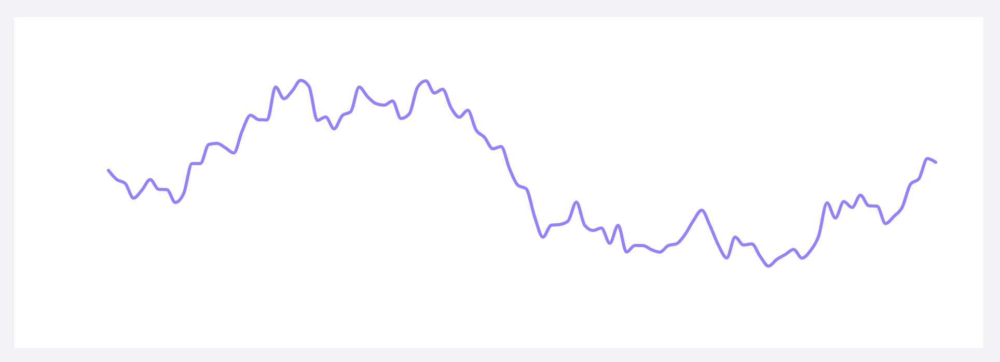

# Drawing our data

<CodeSandboxEmbed
  src="//codesandbox.io/s/y52x4?fontsize=14&hidenavigation=1&theme=dark&autoresize=1&module=/src/Timeline.jsx"
  style={{width: '100%', height: '35em'}}
/>

We already imported our `Line` component from our chart library. Let's render one instance inside of our `Chart`, passing it our data and scaled accessor functions.

```javascript
<Line
  data={data}
  xAccessor={xAccessorScaled}
  yAccessor={yAccessorScaled}
/>
```

If we inspect our webpage in the **Elements** panel, we can see a new `<path>` element.


Let's see what's going on in `src/Chart/Line.jsx`.

We have a basic element that renders a `<path>` element with a class name.

```javascript
const Line = ({ type, data, xAccessor, yAccessor, y0Accessor, interpolation, ...props }) => {
  return (
    <path {...props}
      className={`Line Line--type-${type}`}
    />
  )
}
```

`Line` accepts `data` and accessor props, along with a `type` string. A `Line` can have a `type` of `"line"` or `"area"` — it makes more sense to combine these two types of elements because they are more similar than they are different. There is one more prop (`interpolation`), which we'll get back to later.

Our first step is to create our `lineGenerator()`, which will turn our dataset into a `d` string for our `<path>`. Since `d3.line()` and `d3.area()` mimic our `type` prop, we can grab the right method with `d3[prop]()`.

```javascript
const lineGenerator = d3[type]()
  .x(xAccessor)
  .y(yAccessor)
  .curve(interpolation)
```

`d3.area()` uses `.y0()` and `.y1()` to decide where the top and bottom of its path are. We'll need to add that extra logic only if we're creating an `area`.

```javascript
if (type == "area") {
  lineGenerator
    .y0(y0Accessor)
    .y1(yAccessor)
}
```

Now we can use our `lineGenerator()` to convert our `data` into a `d` string.

```javascript
const line = lineGenerator(data)
```

And we can use that generated string as our path's d attribute.

```javascript
<path {...props}
  className={`Line Line--type-${type}`}
  d={line}
/>
```

Nice! Now when we look at our webpage, we can see a squiggly line that updates every few seconds.




By having such flexible props, we allow the dev to change the **interpolation** of the line - they can choose from [different d3 curve types](https://github.com/d3/d3-shape#curves) for individual lines.

For example, try changing the interpolation of `Line` in `/src/Timeline.jsx` to `d3.curveStepAfter`.

### Final code for this lesson

<CodeSandboxEmbed
  src="//codesandbox.io/s/18wdt?fontsize=14&hidenavigation=1&theme=dark&autoresize=1&module=/src/Chart/Line.jsx"
  style={{width: '100%', height: '35em'}}
/>