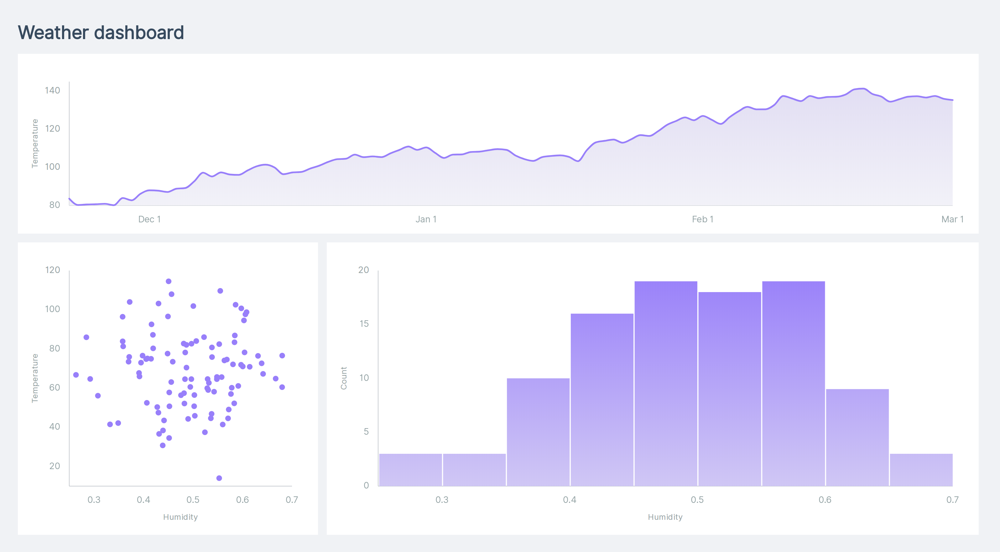

# Setting up interactions

In a production app, we would next want to define our interactions. Most charts could benefit from a tooltip - this could be implemented in various ways.

1. We could add a chart listener rect to our `Chart` component that would sit on top of its `children`. We could listen to all mouse events and use `d3.pointer()` and `d3.leastIndex()` to find the closest point and position the tooltip using our scales (similar to our timeline example in **Module 5**).

2. We could add a boolean property to `Line` that creates the listener rect, tying the tooltip to a specific data element. This might be beneficial if we have many types of charts that need different types of listeners (like our scatter plot example in **Module 5**).

# Wrapping up

Now that we've created some basic chart components and a **Timeline** component, we have a general idea of how to weave React.js and d3.js together. The general idea is to use React.js for any DOM rendering and d3.js as a utility library.

Populate the rest of the dashboard by switching the import statements in `src/App.jsx` to use the files in the `src/completed/` folder.

```javascript
// import Timeline from "./Timeline"
// import ScatterPlot from "./ScatterPlot"
// import Histogram from "./Histogram"
import Timeline from "./completed/Timeline"
import ScatterPlot from "./completed/ScatterPlot"
import Histogram from "./completed/Histogram"
```

When we look at our browser again, we'll see that the whole dashboard is populated!



Check out the code in

`src/completed/ScatterPlot.jsx` and

`src/completed/Histogram.jsx`

to see how we converted our d3 code to React + d3 code. For example, instead of using a data binding (`.join()`) we simply map over each item in our dataset.

The completed timeline has an extra area with a gradient fill - check out how that was implemented. One important piece of information to remember here is that our `Timeline` component could appear multiple times on a page, so we need a unique id per gradient instance in order to grab the right one. This is simple enough to implement, but easy to overlook.

If you're feeling comfortable, play around with one of the charts - what if we added a color scale, or sized the circles by a metric? What would it look like to implement a timeline with multiple lines? What about something radically different, like a radar chart? Remember to let React handle the DOM changes and utilize d3 as much as possible for data manipulation and other conveniences like scales.
