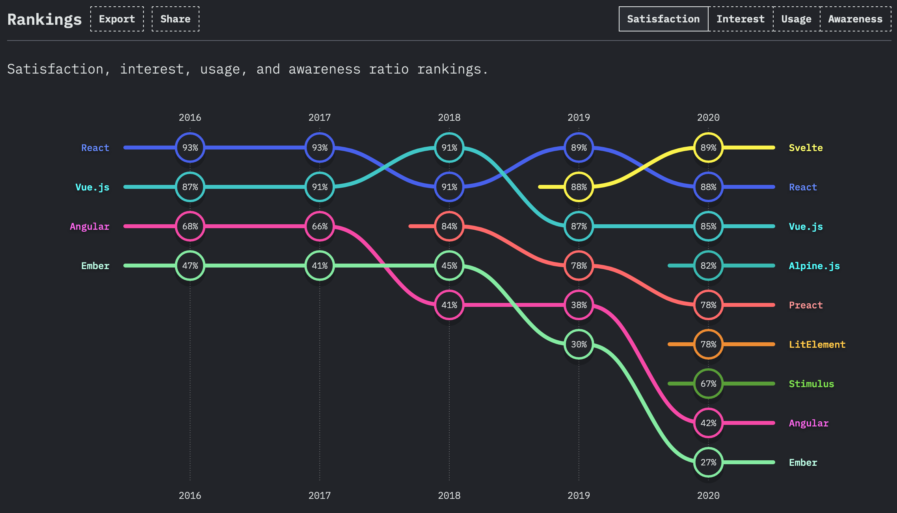

import TopPageMargin from "~/components/TopPageMargin";

<TopPageMargin />

In simple terms, Svelte is a JavaScript framework ([technically a compiler](https://developer.mozilla.org/en-US/docs/Learn/Tools_and_testing/Client-side_JavaScript_frameworks/Svelte_getting_started#how_does_svelte_work)) that simplifies the experience of making stuff on the web. Like other UI frameworks, its selling point is that it abstracts the hard parts of interacting with the Document Object Model (or DOM) using some magic behind the scenes to render reactive updates when necessary.

On a very high level, a Svelte application is powered by a series of **(`.svelte`) files**, each representing a **component**. A file will contain up to three elements: a `<script>` tag (where your *logic* lives), a CSS `<style>` tag (where your *design* lives), and some markup (where your *content* lives). For example, the simplest app might look like this:

{lang=html}  
<<[App.svelte](./protected/App.svelte)

<App />

<!-- FIXME: Can I render the output here? Or use REPL -->

### Designed with visualization in mind

Svelte was an innovation from Rich Harris, who at the time was a graphics journalist at the Guardian. Given that its creator made graphics for a living, it's no surprise that it works well for graphics development (as we’ll see in this course). Data is integrated into Svelte’s markup more intuitively than any other framework, making it a tool well-suited for designing data visualizations.

If you are questioning whether Svelte is the right framework for you, remember who created it. In contrast to Vue, React, and Angular, Svelte was designed by someone who *works with data visualization everyday*, meaning the language’s design is particularly well-suited for this purpose.

### A growing framework

It's a particularly good time to be learning Svelte. The framework was [ranked](https://insights.stackoverflow.com/survey/2021#section-most-loved-dreaded-and-wanted-web-frameworks) the #1 most loved framework in the 2021 Stack Overflow Developer Survey. It [garnered](https://2020.stateofjs.com/en-US/technologies/front-end-frameworks/) the highest level of satisfaction in the 2020 State of JS survey.

Svelte is growing in popularity among visualization practitioners in particular. Increasingly, people are realizing the power of web frameworks when approaching data visualization (see this blog post by [Amelia Wattenberger](https://wattenberger.com/blog/react-and-d3), or this post by... [me](https://www.connorrothschild.com/post/svelte-and-d3/)). Simultaneously, people are increasingly frustrated with D3’s learning curve. Svelte is the perfect tool to meet these converging trends, because it is more intuitive than existing frameworks and because it removes any need for D3’s confusing selection methods (more on that later).

### Learning Svelte

**This course will provide a comprehensive overview of the parts of Svelte you need to know for data visualization.**

If you are interested in learning more about Svelte before getting started (including the elements that are less important for data visualization), [the Svelte tutorial](https://svelte.dev/tutorial/basics) is 100% the best place to start. This tutorial gives you an interactive overview of Svelte. 

Beyond that, here are some resources that may be helpful:

- [Geoff Rich’s blog](https://geoffrich.net/)
- [Tan Li Hau’s blog](https://lihautan.com/blogs/)
- [Steph Dietz’ blog and videos](https://steph-dietz.com/)
- [Svelte Sirens’ streams](https://sveltesirens.dev/streams)
- [Svelte Summit Conference videos](https://www.youtube.com/watch?v=qqj2cBockqE)
