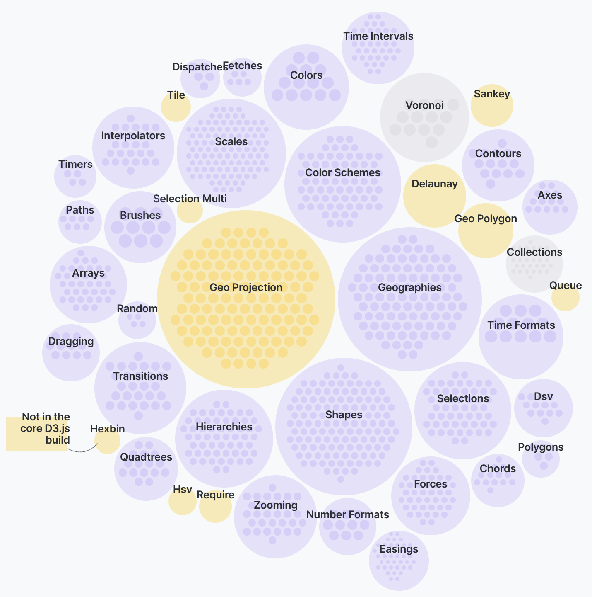
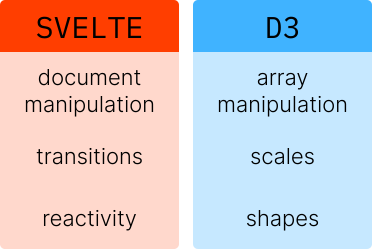

import TopPageMargin from "~/components/TopPageMargin";

<TopPageMargin />

If you’ve made it this far, you’re probably asking: *what about D3?* (And if you don’t know what D3 is, don’t worry about it! We’ll review below.)

## What is D3?

[**D3.js**](https://d3js.org/) (or D3, which stands for Data-Driven Documents) is a JavaScript library that makes it easy to integrate data directly into the [Document Object Model (or DOM)](https://developer.mozilla.org/en-US/docs/Web/API/Document_Object_Model/Introduction).

What does that mean, practically? D3 makes it easy to take large bits of data (say, an array of 10,000 objects) and bind them to the DOM, linking this data to HTML or SVG elements in your webpage.

To illustrate, let’s take a step back and see how we would include data in a webpage *without D3.* In vanilla JavaScript, if we had five `<circle />` elements in an SVG and wanted to set their x-position (`cx`) according to some data, we would do something like this:

```js
let data = [1, 2, 3, 4, 5];
let circles = document.getElementsByTagName("circle");
for (var i = 0; i < circles.length; i++) {
  let circle = circles.item(i);
  circle.setAttribute("cx", data[i] * 10);
}
```

This code is highly imperative, verbose, and not fun to read. D3, however, would simplify this code and reduce its length by a factor of ~4:

```js
let data = [1, 2, 3, 4, 5];
d3.selectAll("circle").data(data).attr('cx', d => d * 10);
```

D3 then, makes it easier to interact with elements on a webpage by leveraging its **selection methods** and its **data binding**. This is why D3 has become a mainstay in data visualization over the past 10 years, and is now a de facto requirement for complex visualization roles in newsrooms.

### So why *not* D3?

The above example uses D3-specific syntax to 1) select elements on a webpage, 2) bind data to those elements, and 3) update attributes accordingly. 

This is better than the highly imperative vanilla JavaScript code, but what if there were a better way?  

What if we had a tool that enabled us to bind our data to these elements **directly inline**, rather than *telling* JavaScript to do it for us? 

(We do have that tool: it’s called Svelte.)

```html
<script>
	let data = [1, 2, 3, 4, 5];
</script>

<svg>
	{#each data as d}
		<circle cx={d * 10} cy={d * 10} r={5} fill='plum' />
	{/each}
</svg>
```

You don't have to understand what's happening in the example above. The key point: In D3, there is a disconnect between *what we write* (our selection methods) and *what is rendered* (the SVG and its constituent elements). In Svelte, *we write what we render* and include our data directly, using tools like `{#each}` loops and inline data binding.

This makes for a better developer experience, easier debugging, and a more intuitive mental model.

Traditional JavaScript (example #1) requires us to give instructions in our code, telling JS exactly what to do and where to insert data in our webpage. D3 (example #2) does the exact same thing, but with more concise code. Svelte (example #3) allows us to *stop giving instructions* and simply write our content with data embedded.

### But wait, there’s more

To be clear, D3 and Svelte are not in opposition to one another. Instead, the tools are complementary. 

A common misconception about D3 is that it is all-encompassing; people assume that they either use D3, or they don’t. And they also assume that if they use D3, their entire project will be built using D3. 

This is the wrong approach to D3. Instead, D3 should be viewed as a **collection of modules that can be used in isolation**, depending on your projects’ needs. For example, D3 includes modules that are suited for interacting with the DOM (like [`d3-selection`](https://github.com/d3/d3-selection/)), but it also includes modules that are fully divorced from the DOM, like those suited for array manipulation ([`d3-array`](https://github.com/d3/d3-array/)) or scaling data ([`d3-scale`](https://github.com/d3/d3-scale)).

As this [great introduction](https://wattenberger.com/blog/d3) to D3 from Amelia Wattenberger illustrates, D3 is 1) enormous (there are dozens of modules) and 2) diverse in its purposes, with different modules focusing on DOM manipulation, geographic visualization, and performant transitions.



So we will be using D3, but we will be selective in the modules that are best suited for our visualization. Which modules are those?

### Svelte for the DOM; D3 for the data

This course will use both Svelte and D3, in combination, to design powerful data visualizations. In particular, it will leverage the two tools in the areas they are most powerful in: **Svelte for the DOM** and **D3 for the data.**

To be more descriptive, we will use Svelte for DOM manipulation and D3 to construct scales and to manipulate arrays. Once we break out of the “D3 project” or “Svelte project” paradigm, we can see the ways that the two languages complement each other.



One important thing to remember throughout this course: this new paradigm means that D3 is *a tool* in our visualization toolkit. It is not the **primary tool** as it has been in most large-scale visualization projects over the last few years. Let's see what that looks like.

### Svelte + D3 in Action

What does this look like in practice? Here’s some code (that you don’t have to understand yet!) to illustrate the division:

```html
<script>
	let width = 300;
	let height = 300;
	let data = [2, 4, 6, 8, 10];

	import { scaleLinear } from "d3-scale"; // D3!
	$: xScale = scaleLinear()
				.domain([0, 10])
				.range([0, width]);
</script>

<svg {width} {height}>
	{#each data as d}
		<circle cx={xScale(d)} 
		cy={height / 2} 
		r={10} 
		fill="plum" />
	{/each}
</svg>
```

Here, we are using Svelte to bind our data to our `<circle />` elements directly, because this makes more sense than doing it through a function found in `d3-selection`. (Again, we can *bind our data inline* rather than *tell D3 to bind it for us.*) 

But in order to map our raw data to a point on the canvas, we need a tool that translates numbers nicely, making a perfect use case for the `scaleLinear` function from `d3-scale`! 

Again, we are using Svelte for the DOM, and D3 for the data. This example illustrates how you will use Svelte + D3 throughout this course, leveraging each tool's best parts to create better data visualizations.
