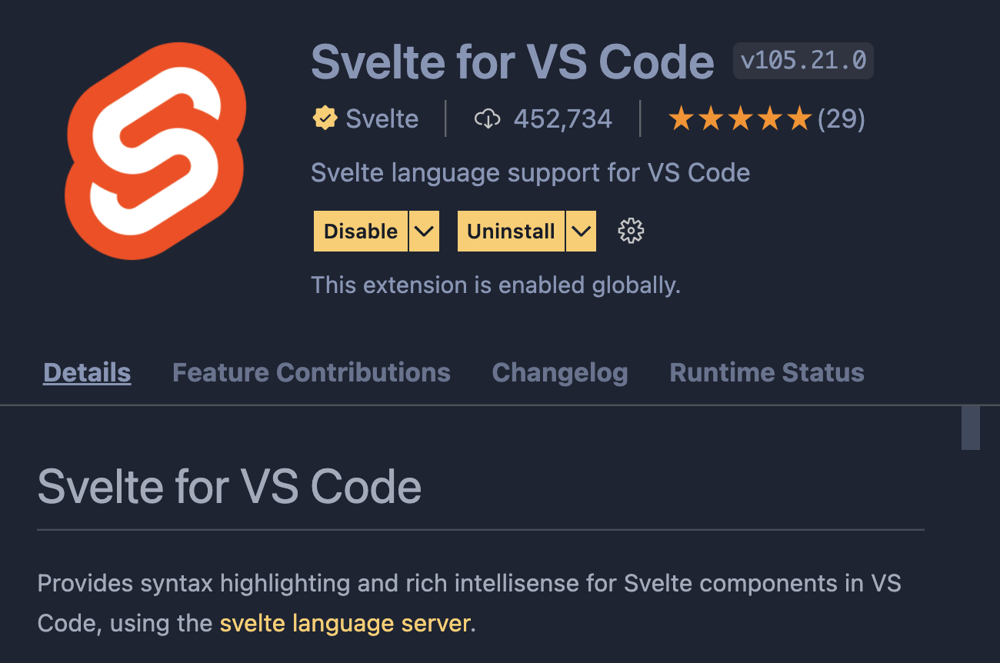

import TopPageMargin from "~/components/TopPageMargin";

<TopPageMargin />

:::note 

A quick note on setup. Setting up a new project can be the hardest part of learning any new tech. (I still get headaches from frustrating setup errors, years into this work!) In the near-inevitable event that you run into hurdles, please don't hesitate to reach out for help via [Twitter DM](https://twitter.com/CL_Rothschild).

:::

We'll use the [command line](https://en.wikipedia.org/wiki/Command-line_interface) to interact with our computer's file system through **commands**, rather than **clicks**. On Mac, you'll use Terminal, and on Windows, you'll likely use [Powershell](https://docs.microsoft.com/en-us/powershell/scripting/overview).

Open Terminal (on Mac) or Powershell (on Windows) and navigate to the directory you want to create your project in. (I recommend creating a new folder, perhaps in `Desktop/`, for this course in particular). 

:::note

Some command line tips:

* You can navigate folders by typing `cd <folder>` (forward) or `cd ../` (back)
* You can see all folders and files "ahead" of you by typing `ls`
* You can create a new folder with the command: `mkdir <new-folder-name>`

For example, you might run the following commands in order to get started.

```shell
cd Desktop
mkdir svelte-dataviz-course
cd svelte-dataviz-course
```

:::

Creating a Svelte application will require you to set up Node and NPM. If you don't already have Node, you can [install it here](https://nodejs.org/en/download/). If you're running into issues, you can [troubleshoot here](https://docs.npmjs.com/downloading-and-installing-node-js-and-npm).

Once Node is installed, You can initialize a Svelte application by cloning the [barebones template I've put together for this course](https://github.com/connorrothschild/svelte-visualization-template). 


In your terminal, navigate to the directory you want to create your project in, and run the following command:

```shell
npx degit connorrothschild/svelte-visualization-template my-first-svelte-app
```

:::note Not sure what's happening here?

We're using [`npx`](https://blog.npmjs.org/post/162869356040/introducing-npx-an-npm-package-runner) — a tool for executing Node packages — to run [`degit`](https://github.com/Rich-Harris/degit), a scaffolding tool that makes copies of git repositories, to copy my template onto your computer!

The syntax here is:

```shell
npx degit <project-to-clone> <new-project-name>
```

:::

This will create a new folder titled `my-first-svelte-app` (unless you supplied a different name). You can navigate to that folder by `cd`ing into it on the command line, like so:

```shell 
cd my-first-svelte-app
```

Now, you're inside your Svelte app's folder. If you want to see the contents of your directory, you can run the following command:

```shell
ls
```

We'll get into these contents as we go throughout the course. 

### Visual Studio Code

In order to edit your Svelte app, you'll need a code editor. I use, and highly recommend [VS Code](https://code.visualstudio.com/).

---

#### If you are on Mac 

After installing VS Code, open the application and follow [these instructions](https://code.visualstudio.com/docs/setup/mac#_launching-from-the-command-line) so that you can open VS Code from the command line:

* Open the Command Palette (<kbd>Cmd</kbd> + <kbd>Shift</kbd> + <kbd>P</kbd>) and type "shell command"
* Click on the option **Shell Command: Install 'code' command in PATH**
* Restart your terminal

Now, you're able to open VS Code from the command line. After navigating back to your project's folder (using `cd`), run `code .` (which means "open VS Code in the *current directory*").

```shell
code .
```

#### If you are on Windows

Open Visual Studio Code and find the project directory we've been working in. It is important that you open at the project's root (e.g. the folder that contains these files and folders):

```
README.md		package.json
index.html		public
jsconfig.json	src
node_modules	vite.config.js
package-lock.json
```

You've now opened your project in VS Code. Congrats! You should see something like this:


### Install VS Code Extensions

If you are using VS Code, you can install various extensions to make code authoring easier, safer, and more efficient. In particular, we'll want [**Svelte for VS Code**](https://marketplace.visualstudio.com/items?itemName=svelte.svelte-vscode).

To install Svelte for VS Code, open the Extensions tab in VS Code (on the left sidebar, or by typing <kbd>Cmd</kbd> + <kbd>Shift</kbd> + <kbd>X</kbd>), and search for it. When the extension appears, click the **Install** button.



Then restart VS Code. Now your `.svelte` files will have proper syntax highlighting, code autocompletion, and more.

---

### Running a live server

From here, we want to run a *live server*. This will allow us to see the application in action.

In our VS Code, let's open an [integrated terminal](https://code.visualstudio.com/docs/editor/integrated-terminal). Essentially, this means that we can see the same command line interface we were just using, but directly in our VS Code. Here are two options for opening the integrated terminal:

* Use the `` ⌃` `` (`control` + `backtick`) keyboard shortcut
* In your toolbar, click **View** -> **Terminal**

You should see something like this at the bottom of your VS Code: 


Let's use this terminal for interacting with our project. For now, we need to install the necessary packages. This is as simple as running the following command:

```shell 
npm install
```

Now, we're ready to start our application!

```shell
npm run dev
```

There we have it! Navigate in your browser (I recommend Chrome, or Firefox) to [`localhost:5173`](http://localhost:5173/). You have an application up and running.

<!-- It should look like this: -->

<!-- FIXME: -->
<!-- <Embed title="gv8115" previewOnly module="01" lesson="04" /> -->

:::tip

If you ever want to stop the live server, you can use the shortcut <kbd>Ctrl</kbd> + <kbd>C</kbd> while your terminal is in focus.

:::

### Making changes

Within VS Code, we can see all of our project files in the left sidebar. Open the `src/` folder and click on `App.svelte`.


Now you're viewing the main page of your app. Let's edit it.

`App.svelte` contains three sections, following the conventional structure of any Svelte file: 

1. At the top is the `<script>` tag which will contain the app's logic via JavaScript.
2. The middle of the file has the HTML markup.
3. At the bottom is the `<style>` tag which will contain the app's style via CSS.

```html
<script>
  // Logic goes here (JavaScript, Svelte)
</script>

<main>
<!-- Markup goes here (HTML, SVG) -->
</main>

<style>
  /* Styles go here (CSS) */
</style>
```

To see the live editing in real time, go ahead and edit the `<h1>` tag which currently reads, **Let's make a chart**, to say, **Let's make *our first* chart**.

Now that we know how to initialize, open, run, and edit our app, we're ready to get into our first module: [**A Simple Scatterplot**](./what-well-be-building).

### Still stuck?

If none of this is working, you can always follow along in your browser. To do so, [visit this CodeSandbox link](https://codesandbox.io/s/svelte-visualization-template-gv8115?module=src/App.svelte), and fork it to make your own project.
