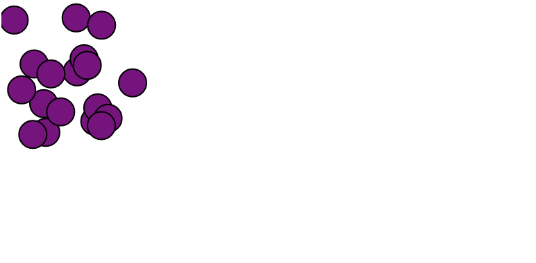
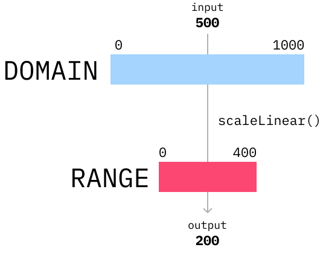

import Embed from "~/components/Embed";
import Blockquote from "~/components/Blockquote";
import TopPageMargin from "~/components/TopPageMargin";

<TopPageMargin />

We'll be creating our first visualization locally, in the folder you just created (`simple-scatterplot/`). If you need to revisit how to create the Svelte app, visit [this lesson](../your-first-svelte-app/).

Our module begins by drawing some <strong>circles</strong>: the essential element of a scatterplot. This requires four steps:

1. Looping through data in our markup 
2. Creating `<circle />` elements
3. Scaling raw data to physical points
4. Sizing our SVG element

### 1. Looping through data in our markup

Looping through our data requires us to import our data. 

Our toy dataset will include data on around 20 students, including their names, their hours studied throughout the course, and their final grades. This data will live in our `data/` folder, and we'll name the file, `data.js`.

```js
export default [
  { name: "Antonio", hours: 44, grade: 50 },
  { name: "Sai", hours: 60, grade: 99 },
  { name: "Yohan", hours: 23, grade: 50 },
  { name: "Krishna", hours: 15, grade: 34 },
  { name: "Jennifer", hours: 10, grade: 20 },
  { name: "Cedric", hours: 25, grade: 65 },
  { name: "Jaylen", hours: 46, grade: 35 },
  { name: "Ethan", hours: 30, grade: 30 },
  { name: "Roy", hours: 8, grade: 10 },
  { name: "Denizhan", hours: 35, grade: 79 },
  { name: "J", hours: 52, grade: 65 },
  { name: "Greyson", hours: 39, grade: 50 },
  { name: "Marshall", hours: 16, grade: 30 },
  { name: "Jonny", hours: 30, grade: 53 },
  { name: "McKenna", hours: 40, grade: 56 },
  { name: "Drake", hours: 45, grade: 75 },
  { name: "Justin", hours: 14, grade: 49 },
  { name: "Joe", hours: 23, grade: 59 }
];
```

In order to import it in `App.svelte`, we need to add the following line to our `<script>` tag:

```js
import data from '$data/data.js';
```

:::note 

This uses an [aliased import](https://mtm.dev/svelte-vite-aliases) to find and import from our `src/data/` folder, no matter where we are in our app. This prevents needlessly long strings such as `../../../src/data/`.

Throughout this course, we will alias common folders, like `data` (`$data`) and `components` (`$components`).

:::

Now, we can access our data in our `App.svelte` file by using the `data` variable. For example, print the structure of `data` in your console to verify that everything is appearing properly. 

```js
console.log(data)
```

In Svelte, we use `{#each}` blocks to loop through our data in our markup directly. The common structure for this is as follows:

```html
<script>
  let array = [1, 2, 3];
</script>

{#each array as item}
    {item}
{/each}
```

... where `array` is a preexisting variable (in an array) and `item` is the arbitrary name of the iterated variable we want to access within the block.

If `array` is an array of objects, as it most commonly will be, we will access the object's properties by using the dot notation, e.g. `{item.name}`.

Back to our app. After our data import, in our markup template (in the middle of your file), you'll write the following: 

```html
<script>
  import data from "$data/data.js";
</script>

{#each data as d}
    {d.name}
{/each}
```

:::note 

`d` is commonly used in data visualization contexts to reference the **current data element**. A common pattern, for example, is `data.map(d => d.variable)`. We'll use `d` in `{#each}` loops to represent **the current row**. You can read more about that [here](https://stackoverflow.com/a/24359419).

:::

Upon saving, you'll notice that this prints the names of each of the students in our dataset, one by one. If we changed our code to instead print `{d.hours}`, we would see the hours studied for each student.

Now that we know how to loop through our data, we can move on to the next step: rendering our circles.

### 2. Rendering `<circle />` elements

As we covered in an earlier module, the building blocks of our scatterplot will be `<circle />` elements. This SVG element has a series of **attributes** that we can use to customize its appearance.

* `cx`: the x-coordinate
* `cy`: the y-coordinate
* `r`: the radius 
* `fill`: the circle's fill
* `stroke`: the color of the circle's border
* `stroke-width`: the width of the circle's border

You can read more about the `<circle />` element and its attributes [here](https://developer.mozilla.org/en-US/docs/Web/SVG/Element/circle).

In our app, we'll loop through our data and create `<circle />` elements for each student. We'll use the following structure:

```html
<svg>
  {#each data as d}
      <circle
        cx={} 
        cy={} 
        r={} 
        fill="" 
        stroke=""
        stroke-width={} 
      />
  {/each}
</svg>
```

We want each of our circles to have the same `fill`, `stroke`, and `stroke-width`; so we can set those now:

```html
<svg>
  {#each data as d}
      <circle
        ...
        fill="purple" 
        stroke="black" 
        stroke-width={1} 
      />
  {/each}
</svg>
```

For now, we'll give the circles a `cx` and `cy` of some random number between 0 and 100, just so that we can see them on our screen.

```html
<svg>
    {#each data as d}
        <circle
          cx={Math.random() * 100} 
          cy={Math.random() * 100} 
          r={10} 
          fill="purple" 
          stroke="black" 
          stroke-width={1} 
          />
    {/each}
</svg>
```



Voila! We have a set of circles, each in our SVG element. The x- and y-coordinates of each circle are a bit more complicated. We'll want to base them on the `hours` and `grade` of each student, but we can't use the **raw values**. Instead, we need to scale these values.

### 3. Scaling raw data to physical points

We know we want to use the `hours` and `grade` values to determine the x- and y-coordinates of our circles. We need to **scale** them.

That is to say, we want to translate each of our **raw data points** to **physical points** on our scatterplot. In order to do that, we'll use [`d3-scale`](https://github.com/d3/d3-scale) — in particular, [`scaleLinear`](https://github.com/d3/d3-scale#scaleLinear).

:::note

In order to use any method from `d3-scale`, we need to download the package from [npm](https://www.npmjs.com/package/d3-scale).

This can be done by running the following code in our terminal:
    
```shell
npm install d3-scale
```

:::

The typical structure of a linear scale is as follows:

```js
import { scaleLinear } from "d3-scale";

let xScale = scaleLinear()
  .domain()
  .range(); // The range of outputs we want to return in px [min, max]
```

Visually, a scale looks like this: 



In both `domain()` and `range()`, we provide an array of two numbers: the minimum and maximum value. So in the above image, we would pass `[0, 1000]` to the `domain()`, and `[0, 400]` to the `range()`. Then passing any number into our newly created `xScale` will return an output based on our domain and range. In the above example, passing `500` would return `200`, because it is the midpoint of the range.

---
### `xScale`

In our `domain()` (think, **input**), we will provide an array of two values representing the smallest possible value (from our data) we would pass to the scale, and the largest.


Let's describe exactly what we want to do: we want to translate each of our points' `grade` value to an x-position on our scatterplot.

In our case, the domain of possible inputs is simple: 0% to 100% (the full range of possible grades).

```js
let xScale = scaleLinear()
  .domain([0, 100]) // ✅
  .range(); // The range of outputs we want to return in px [min, max]
```

As for our `range()` (think, **output**), we'll want the minimum to be 0 (representing the leftmost edge of our scatterplot), and the maximum to be our width of the SVG element.

Let's create a variable called `width` and set it to some arbitrary value (for now). Then we can use this in our `range()`.

```js
let width = 400;

let xScale = scaleLinear()
  .domain([0, 100]) 
  .range([0, width]); // ✅
```

Now, `xScale` works like a function. You can pass a number (between 0 and 100) into `xScale`, and it will return a number (between 0 and 400, our width).

```js
xScale(0); // Returns 0
xScale(50); // Returns 200
xScale(100); // Returns 400
xScale(73.7); // Returns 294.8
```

Now that we know how to use `scaleLinear`, we can use it to scale our data. Within our `{#each}` loop, we can use `xScale` to scale the `grade` value of each student.

```html
{#each data as d}
    <circle
      cx={xScale(d.grade)} 
      cy={Math.random() * 100} 
      ...
    />
{/each}
```

Easy enough! Now we can do the same thing for our y-coordinates (As a reminder, we're rendering the **number of hours studied** on the Y axis). In constructing this scale, we can't simply pass a domain like `[0, 100]`; instead, we want to pass the lowest and highest "hours studied" values in our data.

In order to get the lowest and highest values, we can use the `max` function from [`d3-array`](https://github.com/d3/d3-array).

:::note

The `max` function takes an array of data and returns its largest value. More documentation can be found [here](https://observablehq.com/@d3/d3-extent).

:::

**After importing `d3-array` in your terminal** (using `npm install d3-array`), we can use `max` like so:

```js
import { max } from "d3-array";

let height = 400;
let yScale = scaleLinear()
  .domain([0, max(data, d => d.hours)]) // max(<array>, <accessor function>)
  .range([height, 0]);
```

:::note

Here, the range sets the height to be the minimum, and 0 to be the maximum. This is slightly confusing, but it's because SVG coordinates are upside down. (And get used to this, because it's a frequent pattern!)

As explained in this [Observable notebook](https://observablehq.com/@d3/d3-scalelinear#cell-166): 
<Blockquote>This is very common when using canvas or SVG to draw our visualization: in these two systems, the coordinates are pointing down, from top to bottom. As we usually expect the minimum value to be placed “lower” on the image than the maximal value, the scale’s range will be described by a flipped interval.</Blockquote>

:::

Now, we have a functioning `yScale` that takes in any number of hours studied, and returns a y-coordinate on our scatterplot.

### 4. Use our `width` and `height` variables to set the size of our SVG element

In the above step, we created two variables: `width` and `height`. If these are in fact the width and height of our SVG element, we need to account for that in our SVG element.

`<svg />` container elements take attributes just like `<circle />` elements do. The two important ones here are `width` and `height`.

```html
<svg width={width} height={height}>
  <!-- Circles go here -->
</svg>
```

:::note 

Because the name of our width variable is the same as the SVG attribute, we could skip the labelling and use a [**shorthand attribute**](https://svelte.dev/tutorial/dynamic-attributes), replacing `width={width}` with just `{width}`.

:::

### Bringing it all together

Let's review what we have:

* An array of students in our `data` variable
* An `{#each}` loop that iterates over each student in our `data` variable
* An SVG element, with its size defined by our `width` and `height` variables
* A series of `<circle />` elements, positioned according to their `grade` and `hours` values, scaled with `scaleLinear`

Altogether, we have a scatterplot (that won't be winning any data visualization awards, yet):

<Embed title="fqb6x8" module="01" lesson="01" />

In our [next lesson](../adding-peripheral-elements/), we'll improve this chart by adding "peripheral" elements: axes, gridlines, and labels.

### Need help? Further reading

#### Svelte/looping through data
* [`{#each}` blocks](https://svelte.dev/tutorial/each-blocks)
* [Dynamic attributes](https://svelte.dev/tutorial/dynamic-attributes)

#### SVG
* [Introduction to SVG](https://developer.mozilla.org/en-US/docs/Web/SVG/Tutorial/Introduction)
* [SVG `<circle />` element](https://developer.mozilla.org/en-US/docs/Web/SVG/Element/circle)

#### Scaling
* [`min`, `max`, `extent`](https://observablehq.com/@d3/d3-extent)
* [`scaleLinear`](https://observablehq.com/@d3/d3-scalelinear)

<!-- #### NPM/package installation
* [npm](https://www.npmjs.com/) -->
