import Embed from "~/components/Embed";
import Highlight from "~/components/Highlight";
import TopPageMargin from "~/components/TopPageMargin";

<TopPageMargin />

In this lesson, we'll improve this chart by adding "peripheral" elements: axes, gridlines, and labels. As a reminder, here's where we left off last lesson:

<Embed title="fqb6x8" module="01" lesson="01" />

From here, we want to add three elements:

- Axes with ticks
- Gridlines
- Axis titles

## 1. Constructing axes

Our first step will be drawing axes. In particular, we want two: a horizontal (x) axis, and a vertical (y) axis. First, let's create our X-axis. In order to make our codebase cleaner, we'll separate all of our axis-related code into **separate components**. 

### X-axis

In your project, create a new file called `AxisX.svelte`. It will live in our `src/components/` folder. Once it's created, you can import it in `App.svelte` like this:

```html
<script>
  import AxisX from '$components/AxisX.svelte';
</script>
```

And in your markup, you can use the component like this: `<AxisX />`

We want our axis to live within our SVG element, so we'll render it right before our `{#each}` loop that contains our circles.

```html
<svg>
  <AxisX />
  {#each data as d}
    ...
  {/each}
</svg>
```

Right now, this will change nothing, because `AxisX` is an empty file. Once we add some markup to that file, it will change the appearance of the app.

So what do we want in our `AxisX.svelte` file? We want a **series of ticks**, with each tick having some text and a tick line.

In our x axis, we want to render the ticks at the following values: 0, 25, 50, 75, and 100. These are reasonable cutoffs for something like a grade.

Let's define our ticks in a variable called `xTicks`.

```js
let xTicks = [0, 25, 50, 75, 100];
```

In a second, we'll use an `{#each}` loop from the last lesson to render each tick. But first, let's define exactly what we want to see in each tick: a **tick line**, and a **tick label**. Because we want these two elements to appear next to each other (and share roughly the same position), we'll use a `<g>` element to group them together.

:::note 

The `<g>` element is just a grouping element. It's useful for grouping together elements that share similar properties. We can apply transforms to `<g>` elements, and all of their children will shift accordingly.

:::

So on a high level, for each tick, we want to do something like this:

```html
<g class='axis x'>
  {#each xTicks as tick}
    <g>
      <line ... /> <!-- Our axis tick-->
      <text ... /> <!-- Our axis text-->
    </g>
  {/each}
</g>
```

For now, we'll focus on just text:
  
```html
<g class='axis x'>
  {#each xTicks as tick}
    <g>
      <!-- <line /> -->
      <text>{tick}%</text> <!-- We append the % because this is a grade -->
    </g>
  {/each}
</g>
```

This does render our five ticks; but we can't see them for two reasons: they are at the top of our chart, and they all share the same x position of 0.

In order to shift all of our ticks down, we'll need to use a `transform` property.

:::note

Using `transform: translate(<x>, <y>)` applies a shift to an element. If we applied a transform of `translate(0, 20)`, all of our ticks would shift down 20 pixels. You can read more about `translate` [here](https://developer.mozilla.org/en-US/docs/Web/SVG/Attribute/transform#Translate_attribute).

:::

Since we want to shift all of our ticks down, we'll apply this transform to the outer `<g />` container.

```html
<g class='axis x' transform="translate(0, 20)">
    <!-- All of our ticks-->
</g>
```

But in our chart, we don't want to translate 20px down; we want to translate down the height of the chart. That means we'll want to import `height` from `App.svelte`. We can do this using [props](https://svelte.dev/tutorial/declaring-props).

In `App.svelte`, we will pass `height` as a variable into `<AxisX />`, like this:

```html
<AxisX height={height}  /> 
```

Then in `AxisX.svelte`, we import the prop in our `<script />` tag.

```html
<script>
  export let height;
</script>
```

:::note

This is sort of confusing, but it's important to wrap our heads around how props work early on. Essentially, you pass props **into** components (`<AxisX prop={prop} />`) and then **accept** them in those components, using `export let prop`.

:::

Now that we have `height` in our `AxisX.svelte` file, we can reference it in our `<g>` element.

<!-- FIXME: Can I highlight the first line of code here? -->
<!-- ✅ is a placeholder for line highlighting -->
```html
<g class="axis x" transform="translate(0, {height})"> <!-- ✅ -->
  {#each xTicks as tick}
    <g>
      <!-- <line /> -->
      <text>{tick}%</text>
    </g>
  {/each}
</g>
```

Would you look at that! We now have five ticks at the very bottom of our chart:

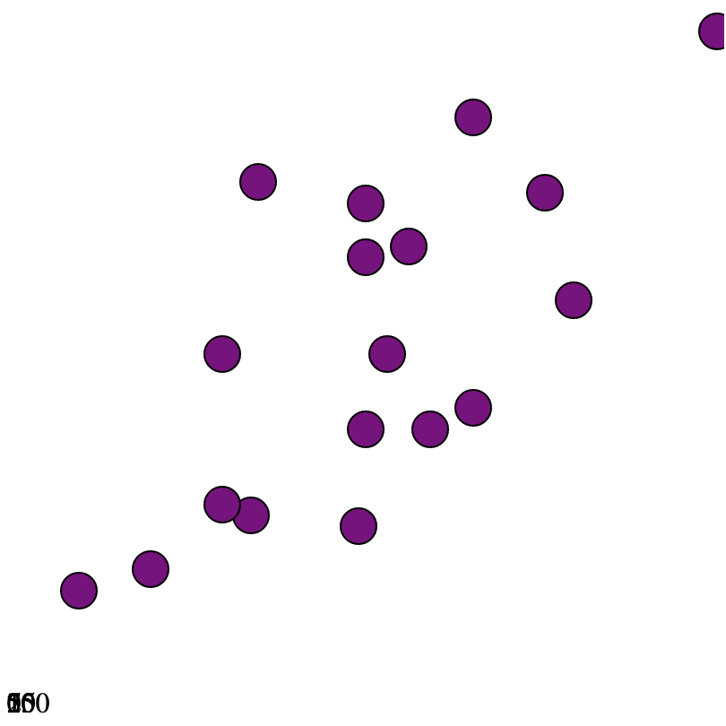

Right now, all of our ticks share the same x position. We want them to be evenly spaced across our axis. They should also correspond exactly to the existing `xScale`, to make for an accurate chart.

This requires us to tell our component what tick values to use — in other words, our `AxisX` component has to know about the `xScale` we're using in `App.svelte`. To get that information into `AxisX`, we'll pass it in as a prop as well.

In `App.svelte`'s reference to `AxisX`, we'll pass in the `xScale` as a prop.

```html
<AxisX height={height} xScale={xScale} /> 
```

And within our `AxisX.svelte` file, we accept the prop using the following syntax in our `<script />` tag:

```html
<script>
  export let height; // from earlier 
  export let xScale; // ✅
</script>
```

Now, `xScale` exists **within** `AxisX.svelte`, and it will update anytime its initial value from `App.svelte` changes.

If you recall, from the last lesson, `xScale` takes in an input (from our domain) and returns an output (from our range). The beautiful thing here is this: we can pass in any of our `xTicks` to return the correct `x` position.

```html
<g class="axis x" transform="translate(0, {height})">
  {#each xTicks as tick}
    <g class='tick' transform="translate({xScale(tick)}, 0)">
      <!-- <line /> -->
      <text>{tick}%</text>
    </g>
  {/each}
</g>
```

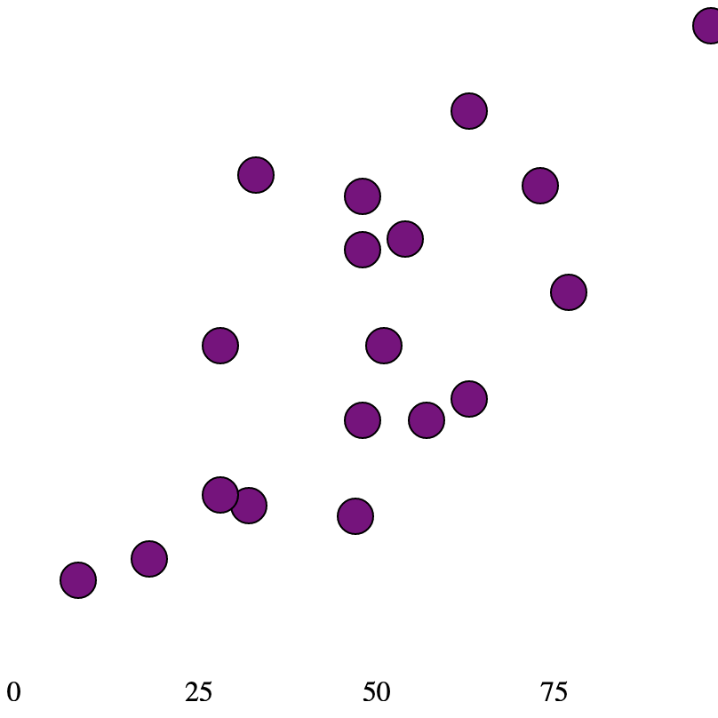

Now our ticks are evenly spaced across our axis, and they are at the bottom of our chart. 

Let's add the tick lines. In order to do so, we'll create a `<line />` element for every tick. `<line />` elements take the following attributes:

- `x1`: the x position of the start of the line
- `y1`: the y position of the start of the line
- `x2`: the x position of the end of the line
- `y2`: the y position of the end of the line
- `stroke`: the color of the line

```html
<line x1="0" y1="0" x2="0" y2="6" stroke="hsla(212, 10%, 53%, 1)"/>
```

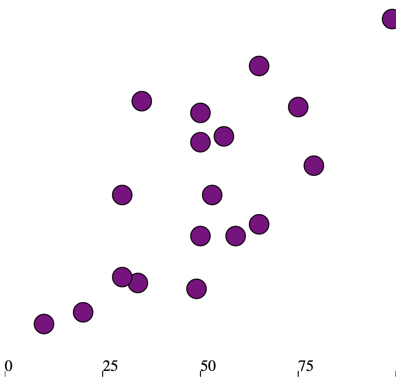

This creates some ticks, but they're out of place. We want to place our `<text />` elements under each tick, as is common in charting. So let's keep our lines as they are, but push our `<text />` elements down by 6 pixels via the `y` attribute.

```html
<line x1="0" y1="0" x2="0" y2="6" stroke="hsla(212, 10%, 53%, 1)"/>
<text x="0" y="6">{tick}%</text>
```

:::note 

Recall that our ticks are wrapped in a `<g />` element which translates them to the bottom of the chart. When we translate our `<text />` elements by `6`, they will be pushed down from the starting point of the already translated `<g />` element.

:::

This pushes down our text to be flush with the tick, but we want it below. We can push it down further, intelligently, with two strategies:

* The `dy` attribute.
* The `dominant-baseline` property

#### 1. The `dy` attribute

The first thing we'll do to shift our text down is supply a `dy` attribute to our text.

The `dy` attribute is used to shift the text down by a certain amount (and its equivalent `dx` does the same for shifting right). It comes in handy when you want to reserve `y` (or `x`) for something rooted in data, and `dy` (or `dx`) for nudges.

:::note

You can read more about `dy` [here](https://developer.mozilla.org/en-US/docs/Web/SVG/Attribute/dy).

:::

```html
<line x1="0" y1="0" x2="0" y2="6" stroke="hsla(212, 10%, 53%, 1)"/>
<text x="0" y="6" dy="9">{tick}%</text>
```

This pushes the text down a bit, but we can use another property, `dominant-baseline`, to shift it down further.

#### 2. The `dominant-baseline` property

The `dominant-baseline` property controls text alignment on the vertical axis (think `text-align` but vertically). Here is a rough overview of how each property affects alignment (from MDN):

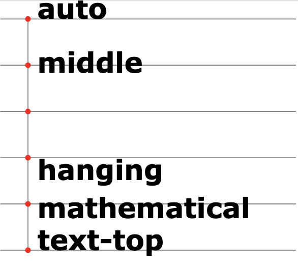

:::note 

You can read more about `dominant-baseline` [here](https://developer.mozilla.org/en-US/docs/Web/SVG/Attribute/dominant-baseline).

:::

We want each of our text elements to be aligned with the tick, so we'll set `dominant-baseline` to `middle`.

```html
<line x1="0" y1="0" x2="0" y2="6" stroke="hsla(212, 10%, 53%, 1)"/>
<text x="0" y="6" dy="9" dominant-baseline="middle">{tick}%</text>
```

While we're here, let's also control the text alignment on the horizontal axis, which we can do with the `text-anchor` property.

```html
<line x1="0" y1="0" x2="0" y2="6" stroke="hsla(212, 10%, 53%, 1)"/>
<text x="0" y="6" dy="9" dominant-baseline="middle" text-anchor="middle">{tick}%</text>
```


Would you look at that! We now have properly aligned text, right under each tick.

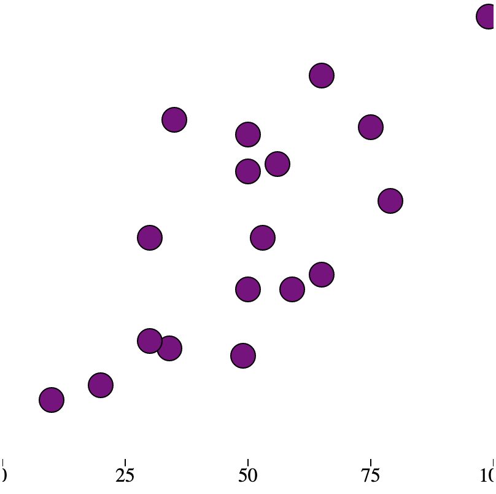

There is another obvious issue — the first and last ticks are cut off because there is not enough space for them. We'll address this when we add margin to our chart [later](#2-adding-margin-to-our-chart).

For now, let's move on to the y-axis.

### Y-axis

Using the same patterns as above, we'll construct a y-axis. We'll create a file of a similar structure, this time, called `AxisY.svelte`.

After creating `AxisY.svelte` in `src/components/`, we'll import it in `App.svelte`, render it directly before `AxisX`, and pass in our `yScale` as a prop.

```html
<script>
  import AxisY from "$components/AxisY.svelte";
</script>

<svg>
  <AxisY yScale={yScale} /> <!-- ✅ --> 
  <AxisX {xScale} {height} />
  <!-- Rest of chart goes here -->
</svg>
```

And within our `AxisY.svelte` file, we'll accept the prop in our `<script />` tag. Then, we want to use an [axis method called `.ticks()`](https://observablehq.com/@d3/scale-ticks) to generate an array of dynamic ticks based on the provided scale. Here, you supply the number of ticks you want as a parameter, and it returns an array of evenly spaced ticks.

```html 
<script>
  export let yScale; 
  let yTicks = yScale.ticks(4); 
</script>
```

If you `console.log` our `yTicks`, you'll see an array of length 4: `[0, 20, 40, 60]`.

:::note 

`.ticks()` used on a linear scale (like ours) only generates ticks at multiples of 1, 2, 5, and powers of 10, so it may return a number slightly different from what you provide. Read more about `.ticks()` [here](https://observablehq.com/@d3/scale-ticks).

:::

So, we have an array of evenly spaced ticks. Just as we did with our x axis, we'll loop through our array and create 1) a `<line />` element and 2) a `<text />` element for each tick.

```html
<g class='axis y'>
  {#each yTicks as tick}
    <g>
      <line />
      <text>{tick}</text>
    </g>
  {/each}
</g>
```

This time, we want each tick to be aligned left and translated **down**, using `yScale` to reflect the size of the chart.

```html
<g class='axis y'>
  {#each yTicks as tick}
    <g class='tick' transform="translate(0, {yScale(tick)})">
      <line />
      <text>{tick}</tick>
    </g>
  {/each}
</g>
```

Great! Now we have text for each y-axis tick.

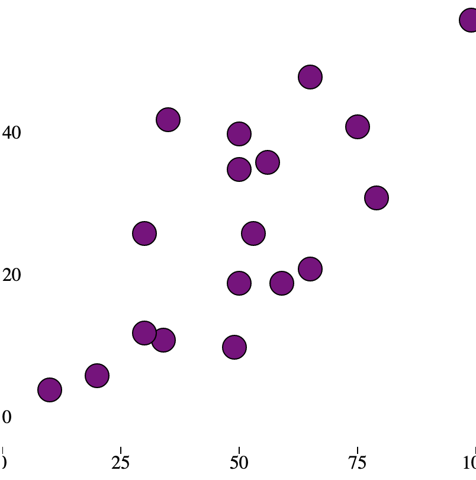

For our y-axis, let's have each line span the entire chart width, as a gridline of sorts. This requires us to import our chart width from `App.svelte`. Notice how `x2` is set to `width`.

```html
<script>
  export let width; // ✅
  export let yScale; // From earlier
  let yTicks = yScale.ticks(4); // From earlier
</script>

<g class='axis y'>
  {#each yTicks as tick}
    <g class='tick' transform="translate(0, {yScale(tick)})">
      <line x1={0} x2={width} y1={0} y2={0} stroke='black' /> <!-- ✅ -->
      <text>{tick}</text>
    </g>
  {/each}
</g>
```

Let's add a bit of space between our lines and our text by nudging our `<text />` elements up a bit.

```html
<text y={-3}>{tick}</text>
```

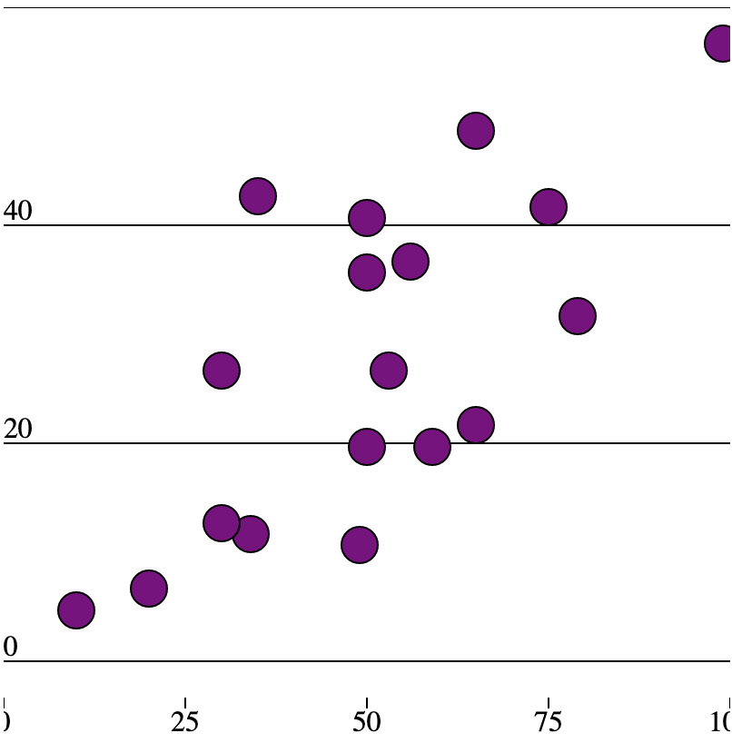

The final problem is that there isn't enough room to see all of our ticks (on both axes!). We can account for this by adding margin to our chart. 

## 2. Adding margin to our chart

In order to place our x-axis below our chart (not within), we need to add some margin. The same is true for the highest y-axis tick, which is not visible currently. 

We want to instantiate the `margin` variable at the highest level in `App.svelte`, so we can import and use it across components.

In `App.svelte`, let's create a `margin` object.

```js
const margin = {
  top: 20,
  right: 15,
  bottom: 20,
  left: 0
};
```

What we want is for the inner chart (e.g. the body, all of the circles) to occupy all of the space available to it, minus the margins. Then we want the peripheral elements to occupy the margin space. This is well illustrated in the following [graphic](https://observablehq.com/@wattenberger2/creating-custom-data-visualizations-using-d3-js) from Amelia Wattenberger:

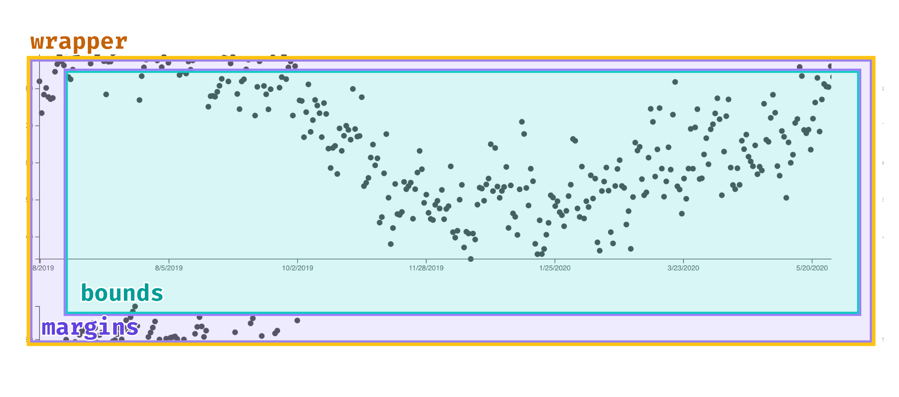

The first thing we need to do to achieve this is `translate` our inner chart to reflect the new margins. In particular, we want to offset the chart horizontally by `margin.left` and vertically by `margin.top`. Let's wrap our existing chart body into a `<g>` element, and then use `translate` to offset our inner chart.

```html
<svg width={width} height={height}>
  <g class='inner-chart' transform="translate({margin.left}, {margin.top})">
    <AxisX />
    <AxisY />
    {#each data as d}
      <!-- Circle goes here -->
    {/each}
  </g>
</svg>
```

This code pushes our chart "right" by `margin.left` pixels, and "down" by `margin.top` pixels, based on the values we've provided.

But we also want to **shrink the inner chart itself**. 

Let's create two new variables, `innerWidth` and `innerHeight`, which represent the chart width and height **minus our margins**.


```js
const margin = {
  top: 20,
  right: 15,
  bottom: 20,
  left: 0
};
const innerWidth = width - margin.left - margin.right; // ✅
const innerHeight = height - margin.top - margin.bottom; // ✅
```

Then, we can use these variables within our existing `xScale` and `yScale` functions. For example, let's update our `yScale`:

```js
let yScale = scaleLinear()
  .domain([0, max(data, d => d.hours)])
  .range([innerHeight, 0]); // Old: .range([height, 0]) ❌
```

In practice, this means that `yScale` will now return smaller values, because the range of possible outputs has shrunk from 400 (`height`) to 360 (`innerHeight`).

We can do the same thing with `xScale`, so it takes up less horizontal space.

```js
let xScale = scaleLinear()
  .domain([0, 100])
  .range([0, innerWidth]); // Old: .range([0, width]) ❌
```

Now the chart is smaller, and translated according to our specified margins.

The last thing we need to do is update our existing `<AxisX />` and `<AxisY />` components to reflect the new margins. This is as simple as replacing our existing `width` and `height` variables with `innerWidth` and `innerHeight`.

```html   
<AxisY width={innerWidth} {yScale} />
<AxisX height={innerHeight} width={innerWidth} {xScale} />
```

Let's review what we've done with margin:

1. Instantiated a `margin` object
2. Translated our "inner chart" to reflect the margins
3. Adjusted `xScale` and `yScale` to account for the margins

In totality, this results in a chart that looks like this:

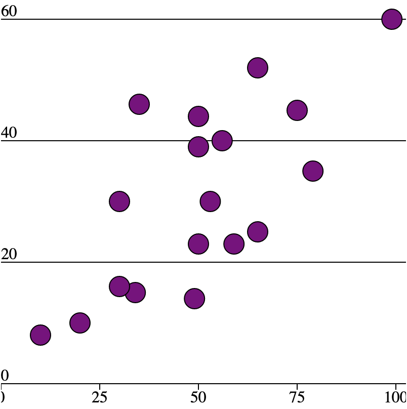

## 3. Polishing our chart

Let's beautify our axes with a bit of polish.

### Less intense colors

The colors for our gridlines and for our ticklines is a bit too dark (currently, it is <Highlight color="#000000">pure black</Highlight>.) Let's make it a light gray: <Highlight text="#000000" color="#e5e7eb">#e5e7eb</Highlight>.

In our `<AxisY />` component, we'll change the color of our gridlines to <Highlight text="#000000" color="#e5e7eb">#e5e7eb</Highlight>. But there's a catch: let's keep our **bottom gridline** a <Highlight text="#000000" color="#8f8f8f">darker color</Highlight>, so that it appears like the "bottom border" of the chart.

```html
{#each yTicks as tick, index}
  <g transform="translate(0, {yScale(tick)})">
    <text>...</text>
    <line x1={0} x2={width} y1={0} y2={0} 
      stroke={index === 0 ? '#8f8f8f' : '#e5e7eb'} /> <!-- ✅ -->
  </g>
{/each}
```


### Axis titles

In both our x and y axis, we want titles to explain to the viewer what is being displayed. Let's begin with the x-axis which represents **final grade**.

After our `{#each}` block containing our `yTicks`, we will create a new `<text />` element to display the title.

We'll give it some basic attributes so that it is 1) above the axis, 2) at the end of the chart, and 3) right-aligned.

Note that we'll have to import `width` as a prop here.

```html
<text class="axis-title" y={-9} x={width} text-anchor="end">
    Final Grade &rarr;
</text>
```

<!-- :::note 

`&rarr;` is the Unicode character for a right-pointing arrow. The system will render a right arrow in its place.

::: -->

Navigate back to `AxisY.svelte` to add a y-axis title, which will be a bit easier. Let's make the axis title "inline", rather than in its own space. Let's simply append the title to our highest tick; this is a common pattern in visualization as well.

We'll leverage the `index` of each tick, just like last time, and dynamically render the text, "hours studied", if the `index` is equal to `yTicks.length` (e.g., it is the highest tick we have).

We'll do this within our existing `<text />` element:

```html
{#each yTicks as tick, index}
   <!-- Other axis elements go here -->
  <text y={-3}>
    {index === yTicks.length - 1 ? `${tick} hours studied` : tick}
  </text>
{/each}
```

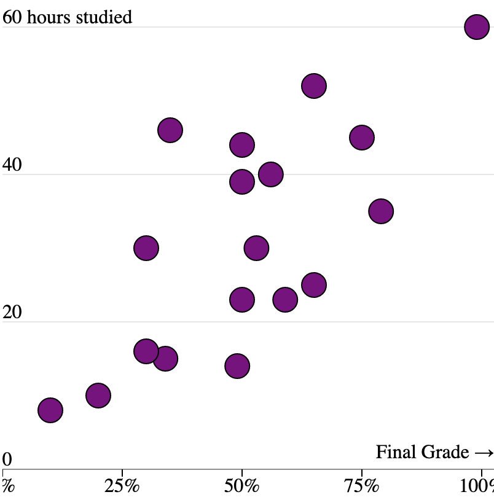

### Better fonts

Let's adjust the appearance of our tick labels using CSS.

In our `App.svelte`, we'll create some CSS rules so that all axis labels will be styled similarly:

```css
<style>
  :global(.tick text, .axis-title) {
    font-weight: 400; /* How thick our text is */
    font-size: 12px; /* How big our text is */
    fill: hsla(212, 10%, 53%, 1); /* The color of our text */
  }
</style>
```

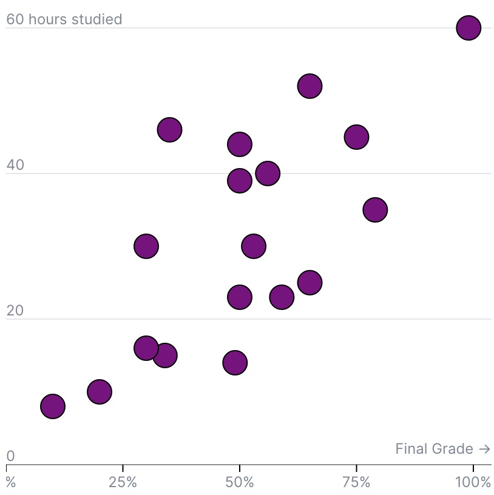

### Final polish

We're basically there. One last thing: we can't see the "0%" tick on our x axis, because it's cut off. We can simply adjust the `text-anchor` property for this tick by dynamically looking at its `index`, just as we've done previously.


<!--prettier-ignore-->
```html
{#each xTicks as tick, index}
  <!-- Other axis elements go here-->
  <text y={6} dy={9}           
      text-anchor={tick === 0 ? 'start' : "middle"}
      dominant-baseline="middle">
      {tick}%
  </text>
{/each}
```

We did it! 🙌 Pat yourself on the back for completing one of the most difficult parts of visualization: peripheral elements.

<Embed title="gvknwt" module="01" lesson="02" />

In our [next lesson](./making-it-responsive), we'll make this chart **responsive**.

## Need help? Further reading

#### SVG
* [The `<g>` element](https://developer.mozilla.org/en-US/docs/Web/SVG/Element/g)
* [The `<line>` element](https://developer.mozilla.org/en-US/docs/Web/SVG/Element/line)
* [The `<text>` element](https://developer.mozilla.org/en-US/docs/Web/SVG/Element/text)
* [The `transform` attribute](https://developer.mozilla.org/en-US/docs/Web/SVG/Attribute/transform)
* [The `dy` attribute](https://developer.mozilla.org/en-US/docs/Web/SVG/Attribute/dy)
* [The `text-anchor` attribute](https://developer.mozilla.org/en-US/docs/Web/SVG/Attribute/text-anchor)
* [The `dominant-baseline` attribute](https://developer.mozilla.org/en-US/docs/Web/SVG/Attribute/dominant-baseline)

#### D3
* [`scale.ticks`](https://observablehq.com/@d3/scale-ticks)
* [Margin convention](https://observablehq.com/@d3/margin-convention)
* [Chart dimensions](https://observablehq.com/@wattenberger2/creating-custom-data-visualizations-using-d3-js#cell-14)
