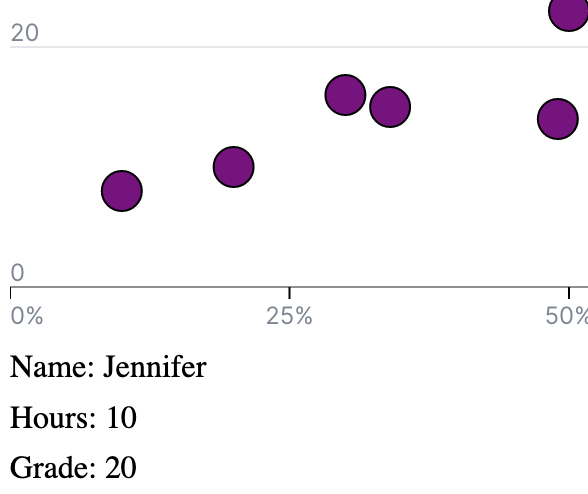
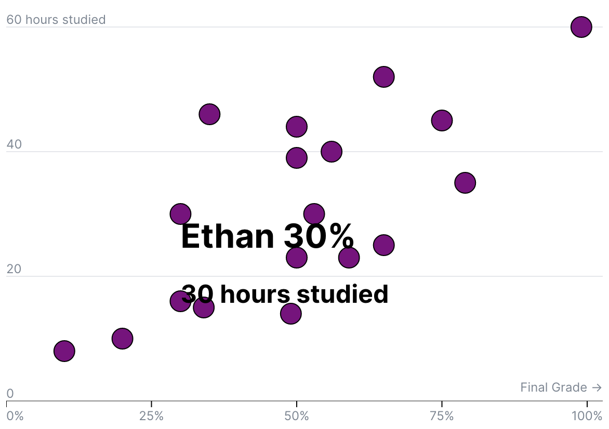
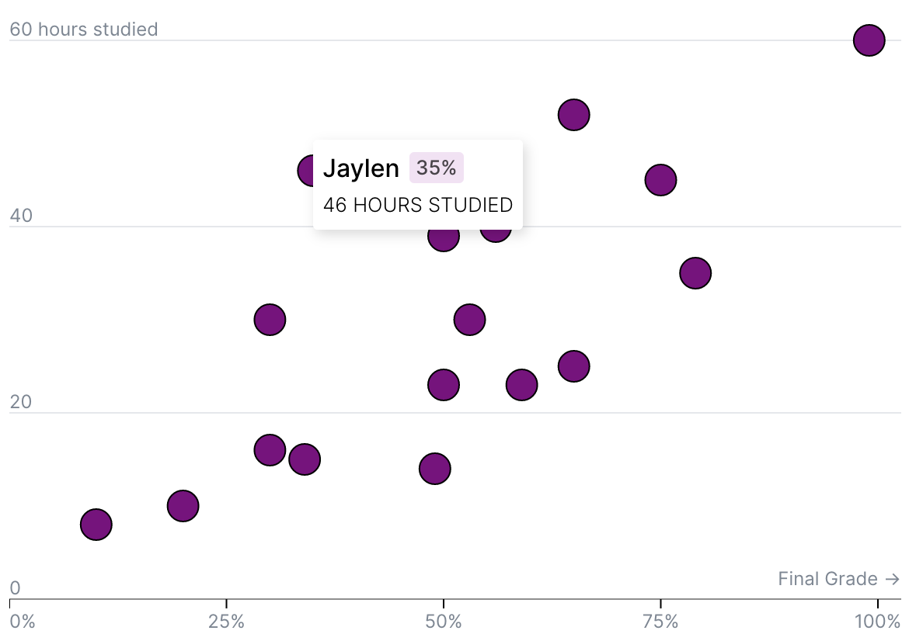
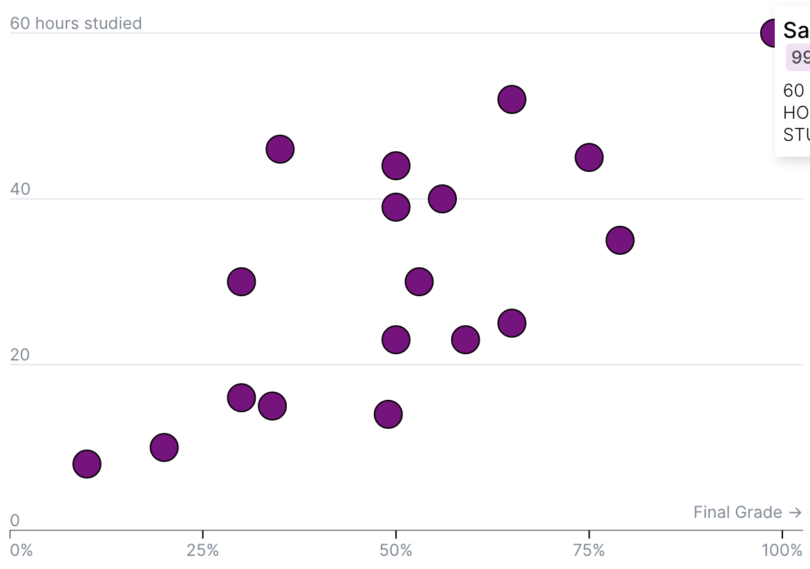
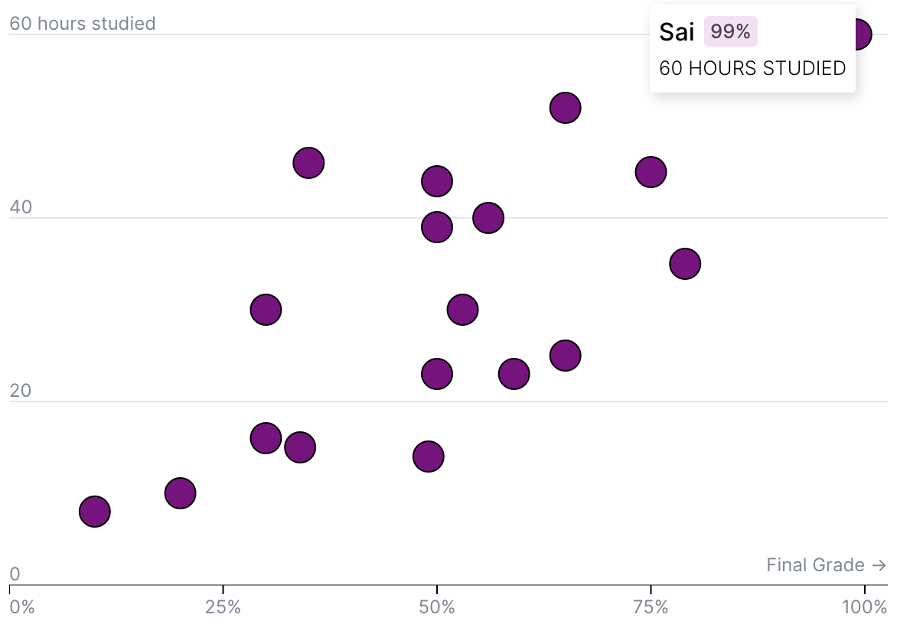
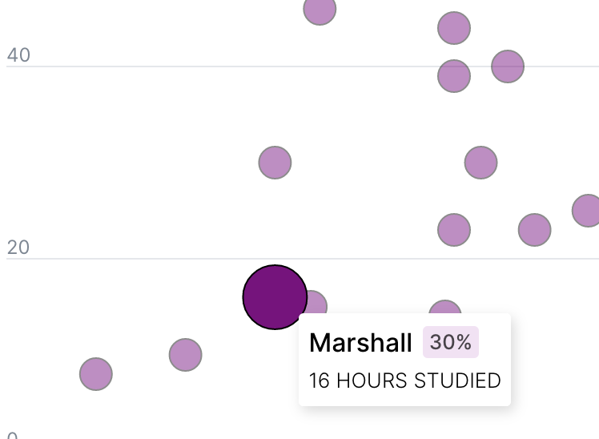

import Embed from "~/components/Embed";
import Blockquote from "~/components/Blockquote";
import TopPageMargin from "~/components/TopPageMargin";

<TopPageMargin />

Here's where we left off in the last lesson:

<Embed title="8ir3pm" module="01" lesson="03" />

In our penultimate lesson, we'll add interactivity to our chart. Alongside responsive design, interactivity is one of the key perks of web-based data visualization (you can't hover over a static chart).

This lesson will teach three concepts:
1. **Event listeners**, via adding `mouseover` and `mouseout` events to our circles
2. **Conditional rendering**, via an `{#if}` block that will show a tooltip when the user hovers over a circle
3. **Accessibility**, via keyboard-focusable `<circle />` elements


### 1. Add event listeners to our circles

Let's begin by adding event listeners to our `<circle />` elements. Svelte makes it easy to add event listeners to elements, via the [`on:` directive](https://svelte.dev/tutorial/dom-events). For example, to add a `mouseover` event listener to a `<div />` element, we would write:

```jsx
<div on:mouseover={handleMouseover} />
```

Where `handleMouseover` is some function we've already defined. 

Alternatively, we can pass an inline event handler to the `on:` directive, like so:

```jsx
<div on:mouseover={() => console.log("Mouseover!")} />
```

:::note Anonymous functions

Anonymous functions are functions that are defined without a name. They are often used in situations where we don't need to reuse the function, or where the function is simple enough that it doesn't need a name.

We use the arrow function syntax (`() =>`) for more concise code. You can read more [here](https://developer.mozilla.org/en-US/docs/Web/JavaScript/Reference/Functions/Arrow_functions).

:::

In either case, we are able to immediately trigger some action when the user hovers over a circle. Let's add a `mouseover` event listener to our circles, and log a message to the console when the user hovers over a circle.

```jsx
<circle 
    cx={xScale(d.grade)}
    cy={yScale(d.hours)}
    fill="purple"
    stroke="black"
    on:mouseover={() => alert("Mouseover!")} 
/>
```

In our case, we don't want to `alert` some arbitrary text; instead, we want to access the data associated with the circle that the user is hovering over. To do this, we can pass the `d` variable to our event handler (recall that we're accessing this from the `{#each}` loop that contains our circles):

```jsx
{#each data as d}
    <circle 
        cx={xScale(d.grade)}
        cy={yScale(d.hours)}
        fill="purple"
        stroke="black"
        on:mouseover={() => console.log(d)}
    />
{/each}
```

Now if you look in your console (right click -> **Inspect**, or <kbd>Cmd</kbd> + <kbd>Shift</kbd> + <kbd>C</kbd>), you'll see an object containing the data associated with the hovered circle.

<!-- FIXME: Add image here -->

Now it's becoming clearer how we can use this data to render a tooltip. Rather than just `console.log`-ing the data, let's store it in a variable called `hoveredData`:

```html
<script>
    let hoveredData;
    $: console.log(hoveredData); // To track what we're hovering

    // Other script code
</script>

<div class='chart-container' bind:clientWidth={width}>
  <svg {width} {height}>
      <g class='inner-chart' transform="translate({margin.left}, {margin.top})">
      <AxisY width={innerWidth} {yScale} />
      <AxisX height={innerHeight} width={innerWidth} {xScale} />
      {#each data as d}
        <circle
          cx={xScale(d.grade)}
          cy={yScale(d.hours)}
          r={10}
          fill="purple"
          stroke="black"
          stroke-width={1}
          on:mouseover={() => hoveredData = d}
        />
      {/each}
    </g>
  </svg>
</div>
```

Now if you go back to your application, open your console, and hover over a circle, you'll see the data associated with that circle logged to the console.

### 2. Render a tooltip

Now that we have access to the data associated with the hovered circle, we can render a tooltip. Let's add a new component titled `<Tooltip />`, and use the `{#if}` block to render it only when the user is hovering over a circle.

Remember, you need to import the tooltip component at the top of your `App.svelte` file.

<!-- FIXME: Highlight lines 5-10 -->
```html
<script>
    import Tooltip from '$components/Tooltip.svelte';

    // Other script code...
</script>

<div class='chart-container' bind:clientWidth={width}>
  <svg {width} {height}>
      <!-- Main SVG content -->
  </svg>
  {#if hoveredData} 
    <Tooltip data={hoveredData} />
  {/if}
</div>
```

:::note 

The `<Tooltip />` component is rendered **outside** of our `<svg />` element. This is because our tooltip will be `HTML`, not `SVG`. Placing the tooltip inside of the SVG element would lead to it not rendering, since the HTML tags would have no meaning to an SVG element.

:::

Within `Tooltip.svelte`, we'll accept the `data` prop and then simply print the data in some `<p>` tags:

```html
<script>
    export let data;
</script>

<h1>{data.name} <span>{data.grade}%</span></h1>
<h2>{data.hours} hours studied</h2>
```



For now, you'll see that these text elements simply print below our chart, as we would expect. However, we want to make the tooltip positioned **absolutely** so that it can appear directly next to the hovered circle.

:::note Absolute positioning

Absolute positioning is a CSS positioning method that allows us to position an element relative to its parent element. In our case, we want to position the tooltip relative to the chart wrapper (our `div` with a class of `chart-container`, so that it can appear directly next to the hovered circle. You can read more about absolute positioning [here](https://developer.mozilla.org/en-US/docs/Web/CSS/position).

<Blockquote>

The element is removed from the normal document flow, and no space is created for the element in the page layout. It is positioned relative to its closest positioned ancestor, if any; otherwise, it is placed relative to the initial containing block. Its final position is determined by the values of top, right, bottom, and left.

</Blockquote>

:::

So where do we want our tooltip to appear? Directly next to the hovered circle. To do this, we can use the `x` and `y` coordinates of the hovered circle, and position the tooltip accordingly. 

Recall that these coordinates are generated from the `xScale` and `yScale` functions, which we've already defined. We can use these functions to calculate the `x` and `y` coordinates of the hovered circle, and then use these coordinates to position the tooltip.

In order to access them in our tooltip, let's pass `xScale` and `yScale` as props to our `<Tooltip />` component. Then let's create variables called `x` and `y`, which we'll use to position the tooltip.

In `App.svelte`:

```html
<Tooltip data={hoveredData} {xScale} {yScale} />
```

And within `Tooltip.svelte`:

```html
<script>
    export let data;
    export let xScale;
    export let yScale;

    $: x = xScale(data.grade);
    $: y = yScale(data.hours);

    console.log("This circle is located at:", {x, y})
</script>
```

Now when you hover over a given point, you'll see exactly where the circle is located — and where we want our tooltip to be positioned.

Let's wrap our tooltip content (the markup) in a `<div>` with a class of `tooltip`, and then position it absolutely. We'll also give it a `top` and `left` value, which we'll set to the `x` and `y` variables we just created.

```html
<div class='tooltip' style="position: absolute; top: {y}px; left: {x}px">
  <h1>{data.name} <span>{data.grade}%</span></h1>
  <h2>{data.hours} hours studied</h2>
</div>
```

And back in `App.svelte`, let's make sure that our chart container is the relative parent of our tooltip. We can do this by adding a `position: relative` style to the `chart-container` class.

```css
.chart-container {
    position: relative; 
}
```

We did it! We made the ugliest tooltip of all time:



#### Make the tooltip pretty

Now that we have a tooltip, let's make it look a little nicer with some CSS. 

First, we'll make the tooltip itself stand out by giving it a background color, some padding, and a box shadow. We'll also apply a CSS transition here so that the tooltip smoothly animates from one circle to the next:

```css
.tooltip {
    padding: 8px 6px;
    background: white;
    box-shadow: rgba(0, 0, 0, 0.15) 2px 3px 8px;
    border-radius: 3px;
    pointer-events: none;
    transition: top 300ms ease, left 300ms ease;
}
```

<!-- FIXME: Image here? -->

Next, let's style our text. We want to reset the default margin on our `h1` and `h2` element, and give them a shared `font-weight` of 300. Then we can style each independently, so that there is nice visual hierarchy:

```css
h1 {
    font-size: 1rem;
    font-weight: 500;
    margin-bottom: 6px;
    width: 100%;
}

h2 {
    font-size: 0.8rem;
    font-weight: 300;
    text-transform: uppercase;
}
```

<!-- FIXME: Image goes here -->

And finally, we'll style our "grade" label, which should stand out as it is the main focus of each element. We'll apply standard "label styling" to this, with a background, some padding, and a slightly reduced font size.

```css
span {
    background: #dda0dd50;
    font-size: 80%;
    margin-left: 2px;
    padding: 2px 4px;
    display: inline-block;
    vertical-align: bottom;
    border-radius: 3px;
    color: rgba(0, 0, 0, 0.7);
}
```

There we go! Now our tooltip is much prettier:



#### Offset the tooltip

There's one problem with our current approach. Displaying the tooltip near the edge of the chart leads it to be cut off and/or squished:



We don't want this! We want our entire tooltip to be visible at all times. So let's offset the tooltip if it's too close to the edge of the chart.

Let's describe exactly how we should do this, in plain language: if the tooltip's x position plus its width is greater than the width of the chart, then we should offset the tooltip to the left.

In code, that looks like this:

```html
<script>
    // Other script code
    export let width; // Imported from App.svelte; represents chart width
    let tooltipWidth; // Calculated using bind:clientWidth below
    
    $: xPosition = x + tooltipWidth > width ? x - tooltipWidth : x;
</script>

<div class='tooltip' 
    style="position: absolute; top: {y}px; left: {xPosition}px" 
    bind:clientWidth={tooltipWidth}>
  <!-- Tooltip content -->
</div>
```

:::note 

Recall that we can use the `bind:clientWidth` directive to bind a variable to the width of an element. We can then use this variable to keep track of the `xPosition` of the tooltip.

:::

In action, we can now see that our tooltip is set to the left if the hovered circle is too close to the edge:



#### Nudge

Let's also offset the tooltip a bit so it doesn't fully overlap with our circle. This is as simple as adding a small amount of padding to the `xPosition` variable (and doing the same thing for a newly created `yPosition` variable):

```html
<script>
    // Other script code
    const xNudge = 15;
    const yNudge = 30;
    
    $: xPosition = x + tooltipWidth > width ? x - tooltipWidth - xNudge : x + xNudge;
    $: yPosition = y + yNudge;
</script>

<div class='tooltip' 
    style="position: absolute; top: {yPosition}px; left: {xPosition}px" 
    bind:clientWidth={tooltipWidth}>
  <!-- Tooltip content -->
</div>
```

:::note 

You can adjust `xNudge` and `yNudge` as you see fit.

:::

Now there is a nice margin between our circle and its accompanying tooltip. Great job!

---

There are two more polish steps for this interaction: 
1. Make clear which circle is being hovered, and 
2. Make the tooltip disappear when the mouse leaves the chart.

#### Make clear which circle is being hovered

To make it abundantly clear to the user which circle is in focus, we can both emphasize the hovered circle and de-emphasize others, using dynamic attributes in our `<circle />` elements.

Back in `App.svelte`, we'll adjust the `r` and `opacity` attributes of our `<circle />` elements, based on whether or not they are the hovered circle:

```html
<script>
    // Other script code
    let radius = 10;
</script>

<circle
    cx={xScale(d.grade)}
    cy={yScale(d.hours)}
    fill="purple"
    stroke="black"
    stroke-width={1}
    r={hoveredData == d ? radius * 2 : radius}
    opacity={hoveredData ? (hoveredData == d ? 1 : 0.45) : 0.85}
    on:mouseover={() => hoveredData = d} 
/>
```

Now our hovered circle stands out from the rest when we hover. But when nothing is hovered, all circles look the same:



The transition between circle states is rather abrupt. Let's adjust the CSS rule for our `<circle />` elements to make the transition smoother. (While we're at it, let's add a `cursor: pointer` as well).

```css
circle {
    transition: r 300ms ease, opacity 500ms ease;
    cursor: pointer;
}
```

Bam! Now our circles transition smoothly between states.

#### Make the tooltip disappear when the mouse leaves the chart

Finally, let's make the tooltip disappear when the mouse leaves the chart. We can do this by setting `hoveredData` to `null` when the mouse leaves the chart.

```jsx
<svg on:mouseleave={() => hoveredData = null}>
    <!-- Circles -->
</svg>
```

When we leave the chart, our tooltip disappears.

:::note 

You could always trigger the removal of the tooltip on individual circles by adding the event listeners there (on each `<circle />`), rather than on the `<svg />` element. This is a matter of preference.

:::

#### Transition the tooltip

A small but nice touch is to fade the tooltip in and out, using Svelte's built-in [transition directive](https://svelte.dev/tutorial/transition). 

First, we'll import the `fly` transition from Svelte:

```html
<script>
    import { fly } from 'svelte/transition';
</script>
```

And then in our tooltip `div`, we'll apply it like so: 

```html
<div class='tooltip' transition:fly />
```

:::note 

Feel free to play around with the parameters of the `fly` transition, like `delay` and `duration`. You can learn more [here](https://svelte.dev/tutorial/adding-parameters-to-transitions).

:::

### 3. Make it accessible

For accessibility purposes, each `mouseover` event should be accompanied by a `focus` event. This is to ensure the experience is the same for [users who are using a keyboard to navigate the page](https://www.accessibility-developer-guide.com/knowledge/keyboard-only/). 

This is thankfully quite simple. First, we'll add the `on:focus` event, and then we'll add a `tabindex` attribute to each circle. This will allow the user to tab through the circles, and trigger the `focus` event.

```jsx
<circle
    on:mouseover={() => hoveredData = d} 
    on:focus={() => hoveredData = d}
    tabindex="0"
    ...
/>
```

:::note tabindex 

The `tabindex` attribute is used to make an element focusable. You can read more about it [here](https://developer.mozilla.org/en-US/docs/Web/HTML/Global_attributes/tabindex).

:::

If you try to tab through your chart now, you'll notice one problem: there is no apparent order to the circles. This is because the order of the circles is determined by the order of the data in the `data` array. We instead want to make the tab order match the order of the circles on the chart.

To do this, we'll sort the data by `grade` (our x axis value) in our {#each} loop.

```html
<g class='inner-chart' transform="translate({margin.left}, {margin.top})">
    {#each data.sort((a, b) => a.grade - b.grade) as d, index}
        <!-- Circles -->
    {/each}
</g>
```

There we go! Now we can tab through our chart and see the tooltip appear as we go. As a note, this won't change your chart visually; it will simply reorder the circles in the DOM.

Altogether, here's our near-final interactive chart: 

<Embed title="70om72" module="01" lesson="04" />

In our next and final lesson, we'll add some polish to our chart and finish up.

## Need help? Further reading

#### Svelte
* [DOM Events](https://svelte.dev/tutorial/dom-events)
* [Inline handlers](https://svelte.dev/tutorial/inline-handlers)
* [The transition directive](https://svelte.dev/tutorial/transition)
* [Adding parameters to transitions](https://svelte.dev/tutorial/adding-parameters-to-transitions)

#### JavaScript
* [Arrow functions](https://developer.mozilla.org/en-US/docs/Web/JavaScript/Reference/Functions/Arrow_functions)

#### CSS
* [Absolute positioning](https://developer.mozilla.org/en-US/docs/Web/CSS/position)

#### Accessibility 
* [Introduction to keyboard-only usage](https://www.accessibility-developer-guide.com/knowledge/keyboard-only/)
* [Content on hover & focus](https://accessuse.eu/en/Content-hover-focus.html)
* [Keyboard accessibility](https://webaim.org/techniques/keyboard/tabindex)
* [tabindex](https://developer.mozilla.org/en-US/docs/Web/HTML/Global_attributes/tabindex)
