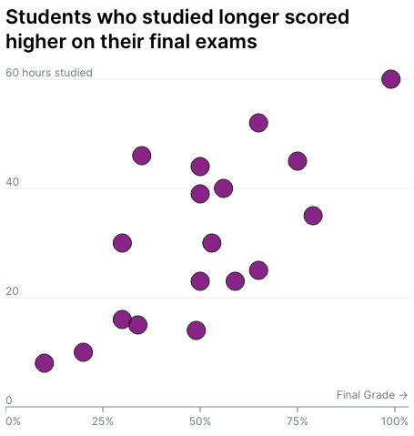

import Embed from "~/components/Embed";
import TopPageMargin from "~/components/TopPageMargin";

<TopPageMargin />

Here's our (mostly) completed chart.

<Embed title="70om72" module="01" lesson="04" />

Let's add a few finishing touches! In particular, we'll add a title, and apply a smooth transition to each circle as it enters the chart.

### A chart title

In designing interactive data visualizations on the web, titles and subtitles are easy to include. Rather than use the more complicated SVG text elements, we can use a plain old `h1` HTML element.

:::note

As a reminder, `h1` stands for "heading 1". Other heading elements include `h2`, `h3`, `h4`, `h5`, and `h6`. The number indicates the level of importance of the heading. For example, `h1` is the most important heading, and `h6` is the least important.

:::

In `App.svelte`, we'll insert our chart title right before the chart itself:

```html
<h1>Students who studied longer scored higher on their final exams</h1>
<div class="chart-container" bind:clientWidth={width}>
    <!-- Chart body goes here -->
</div>
```

Then we need to style the chart title which we can do using CSS. Because this is the only `h1` tag in this component, we can use the `h1` selector to style it:

```css
h1 {
    margin: 0 0 0.5rem 0;
    font-size: 1.35rem;
    font-weight: 600;
}
```

Here, we're making the title slightly bold, setting it to a reasonable size, and setting the bottom margin to 0.5rem.



### Transitions

The last thing we'll do is add some transitions to our chart. Transitions are a great way to add polish to your data visualizations, and make your charts feel more alive.

In this case, we'll add a transition to each circle as it enters the chart. We'll use the `in:fade` transition, which will fade each circle in as it enters the chart.

In `App.svelte`, we'll add the `in:fade` transition to each circle:

```html
<script>
    import { fade } from 'svelte/transition';
    
    // Other script code
</script>

<!-- Within the SVG container -->
{#each data.sort((a, b) => a.grade - b.grade) as d, index}
    <circle 
        in:fly={{ x: -10, opacity: 0, duration: 500 }}
    />
{/each}
```

Here, we're using the `in:fly` transition which will make each circle fly in as it enters the chart. We're setting the duration of the transition to 500ms.

In its complete form, our first chart looks like this:

<Embed title="ohk8k9" 
        module="01"
        lesson="final"
        runOnClick={true} />
