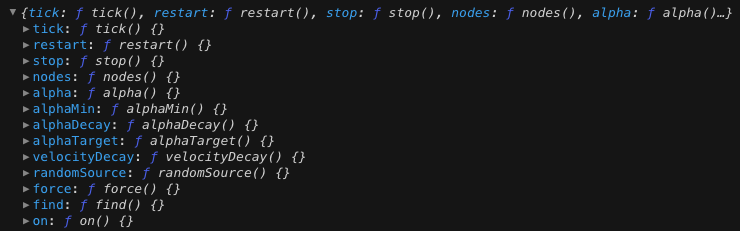
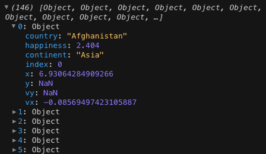
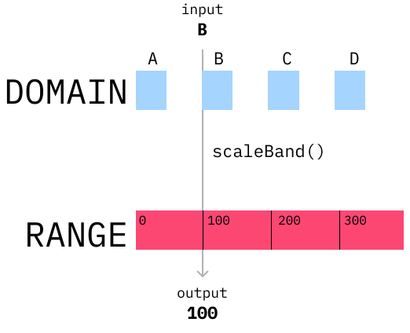

import Embed from "~/components/Embed";
import TopPageMargin from "~/components/TopPageMargin";
import Blockquote from "~/components/Blockquote";

<TopPageMargin />

We begin by drawing circles, just like in our last lesson; but this time, we'll use a physics-based force layout to arrange the circles.

This means that rather than apply some fixed x and y position to each circle, we'll let a physics engine determine the position of each circle. In particular, we'll be using [`d3-force`](https://github.com/d3/d3-force) which will do the following:

<Blockquote>

This module implements a velocity Verlet numerical integrator for simulating physical forces on particles. The simulation is simplified: it assumes a constant unit time step Δt = 1 for each step, and a constant unit mass m = 1 for all particles. As a result, a force **F** acting on a particle is equivalent to a constant acceleration **a** over the time interval **Δt**, and can be simulated simply by adding to the particle’s velocity, which is then added to the particle’s position.

</Blockquote>

Don't have any idea what's going on? No problem. D3 is going to handle a lot of the "behind the scenes" math and physics for us, and we'll convert that into points on a canvas. 

## A force simulation primer

:::note

This module is somewhat advanced and it wouldn't hurt to spend a bit of time with `d3-force` before diving in. Here's a [great introduction](https://observablehq.com/@ben-tanen/a-tutorial-to-using-d3-force-from-someone-who-just-learned-ho) from Ben Tanen.

:::

The basic component of use here will be a force simulation. Here's an example of force simulation:

```js
import { forceSimulation, forceY, forceX, forceCollide } from "d3-force";

const simulation = forceSimulation(nodes)
    .force("x", forceX().x(d => d.x).strength(0.02))
    .force("y", forceY().y(d => d.y).strength(0.02))
```

Here, `nodes` would be an array of objects, each containing at least an `x` and `y` property. (Those are needed because they are referenced in the `force*` functions.)

We can apply any number of **forces**, where each represents a new interaction with the overall simulation. For example, if we omitted `forceX`, our simulation would only attract toward the vertical axis.

We could also add others. For example, we could add a `forceCollide` to make sure that the circles don't overlap. In the example below (a barebones version of our final chart), click the button to see what something like `forceCollide` does:

<iframe src="https://codesandbox.io/embed/force-collide-toggling-7xndiv?view=preview" 
      style={{ width: "100%", height: "400px", border: "0" }}
      allow="accelerometer; ambient-light-sensor; camera; encrypted-media; geolocation; gyroscope; hid; microphone; midi; payment; usb; vr; xr-spatial-tracking"
      sandbox="allow-forms allow-modals allow-popups allow-presentation allow-same-origin allow-scripts" 
/>


---

In our chart, we're going to want three forces: `forceX`, `forceY`, and `forceCollide`. Here's a brief description of each:

* [`forceX`](https://github.com/d3/d3-force#forceX): attracts nodes towards the horizontal axis toward a given position, `x`.
* [`forceY`](https://github.com/d3/d3-force#forceY): attracts nodes towards the vertical axis toward a given position, `y`.
* [`forceCollide`](https://github.com/d3/d3-force#forceCollide): makes sure that no two nodes overlap.

Let's begin by importing our data and defining which columns we want to map to the `forceX` and `forceY` forces.

`data.js` will look like this:

```js
export default [
  {
    country: "Afghanistan",
    happiness: 2.404,
    continent: "Asia"
  },
  {
    country: "Lebanon",
    happiness: 2.955,
    continent: "Asia"
  },
  {
    country: "Zimbabwe",
    happiness: 2.995,
    continent: "Africa"
  },
  {
    country: "Rwanda",
    happiness: 3.268,
    continent: "Africa"
  },
  // ...
];
```

...where each country is represented by an object. 

In total, there is one object for every country in the world. Each object includes its name (`country`), its happiness score (`happiness`), and its continent (`continent`).

You can download the complete file [here](./public/data/data.json) or see it in CSV form [here](https://docs.google.com/spreadsheets/d/1ebYGFODm2z7hUmNlYkjThV23YNxwWkbMY2wIbiWhM5Y/edit?usp=sharing). 

In `App.svelte`, we can import our data and `console.log` to verify that everything is working.

```html
<script>
    import data from "$data/data.js";
    console.log(data)
</script>
```

Within our chart, each circle's attributes will be determined in the following way:
* Each circle's radius and x position will be determined by its `happiness` score
* Each circle's color and y position will be determined by its `continent`

As it relates to our force layout:
* Map the `happiness` column to the `forceX` force.
* When grouped by continent, map the `happiness` column to the `forceY` force.
* Apply a `forceCollide` to make sure that no two circles overlap.

Let's do it!

```html
<script>
    import data from "$data/data.js";
    import { forceSimulation, forceX, forceY, forceCollide } from "d3-force";

    const RADIUS = 5;
    const simulation = forceSimulation(data)
        .force("x", forceX().x(d => d.happiness).strength(0.8))
        .force("y", forceY().y(d => d.continent).strength(0.2))
        .force("collide", forceCollide().radius(RADIUS);
</script>
```

:::note 

The `strength` parameter of each force is a multiplier for the force's effect on the simulation. You can set `strength` to any number between 0 and 1 to make it more or less powerful.

:::

If you `console.log` the `simulation`, you'll see it's an object with multiple properties.



Some of these properties allow us to adjust how our simulation behaves. For example, we can adjust the speed at which the bubbles move using [`simulation.alphaDecay`](https://github.com/d3/d3-force#simulation_alphaDecay). We can stop the simulation entirely using [`simulation.stop()`](https://github.com/d3/d3-force#simulation_stop), or we can start it again using [`simulation.restart()`](https://github.com/d3/d3-force#simulation_restart).

Of interest to us is `simulation.nodes()` which returns an array of all the nodes in the simulation.

In other words, this array will represent each circles' x and y positions, as well as some other attributes.



As we can see, each object in the array represents a country in our original dataset (with its original `country`, `happiness`, and `continent` properties). But it also has new ones, like `x` and `y`, which represent the force-directed position of the circle.

There are two problems. First, each circle's `x` value is unscaled, and second, `y` is consistently `NaN` (which stands for "Not a Number"). This is because the `forceY` force is applied to the `continent` column, and the `continent` column is not numeric. The `.x()` and `.y()` functions require a number to compute their coordinates.

In order to address this, we'll create `xScale` and `yScale` functions, just as we did in the last module.

## Scaling our data

### `xScale`

Let's begin by instantiating an `xScale` function, which will take in a raw "happiness" score and return some value between 0 and the width of the chart.

As with the last module, we'll bind the chart container's `clientWidth` to `width`. We'll also add some margin so that we can account for this chart padding in our newly created scales. And as with last lesson, we'll create an `innerWidth` variable to represent the width of the chart minus the margin, and the same for `innerHeight`.

```html
<script>
  let width = 400, 
    height = 400;

  const margin = { top: 0, right: 0, bottom: 20, left: 0 };

  $: innerWidth = width - margin.left - margin.right;
  let innerHeight = height - margin.top - margin.bottom;

  // Other script code...
</script>

<div class='chart-container' bind:clientWidth={width}>
  <svg {width} {height}>
  </svg>
</div>
```

:::note 

`width` updates, but `height` doesn't, which is why we use `$:` to create `innerWidth`.

:::

Now we want to construct an `xScale` function, which maps a raw happiness score to a value between 0 and `innerWidth`.

```html
<script>
  import { scaleLinear } from "d3-scale";

  $: xScale = scaleLinear()
    .domain([1, 9]) // Alternatively, we could pass .domain(extent(data, d => d.happiness))
    .range([0, innerWidth])
</script>
```

Note that we are using a fixed domain of `[1, 9]`, because the happiness scores all fall within this range. We could alternatively pass a domain of `extent(data, d => d.happiness)`, which would dynamically generate the domain based on the `min` and `max` `happiness` scores, but we know that our data will always fall within this `[1, 9]` domain — so we'll pass it explicitly to have greater control.

### `yScale`

Let's do the same thing with our `yScale` function. Rather than use `scaleLinear` which is used for numeric data, we'll use [`scaleBand`](https://observablehq.com/@d3/d3-scaleband) which is used for ordinal or categorical data (such as `continent` in our dataset).

`scaleBand` will take in an array of values in the domain (which are not numeric in nature), and return a position that is evenly spaced with the given range.



Here, passing any of the values `A`, `B`, `C`, or `D` to `scaleBand` would return that letter's index divided by the number of values in the array times the range. Assuming the range is `[0, 400]`, `A` would return 0, `B` would return 100, `C` would return 200, and `D` would return 300.

In our case, we want to pass in each of the unique `continent` values as the domain for our `yScale`, and return an evenly positioned y value in the range.

We could simply pass our array of continents in using `data.map(d => d.continent)`, but to make for a more visually appealing chart, we'll **sort the continents by their average happiness scores**. (It's small tweaks like this that can bring charts to the next level.)

We'll do some wizardry using [`d3.rollups`](https://observablehq.com/@d3/d3-group) to get this list of continents sorted by their happiness scores.

```js
import { mean, rollups } from "d3-array";

// Generate the average for each continent, so that we can sort according to that
const continents = rollups(
    data,
    v => mean(v, d => d.happiness),
    d => d.continent
  ) // Group data by continent and return the group-wide mean
  .sort((a, b) => a[1] - b[1]) // Sort according to value
  .map(d => d[0]); // Grab the continent name
```

:::note

Don't worry if you don't know what's going on here. If you want to learn more though, see [this guide](https://observablehq.com/@d3/d3-group).

:::

Now if you print `continents`, you'll see it's sorted in the following order:

  * `Africa`
  * `Asia`
  * `South America`
  * `North America`
  * `Europe`
  * `Oceania`

Let's pass that array into `yScale`:

```js
let yScale = scaleBand()
  .domain(continents)
  .range([innerHeight, 0])
  .paddingOuter(0.5);
```

Here, we're using [`paddingOuter`](https://observablehq.com/@d3/d3-scaleband#cell-180) to give some breathing room on the top and bottom of the chart.

## Draw some circles!

Let's revisit the `simulation` we instantiated earlier, and pass in our `xScale` and `yScale` functions.

```js
let simulation = forceSimulation(data)
  .force("x", forceX().x(d => xScale(d.happiness)).strength(0.8))
  .force("y", forceY().y(d => yScale(d.continent)).strength(0.2))
  .force("collide", forceCollide().radius(RADIUS))

let nodes = simulation.nodes();
```

At first, you'll notice this errors out, because `xScale` is a reactive variable whereas `simulation` was instantiated with `let`. Because `xScale` is referenced within `simulation`, we need to replace `let` with `$:`. The same goes for `nodes`.

```js
$: simulation = forceSimulation(data)
// ...

$: nodes = simulation.nodes();
```

Now, if you `$: console.log(nodes)`, you will see that each node has a properly scaled `x` and `y` value.

With this set of nodes, which are now scaled from our data, we can draw our circles. As with previous examples, we'll write our markup directly, and use an `{#each}` block to iterate over our data.

```html
<svg {width} {height}>
  <g class="inner-chart" transform="translate({margin.left}, {margin.top})">
    {#each nodes as node}
      <circle cx={node.x} cy={node.y} r={node.happiness} fill="steelblue" />
    {/each}
  </g>
</svg>
```

:::note 

Like last module, we are wrapping our inner chart with a `<g>` element, and translating it according to our `margin` values. This is so that we can add axes later on, and have them be positioned correctly.

:::

Altogether, our code for drawing circles linked to our data looks like this:

```html
<script>
  import data from "$data/data.js";
  import { forceSimulation, forceX, forceY, forceCollide } from "d3-force";
  import { scaleLinear, scaleBand } from "d3-scale";

  let width = 400,
    height = 400;
  const margin = { top: 0, right: 0, left: 0, bottom: 20 };

  $: innerWidth = width - margin.left - margin.right;
  let innerHeight = height - margin.top - margin.bottom;

  const RADIUS = 5;

  import { mean, rollups } from "d3-array";

  // Generate the average for each continent, so that we can sort according to that
  const continents = rollups(
    data,
    v => mean(v, d => d.happiness),
    d => d.continent
  ) // Group data by continent and return the group-wide mean
    .sort((a, b) => a[1] - b[1]) // Sort according to value
    .map(d => d[0]); // Grab the continent name

  $: xScale = scaleLinear()
    .domain([1, 9]) // Alternatively, we could pass .domain(extent(data, d => d.happiness))
    .range([0, innerWidth]);

  let yScale = scaleBand()
    .domain(continents)
    .range([innerHeight, 0])
    .paddingOuter(0.5);

  $: simulation = forceSimulation(data)
    .force("x", forceX().x(d => xScale(d.happiness)).strength(0.8))
    .force("y", forceY().y(d => yScale(d.continent)).strength(0.2))
    .force("collide", forceCollide().radius(RADIUS))

  $: nodes = simulation.nodes();
  $: console.log(nodes);
</script>

<div class='chart-container' bind:clientWidth={width}>
  <svg {width} {height}>
    <g class="inner-chart" transform="translate({margin.left}, {margin.top})">
      {#each nodes as node}
        <circle cx={node.x} cy={node.y} r={node.happiness} fill="steelblue" />
      {/each}
    </g>
  </svg>
</div>
```

<!--  -->

<Embed title="xmzghl" height="400px" previewOnly module="02" lesson="01" />

Congrats! We drew some circles. Very obviously, there's something wrong though. The circles are centered around the (0, 0) origin, and don't seem to be moving or actually correlated with our data points in any meaningful way. (We can fix this by resizing the window, but that's obviously not a reasonable solution.) We'll address this in our next lesson.

## Need help? Further reading

#### Force layout
* [D3 Force layout](https://www.d3indepth.com/force-layout/)
* [A tutorial to using `d3-force` from someone who just learned how to use it](https://observablehq.com/@ben-tanen/a-tutorial-to-using-d3-force-from-someone-who-just-learned-ho)
* [Use the (`d3`) force](https://wattenberger.com/blog/d3-force)

#### Array manipulation
* [`rollups`](https://observablehq.com/@d3/d3-group#rollups)

#### Scales
* [`scaleBand`](https://observablehq.com/@d3/d3-scaleband)
