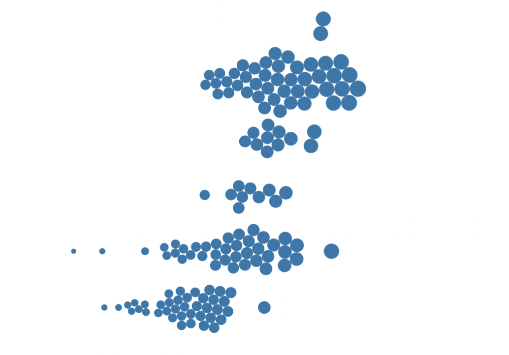

import Embed from "~/components/Embed";
import TopPageMargin from "~/components/TopPageMargin";
import Blockquote from "~/components/Blockquote";

<TopPageMargin />

In our last lesson, we finished off with a broken force diagram that looked like this:

<Embed title="xmzghl" height="400px" previewOnly module="02" lesson="01" />

In this lesson, we'll identify what's wrong with our code, and fix it. In doing so, our chart will also become responsive.

## A lesson in reactivity

Our force simulation has many [**ticks**](https://observablehq.com/@d3/simulation-tick). A tick can be thought of as a frame of animation. In the [example below](https://observablehq.com/@ben-tanen/a-tutorial-to-using-d3-force-from-someone-who-just-learned-ho#beeswarm_sect), see how the animation progresses based on the current "frame", which represents a tick.

<iframe width="100%" height="634" frameborder="0"
  src="https://observablehq.com/embed/@ben-tanen/a-tutorial-to-using-d3-force-from-someone-who-just-learned-ho?cells=chart_beeswarm%2Cviewof+keyframe_beeswarm"></iframe>

But in our code, we have no way of recording updates to the simulation on tick. And so rendering `simulation.nodes()` in an `{#each}` loop is problematic, because it will only render those nodes at the outset, and when any of the relevant dependencies change. This explains why they appear in the top left corner, and then move to their correct positions on resize. (It would also be problematic if we wanted to use physics to smoothly transition element positions.)

So how do we solve this problem?

## `.on('tick')`

<!-- The simulation will run as soon as it is instantiated. But we have no way of detecting this in our `<script / >` tag, since it only runs on load. -->

We need to add an [`.on('tick')`](https://github.com/d3/d3-force#simulation_on) function to the simulation object already instantiated in our `<script />` tag. This function will run every time the simulation ticks.

So what do we want to do with our simulation? On simulation tick (remember, "every frame"), we want to update the `nodes` array—the array that we render in our `{#each}` loop.

<!-- Right now, we're instantiating our `simulation` with a reactive dollar label (`$:`). Although we do want our simulation to be reactive, this isn't the best way to handle something like a force simulation, which has its own internal state. -->

Let's begin by declaring both `simulation` and `nodes` as non-reactive variables (replacing our `$:` with `let`). Then, we'll add the `.on('tick')` listener in our `<script />` tag.

```js
let simulation = forceSimulation(data)
    .force("x", forceX()
        .x(d => xScale(d.happiness))
        .strength(0.8)
    )
    .force("y", forceY()
        .y(d => yScale(d.continent))
        .strength(0.2)
    )
    .force("collide", forceCollide().radius(RADIUS));

let nodes = []; // An empty array which will be populated once the simulation ticks
simulation.on("tick", () => {
    nodes = simulation.nodes(); // Update the nodes array
});
```

In essence, this chunk of code will create an array of nodes that updates every time the simulation ticks.

But recall that `xScale` was a reactive variable. This means that creating `simulation` with `const` will lead to an error, as `xScale` doesn't exist as a function on immediate page load. So how do we make sure that the simulation is updated when `xScale` changes? 

:::note

You may think that we could create `simulation` with a reactive dollar label, but you'll run into a tricky issue:


Our bubbles don't fit in the window — they "lag" our window resizing. 

The issue here is that `simulation` is **reinstantiating** every time any of its constituent elements changes. Because we are using `$:` to instantiate `simulation`, we will essentially overwrite the previous `simulation` with a new one every time we resize the window.

:::

Instead, we'll use a **reactive block**.

## Reactive blocks

We instead want to instantiate a **single, simple** `simulation` object, and then *update* it whenever any of its constituent elements change.

In this new configuration, we'll create `simulation` without any of its complicated force logic (*importantly, this means we're omitting `xScale`, and so we won't run into a build error*). We'll instead that entire chunk into a [reactive block](https://svelte.dev/tutorial/reactive-statements). In essence, this reactive block will update whenever any of the variables inside of it change.

We'll also include additional parameters in our reactive block: `alpha` and `alphaDecay`. These parameters control the rate at which the simulation finishes, which you can read more about [here](https://observablehq.com/@maliky/testing-the-d3-forces-parameters).

In sum, our code will look like this:

```js
let simulation = forceSimulation(data); // Instantiate a barebones simulation
let nodes = []; // Create an empty array to be populated when simulation ticks
simulation.on("tick", () => {
    nodes = simulation.nodes(); // Repopulate and update
});

// Run the simulation whenever any of the variables inside of it change
$: {
simulation
    .force("x", forceX()
        .x(d => xScale(d.happiness))
        .strength(0.8)
    )
    .force("y", forceY()
        .y(d => yScale(d.continent))
        .strength(0.2)
    )
    .force("collide", forceCollide().radius(RADIUS))
    .alpha(0.3) // [0, 1] The rate at which the simulation finishes. You should increase this if you want a faster simulation, or decrease it if you want more "movement" in the simulation.
    .alphaDecay(0.0005) // [0, 1] The rate at which the simulation alpha approaches 0. you should decrease this if your bubbles are not completing their transitions between simulation states.
    .restart(); // Restart the simulation
}
```

:::note

Finding precise values for `alpha` and `alphaDecay` is going to be more trial and error than it is exact science (unless you're well versed in physics, perhaps). As with adjusting `strength` values, it is common to play around with multiple values until you find the right combination for your data.

:::

Voila! With that change in place, we now have a smoothly animating simulation  that is reactive and responsive. 

<!--  -->

<Embed title="g8l0s0" module="02" lesson="02" height="400px" />

### Need help? Further reading

* [`simulation.tick`](https://observablehq.com/@d3/simulation-tick)
* [Why do we need `force.on('tick'..` in d3?](https://stackoverflow.com/a/28745519)

#### Reactivity
* [Reactive statements](https://svelte.dev/tutorial/reactive-statements)

#### Force simulations
* [`simulation.tick()`](https://github.com/d3/d3-force#simulation_tick)
* [`d3.force` testing ground](https://bl.ocks.org/steveharoz/8c3e2524079a8c440df60c1ab72b5d03)
* [Exploring `d3.force`'s parameters](https://observablehq.com/@maliky/testing-the-d3-forces-parameters)
* [Alpha, Velocity, and Restart](https://stackoverflow.com/a/52117221)