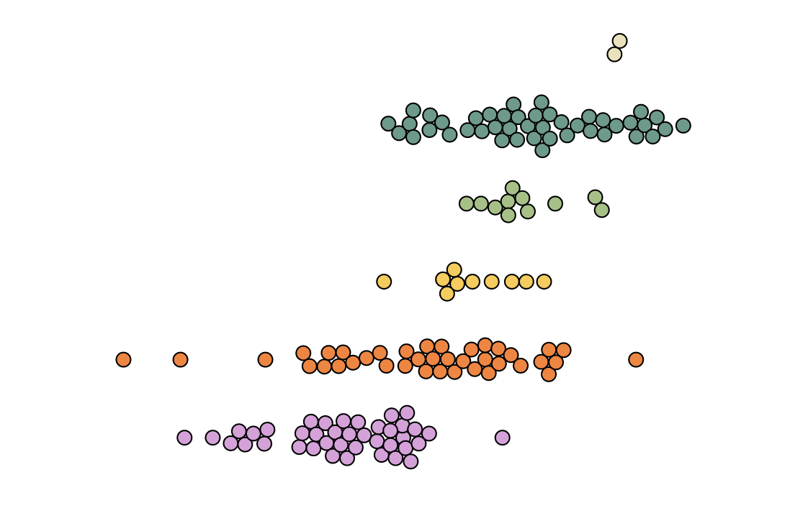

import Embed from "~/components/Embed";
import TopPageMargin from "~/components/TopPageMargin";
import Blockquote from "~/components/Blockquote";

<TopPageMargin />

In our last lesson, we finished making our chart **reactive** and **responsive**.

<Embed title="uwsesh" module="02" lesson="02" height="400px" />

One evident problem is that every circle looks mostly the same. Obviously, we want to link each circle to the data it represents, in whatever way we can. 

We've already connected each circle's **y position** to its `continent`, and its **x position** to its `happiness`. In this lesson, we will:

* Connect the circle's **color** to its grouping variable (`continent`)
* Connect the circle's **radius** to its `happiness` variable

## Color our circles

We will use the `fill` attribute to color our circles, and we will use the `continent` variable to determine the color of each circle. 

In order to create a mapping between the `continent` variable and the color, we will create a function called `colorScale`. We will use D3's `scaleOrdinal()` to create this scale, where we pass in an array of continents to the domain, and an array of colors to the range. (Recall that `continents` is an array of continents, sorted by average happiness score, that we generated in a previous lesson.)

```js
import { scaleOrdinal } from "d3-scale";

const colorRange = ["#dda0dd", "#fe7f2d", "#fcca46", "#a1c181", "#619b8a", "#eae2b7"];
let colorScale = scaleOrdinal()
    .domain(continents) // continents was already defined in our code
    .range(colorRange);
```

We will then use this scale to assign the color of each circle. In our `{#each}` loop which renders our circles, we will add the `fill` attribute:

```html
<!-- In addition to the other attributes -->
<circle fill={colorScale(node.continent)} />
```

Now, our circles' color is determined by their continent. 



## Size our circles

Let's also map our circles' radii to their `happiness` value. We'll want to create a new scale for our radius — called `radiusScale` — that takes in a happiness value and returns a radius.

In order to do this most accurately, we'll use [`scaleSqrt()`](https://github.com/d3/d3-scale#scaleSqrt), which is a square root scale. We do this because viewers perceive the **area** of a circle, not its **radius**. If we used a normal linear scale, the circles would look disproportionately large. 

As explained by [Robert Kosara](https://eagereyes.org/blog/2008/linear-vs-quadratic-change):

<Blockquote> 

One of the most common mistakes in chart design is to scale an area by two sides at the same time, producing a quadratic effect for a linear change. That overstates the larger numbers and produces a badly skewed chart. A little care and some basic high-school math can help avoid the problem.

</Blockquote>

```js
import { scaleSqrt } from "d3-scale";
let radiusScale = scaleSqrt()
    .domain([1, 9]) // The same domain passed to xScale
    .range([3, 8]);
```

Finally, we pass this scale to the `r` attribute of our circles:

```html
<!-- In addition to the other attributes -->
<circle r={radiusScale(node.happiness)} />
```

This is working, but notice that our circles slightly overlap:


This is because our force layout is preventing a collision based on the radius of each circle. We previously hardcoded this radius (in a variable called `RADIUS`) to be 5. We can now remove this variable, and use our `radiusScale` instead.

In our force simulation declaration, we'll change this line:

```js
.force("collide", forceCollide().radius(RADIUS))
```

to this:

```js
.force("collide", forceCollide().radius(d => radiusScale(d.happiness)))
```

And our circles are no longer overlapping!


### Making radii smaller for smaller screens

If you look at our chart on a smaller screen, you'll notice that the circles are slightly too large. We'll fix this by making our `radiusScale` reactive (using the dollar label `$:`), and changing its domain based on the width of the screen. 

```js
$: radiusScale = scaleSqrt()
    .domain([1, 9])
    .range(width < 568 ? [2, 6] : [3, 8]);
```

:::note

This can be read as: "If the width of the screen is less than 568 pixels, use a range of `[2, 6]`. Otherwise, use a range of `[3, 8]`."

:::

Great! Now our circles are sized according to their happiness score (and screen size), and colored according to their continent.

<Embed title="jlrfls" module="02" lesson="03" height="400px" />

### Need help? Further reading

#### Scales
* [`scaleSqrt`](https://observablehq.com/@d3/continuous-scales#scale_sqrt)
* [`scaleOrdinal`](https://observablehq.com/@d3/ordinal-scales#scale_ordinal)

#### Theory
* [Linear vs. Quadratic Change](https://eagereyes.org/blog/2008/linear-vs-quadratic-change)