import Embed from "~/components/Embed";
import TopPageMargin from "~/components/TopPageMargin";
import Blockquote from "~/components/Blockquote";
import Highlight from "~/components/Highlight";

<TopPageMargin />

In the last lesson, we left off with a force diagram with circles having dynamic attributes based on the countries they represent.

<Embed title="jlrfls" module="02" lesson="03" height="400px" />

In this lesson, we'll add the peripheral elements that will bring our chart to life and make it more informative.

In particular, we'll add four elements:
* An x-axis
* A y-axis
* A legend
* A title

## Adding an x-axis

Let's start with the x-axis. We'll add it to the `App.svelte` file, just before our `.inner-chart` group of circles. As with the last module, we'll place all axis-related code in its own file, called `AxisX.svelte`.

Let's begin by describing exactly what we want. We want an axis that runs horizontally across the bottom of our chart, with a tick mark for some of the values in our `xScale`. In addition, we'll want a gridline — for each tick — that spans the entire height of the chart.

From the description above, it becomes clear that we need at least two variables imported in our `AxisX.svelte` file: `xScale` and `height`. We'll also import `width`, as we'll need it later.

In `App.svelte`, we'll import `AxisX` and pass it the variables it needs:

```html
<script>
    import AxisX from "$components/AxisX.svelte";
    // Rest of our script code
</script>

<svg {width} {height}>
    <g class='inner-chart' transform="translate({margin.left}, {margin.top})">
        <AxisX {xScale} height={innerHeight} width={innerWidth} />
        <!-- Rest of our chart code -->
    </g>
</svg>
```

In `AxisX.svelte`, we'll add this to accept the props:

```js
<script>
    export let xScale;
    export let height;
    export let width;
</script>
``` 

As with our previous module, we'll create ticks using the `ticks` method of our `xScale`.

In our script tag, we can instantiate `ticks` as a variable:

```js
$: ticks = xScale.ticks(4); // Where 4 is the number of ticks we want to render
```

:::note
Remember that we use the `$:` syntax so that our ticks will update if and when `xScale` changes.
:::

Let's render the newly created array of ticks in an `{#each}` block. Because we want to position each tick according to its scaled value, we'll `translate` it using `xScale`.
 
```html
<g class='axis x'>
    {#each ticks as tick}
        <g class='tick' transform="translate({xScale(tick)}, 0)">
            <text>{tick}</text>
        </g>
    {/each}
</g>
```

We can't see them, because each tick is at the top of the chart. Let's set the `y` positions of each of our text elements to equal the height of our chart (minus the vertical margin).

```html
<g class='axis x'>
    {#each ticks as tick}
        <g class="tick" transform="translate({xScale(tick)}, 0)">
            <text x="3" y={height}>{tick}</text>
        </g>
    {/each}
</g>
```

Now, we can see each tick.

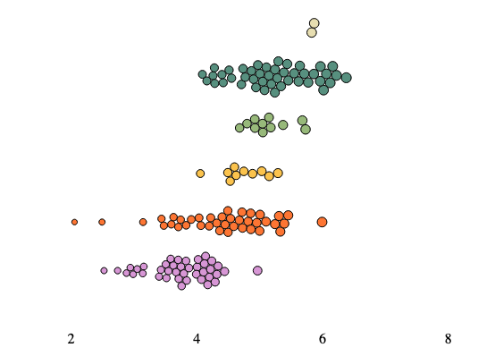

Let's also add gridlines for each tick. We'll add a `line` element to each tick, and set its `y2` attribute to the height of our chart. We'll add a <Highlight color="hsla(215, 15%, 91%, 1)" text="black">light gray</Highlight> stroke to each line.

```html
<g class='axis x'>
    {#each ticks as tick}
        <g class="tick" transform="translate({xScale(tick)}, 0)">
            <text x="3" y={height}>{tick}</text>
            <line x1="0" x2="0" y1="0" y2={height} stroke="hsla(215, 15%, 91%, 1)" />
        </g>
    {/each}
</g>
```

So that each line appears nicely next to its text, we'll push our text element to the right by 3 pixels, changing this line:

```html
<text x="0" y={height}>{tick}</text>
```

... to this:

```html
<text x="3" y={height}>{tick}</text>
```

Great. Now we have a nice axis with ticks for our x values, and lines for reference:

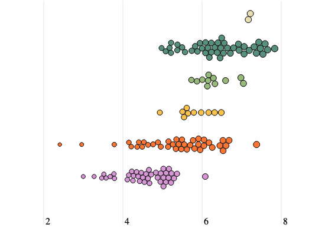

### An x-axis title

Let's finish our x-axis by adding a title. We'll add a `text` element to the bottom of our chart, and set its `x` attribute to the end of our chart (`width`). We'll also set its `y` attribute to the height of our chart.

```html
<text
  class="axis-title"
  x={width}
  y={height}
  dy="4"
  dominant-baseline="hanging"
  text-anchor="end"
>
  Happiness, out of 10 &rarr;
</text>
```

:::note 

Recall that we use `text-anchor="end"` to right align our text, so that it fits nicely within the chart bounds. And we use `dy="4"` to push our text down by 4 pixels (`4` was determined via testing. There's no exact science to these nudges).

:::

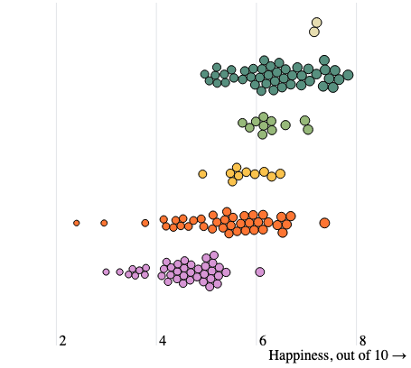


## Adding a y-axis

Now, let's add a y-axis to our chart. We'll add this axis in `App.svelte`, right before our  group of circles. As with the x-axis, we'll place all axis-related code in its own file, called `AxisY.svelte`.

In order to add a y-axis, we'll need to import `yScale` in our `AxisY.svelte` file:

In `App.svelte`:

```html
<script>
    import AxisY from "$components/AxisY.svelte";
    // Rest of our script code
</script>

<svg {width} {height}>
    <AxisX {xScale} height={innerHeight} width={innerWidth} />
    <AxisY {yScale} />
    <!-- Rest of our chart code -->
</svg>
```

And in `AxisY.svelte`:

```jsx
<script>
    export let yScale;
</script>
```

With this starting point, we can use the exact same patterns from previous axes to create our y-axis. We'll create an array of continents using the `domain` method of our `yScale`, and render them in an `{#each}` block.

```html
<script>
  export let yScale;
  $: ticks = yScale.domain();
</script>

<g class='axis y'>
  {#each ticks as tick, index}
    <g class='tick'>
      <text y={yScale(tick)}>{tick}</text>
    </g>
  {/each}
</g>
```

Well, that was easy! After detecting similar patterns in our code, we can reuse them to create new elements.

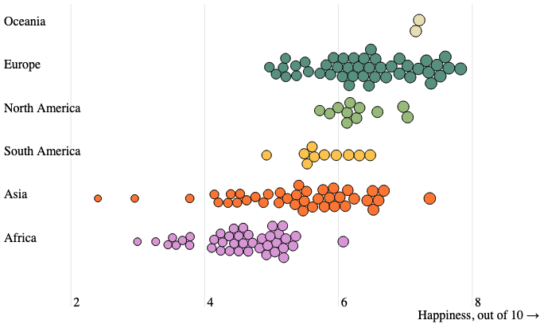

## Styling our axes

Let's add some CSS rules to improve the appearance of our currently ugly axes. We'll add these rules to `App.svelte`, and wrap them in a `:global()` declaration so they apply to all elements in our app.

```css
:global(.tick text, .axis-title) {
    font-size: 12px; /* How big our text is */
    font-weight: 400; /* How bold our text is */
    fill: hsla(212, 10%, 53%, 1); /* The color of our text */
    user-select: none; /* Prevents text from being selected */
}
```

Nice! Our axes look much better now.

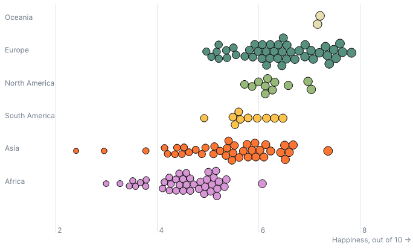

## Adding a chart title

Adding a title to our chart is the simplest thing we'll do in this lesson.

Before our `.chart-container` element in `App.svelte`, add a `h1` element with the following title (or any other title): "The happiest countries in the world".

```html
<h1>The happiest countries in the world</h1>
<div class="chart-container">
    <!-- Rest of our chart code -->
</div>
```

Let's style our chart title with the following CSS rules (also in `App.svelte`):

```css
h1 {
    font-size: 1.35rem; /* How big our text is */
    margin: 0 0 0.5rem 0; /* Adds a bottom margin */
    font-weight: 600; /* How bold our text is */
    text-align: center; 
}
```

:::note 

We don't use `:global()` here because we only want to style the `h1` element in `App.svelte`. Any `h1` elements in other components will not be affected by this styling.

:::

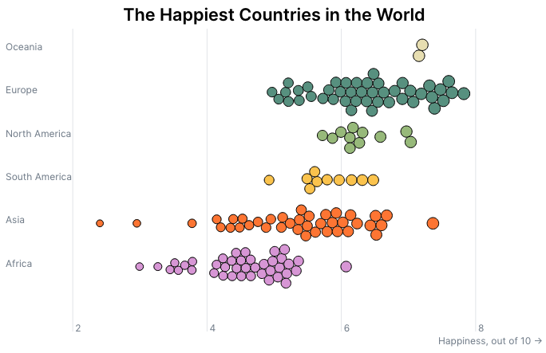

### Adding a legend

Our final peripheral element of interest is a legend. Legends are an important way to add context to our chart. Although our chart already has y-axis labels and so this legend is a bit redundant, in a future step, we'll add the ability for users to group all circles together (making this legend an important addition).

Our legend will be composed of HTML elements, rather than SVG elements. Practically, this just means that it's a bit easier because its elements will naturally fall within the document flow. (Among other things, this means that the legend will be naturally responsive.)

We'll add our legend to `App.svelte`, right before our chart. Again, we'll include all legend-related code in its own file, called `Legend.svelte`. Because our legend is going to showcase the relationship between each continent and its color, we'll need to import our `colorScale` in `Legend.svelte`.

In `App.svelte`: 

```html
<script>
    import Legend from "$components/Legend.svelte";
    // Other script code...
</script>

<h1>The Happiest Countries in the World</h1>
<Legend {colorScale} />
<div class='chart-container'>
    <!-- Rest of our chart code -->
</div>
```

And in `Legend.svelte`:

```jsx
<script>
    export let colorScale;
    console.log(colorScale);
</script>
```

`colorScale` is a function that takes in a continent and returns a color. As with previous scales, it has a `domain` and `range` method. 

If you console `colorScale.domain()` and `colorScale.range()`, you'll see that the domain is an array of continents, and the range is an array of colors.

```js
console.log(colorScale.domain()) // ["Africa", "Asia", "South America", "North America", "Europe", "Oceania"]
console.log(colorScale.range()) // ["#dda0dd", "#fe7f2d", "#fcca46", "#a1c181", "#619b8a", "#eae2b7"]
```

This structure makes creating our legend a breeze. We want to loop through each element in `colorScale.domain()`, and create a `div` element for each one. We'll also add a `span` element to each `div` that will display the color associated with that continent. This `span` will be colored according to the color scale itself, e.g. `colorScale("Africa")` will return `#dda0dd`.

```html
<div class='legend'>
  {#each colorScale.domain() as continent}
    <p>
      <span style="background-color: {colorScale(continent)}" />
      {continent}
    </p>
  {/each}
</div>
```

This worked... kind of.

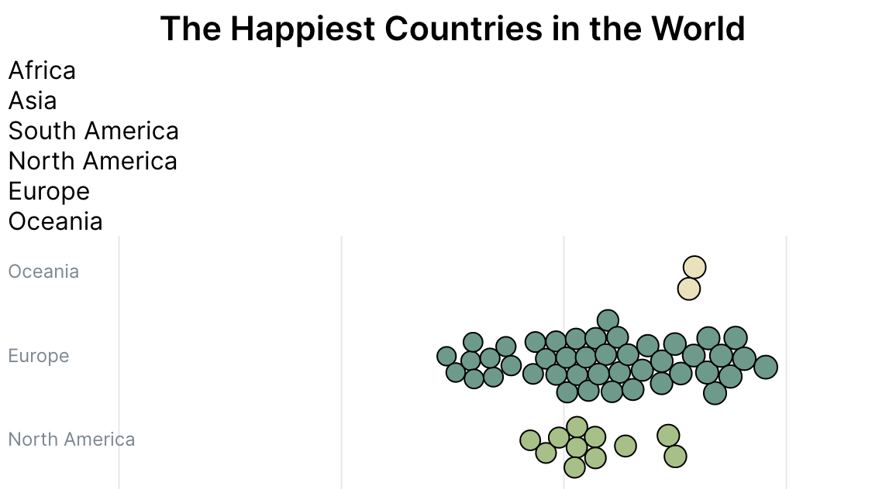

There are two problems. First, the legend is stacked vertically (we want it to be horizontal). Second, the dots that are meant to show color (each `<span />` element) are not visible.

#### Arrange our legend horizontally

To make our legend horizontal, we'll need to make the parent container, the `.legend` div, a flex container.

```css
.legend {
    display: flex;
    flex-direction: row; /* Makes the legend horizontal */
    justify-content: center; /* Centers the legend items */
    flex-wrap: wrap; /* Wraps the legend items to the next line */
}
```

:::note 

I won't go deep into the specifics of CSS flexbox, but on a high level, `justify-content: center` is used to center the legend items horizontally. `flex-wrap: wrap` is used to make sure that the legend items wrap to the next line when there isn't enough space to fit them all on one line.

You can learn more about flexbox [here](https://css-tricks.com/snippets/css/a-guide-to-flexbox/).

:::

Now, our legend is horizontally aligned, but there's not enough space between our elements.

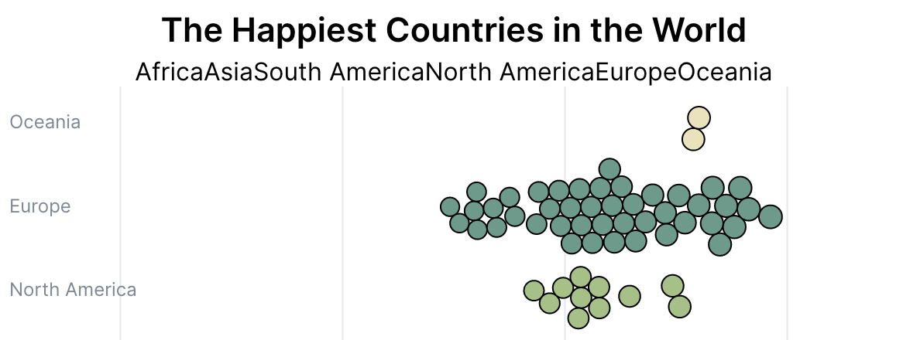

In order to solve this, we'll add the `column-gap` property to our `.legend` class. This property adds horizontal space between each element. We'll do a `row-gap` as well, to add vertical space (which matters on small screens, when the legend items will break onto multiple lines).

```css
.legend {
    display: flex;
    flex-direction: row;
    justify-content: center;
    flex-wrap: wrap;
    column-gap: 10px; /* Adds horizontal space between each legend item */
    row-gap: 5px; /* Adds vertical space between each legend item */
}
```

Finally, let's add a slight `margin-bottom` to the legend so that it doesn't touch the chart.

```css
.legend {
    display: flex;
    flex-direction: row;
    justify-content: center;
    flex-wrap: wrap;
    column-gap: 10px;
    row-gap: 5px;
    margin-bottom: 0.25rem; /* Adds a bottom margin */
}
```

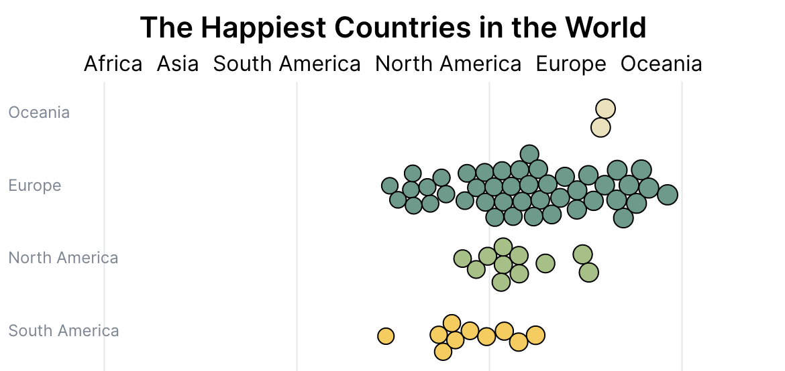

#### Make the legend dots visible

Our legend dots still aren't visible, and that's because they don't have a width or height. If you inspect the HTML elements, you'll see that the `<span />` elements have a width and height of 0.

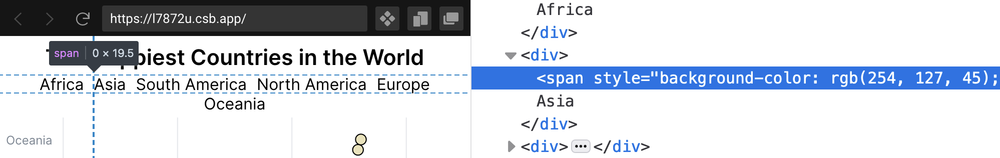

Let's give our circles a display of `inline-block` and a width and height of 9px. `display: inline-block` will make an element behave like an inline element (e.g. it won't force a line break), but also allows us to set a width and height. To make it a circle, we'll also add a `border-radius` of 50%. Finally, we'll add a slight border.

```css
span {
    width: 9px;
    height: 9px;
    display: inline-block; /* Makes the span behave like an inline element */
    border-radius: 50%; /* Makes the span a circle */
    border: 1px solid rgba(0, 0, 0, 0.5); /* Adds a slight border */
}
```

Now we have nice looking circles, one for each continent: 

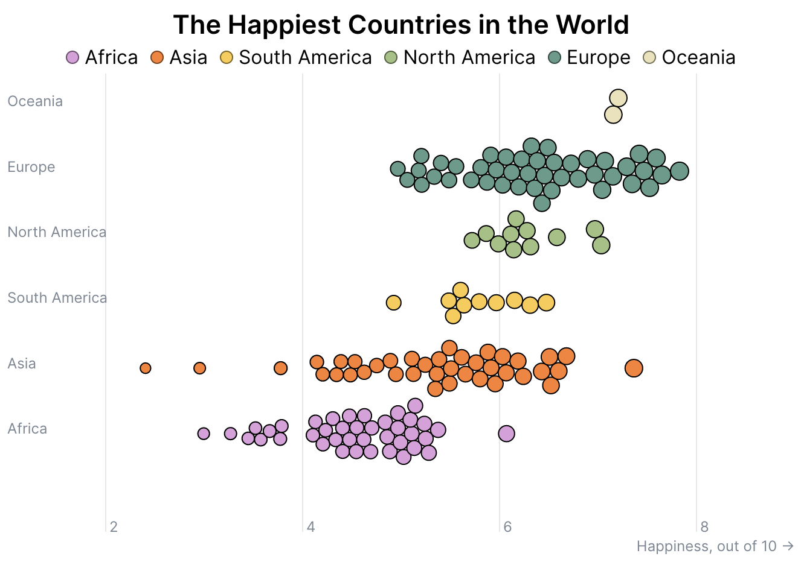

Let's do some final, slight styling to our text elements. This is personal preference (the current legend looks fine), but I prefer the following changes:

```css
p {
    font-size: .8rem; /* Makes the text smaller */
    text-transform: uppercase; /* Makes the text uppercase */
}
```

To make each individual legend element vertically aligned, we'll add a `display: flex` and `align-items: center` to the `p` element.

```css
p {
    font-size: .8rem;
    text-transform: uppercase;
    display: flex;
    align-items: center;
}
```

But in doing so, we'll also need to add a slight gap between the elements, so that they don't touch. We'll add a `gap` property to the `p` element.

```css
p {
    font-size: .8rem;
    text-transform: uppercase;
    display: flex;
    align-items: center;
    column-gap: 3px; /* Adds a slight gap between the span and the text */
}
```

With that, we've completed our legend, and we're finished with this lesson!

<Embed title="0kbbzp" module="02" lesson="04" />

## Need help? Further reading

#### HTML/CSS
* [Normal Flow](https://developer.mozilla.org/en-US/docs/Learn/CSS/CSS_layout/Normal_Flow)
* [A Complete Guide to Flexbox](https://css-tricks.com/snippets/css/a-guide-to-flexbox/)
