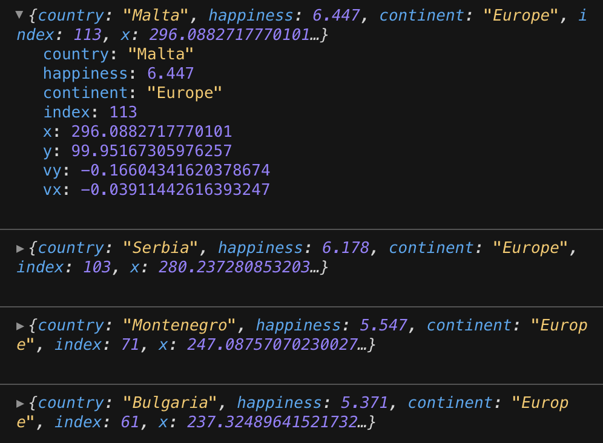
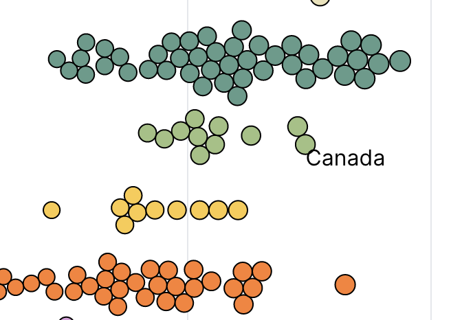
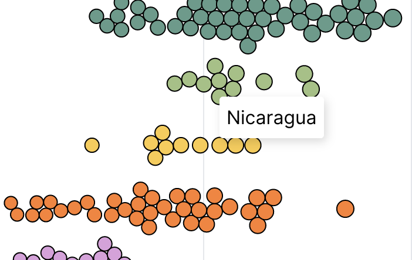
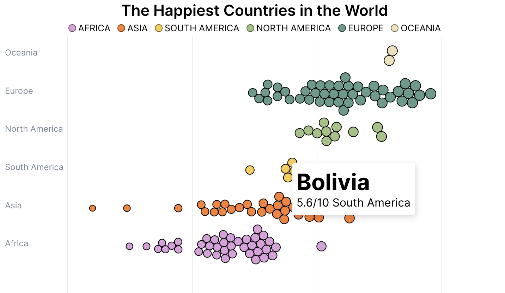
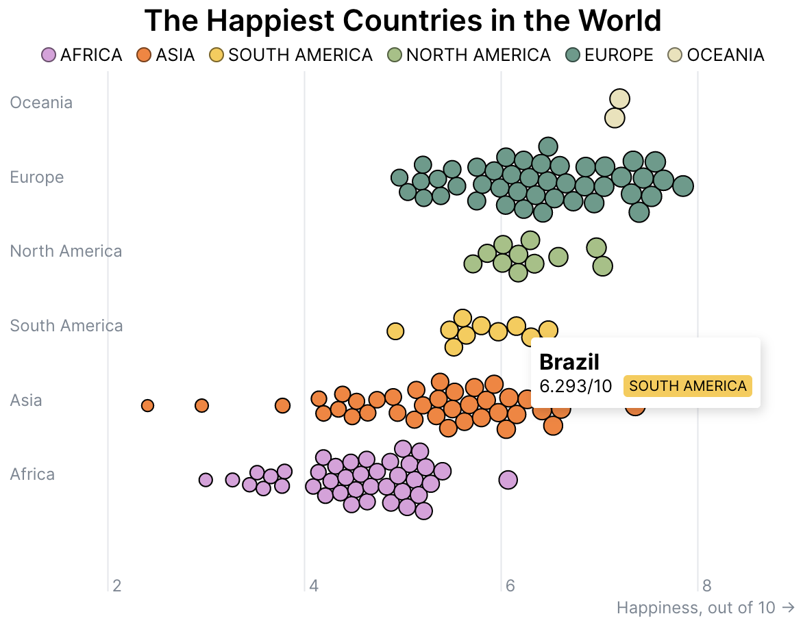
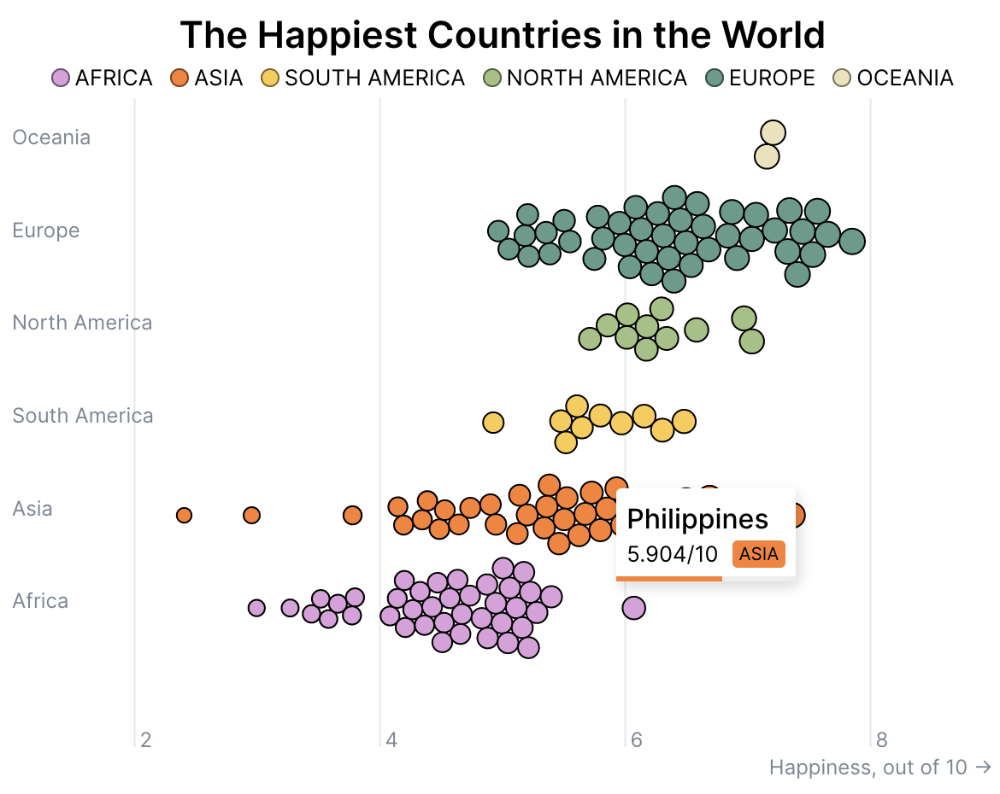
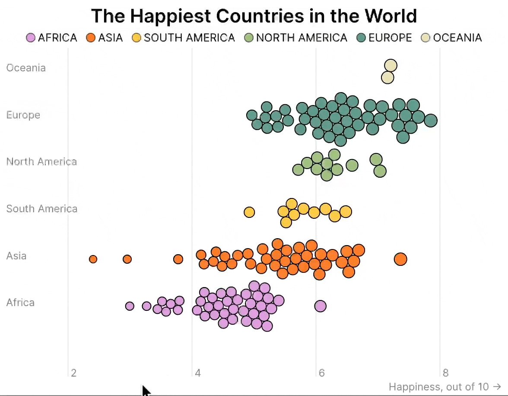
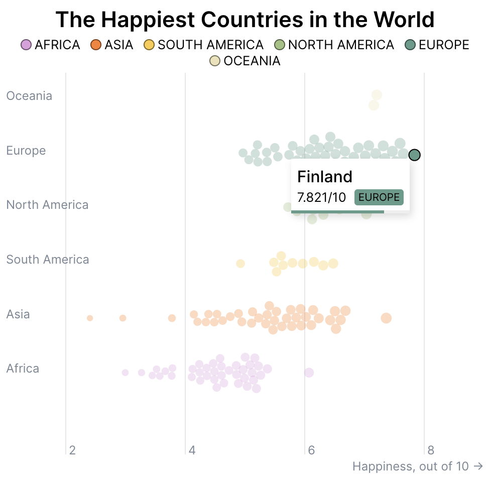

import Embed from "~/components/Embed";
import TopPageMargin from "~/components/TopPageMargin";
import Blockquote from "~/components/Blockquote";
import Highlight from "~/components/Highlight";

<TopPageMargin />

In the last lesson, we added peripheral elements to our force diagram, resulting in a mostly complete chart that looks like this:

<Embed title="0kbbzp" module="02" lesson="04" />

The only thing missing is interactivity. Currently, hovering over the chart does nothing. That's lame! We design data visualizations on the web so that we can leverage interactions in the browser.

In the next few lessons, we'll add interactivity to our force diagram. 

We'll do so on three fronts: 

1. We'll add a tooltip that shows the name of the country when you hover over a node.
2. We'll add events to our legend so that when a user hovers over a continent, it filters the chart.
3. We'll add a click event to our chart, so that users can toggle between grouping the circles altogether and by continent.

We'll spend this lesson making a tooltip. The creation of this tooltip will follow the same pattern as the last module. We'll need:

* A hover event on each circle
* A variable keeping track of the hovered data point
* A tooltip component that appears if there is a hovered data point

### Hover events

After the list of attributes currently present in each `circle` element, we'll add an `on:mouseover` event. This event will set the `hovered` variable to the data point associated with the hovered circle.

In our script tag, we'll instantiate `hovered` as a variable, and set it to `null` by default. 

```html
<script>
    let hovered;
    $: console.log(hovered) // To keep track of what is being hovered
</script>
```

In our markup, directly in our `{#each}` loop, we'll add the `on:mouseover` event. For accessibility purposes, we'll do the same thing `on:focus`, and add a `tabindex` attribute to each circle.

```html
{#each nodes as node (node.id)}
    <circle
        r={node.r}
        cx={node.x}
        cy={node.y}
        fill={node.fill}
        stroke={node.stroke}
        on:mouseover={() => hovered = node}
        on:focus={() => hovered = node}
        tabindex="0"
    />
{/each}
```

Now, if you hover over a circle and look in the console, you'll see the data associated with that element printed.



We'll add an `on:mouseleave` event to the `.inner-chart` element that contains our circles, so that the tooltip disappears when the chart loses focus:

```html
<g class="inner-chart" 
    transform="translate({margin.left}, {margin.top})"
    on:mouseleave={() => (hovered = null)}>
    <!-- Rest of chart -->
</g>
```

As with the last lesson, we want to render a tooltip only if there is a hovered data point. We'll do so by creating a new component, `Tooltip.svelte`, and rendering it in our markup.

In `App.svelte`, directly after our `svg` element, we'll add the following:

```html
<script>
    import Tooltip from "$components/Tooltip.svelte";
    // Other script code...
</script>

{#if hovered}
    <Tooltip data={hovered} />
{/if}
```

And in our `Tooltip.svelte` component:

```html
<script>
    export let data;
</script>
```

The great thing about force diagrams is that our x and y coordinates are already included in the `nodes` data we use to render our circles. Practically, that means we can simply position our tooltip according to these values.

You can see this with the following oversimplified and ugly tooltip:

```html
<script>
  export let data;
</script>

<div class='tooltip'
  style="position: absolute;
  top: {data.y}px;
  left: {data.x}px;"
>
  {data.country}
</div>
```



There are obviously a few things we'd like to change. Let's begin by styling our tooltip with CSS.

In our `<style>` tag, we'll add the following rules:

```css
.tooltip {
    position: absolute; 
    background: white;
    box-shadow: rgba(0, 0, 0, 0.15) 2px 3px 8px; /* Gives a nice 3d effect */
    padding: 8px 6px; /* Adds space around content within tooltip */
    border-radius: 3px; /* Rounds corners */
    pointer-events: none; /* Prevents tooltip from blocking mouse events */
}
```



Let's improve our tooltip by adding more content to it. Rather than just showing the country name, we'll show the country name, the continent, and the population. We'll also add a title to the tooltip.

We'll place the country in a `<h1>` tag, and the happiness score and continent directly below it, each in `<span>` elements (so that they can be placed next to each other).

```html
<div class='tooltip'
  style="top: {data.y}px; left: {data.x}px;"
>
  <!-- Country name -->
  <h1>
    {data.country}
  </h1>
  <!-- Additional info under the country name -->
  <span class="score">
    {data.happiness}/10
  </span>
  <span class="continent">
    {data.continent}
  </span> 
</div>
```



Currently, our `.score` and `.continent` elements are next to each other. It would be nice to space them out. We can do this by wrapping them in a flex container, and spacing them with `justify-content: space-between`. Let's also add a `column-gap` to give them a little more breathing room.

```html
<!-- Additional info under the country name -->
<div class='info'>
    <span class="score">
        {data.happiness}/10
    </span>
    <span class="continent">
        {data.continent}
    </span> 
</div>
```

```css
.info {
    display: flex;
    justify-content: space-between;
    column-gap: 8px;
}
```

Now, our "additional" content appears below the country name, and is spread out across the tooltip. We can further distinguish these two text elements visually. 

First, we'll just make our `.score` text smaller.

```css
.score {
    font-size: 0.8rem;
}
```

Next, let's make our continent text look more like a "label" by giving it a colored background and uppercase text. 

```css
.continent {
    font-size: 0.65rem;
    padding: 3px 4px 2px 4px;
    border-radius: 3px;
    text-transform: uppercase;
    white-space: nowrap; /* Prevents line breaks */
}
```

This creates the label look, but in order to actually color the background **dynamically** according  to the continent, we'll need to do that *inline*, using the `style` attribute. In order to do so, we'll also need to access the `colorScale` function in `App.svelte`; so import that into `Tooltip.svelte`.

```html
<script>
    export let data;
    export let colorScale; 
</script>

<!-- After other markup-->
<span class="continent" style="background: {colorScale(data.continent)}">
    {data.continent}
</span>
```

Nice! Our tooltip is looking pretty good.



Now, some additional styling. Let's add some vertical spacing between the country name and the additional info with `margin-bottom`. We'll also make sure the `h1` looks nice with a few other rules.

```css 
h1 {
    margin: 0;
    font-size: 1rem;
    font-weight: 500;
    margin-bottom: 3px;
}
```

#### Adding an inline bar chart

Let's add one final element to our tooltip: an inline bar chart. This will remind the viewer of the hovered country's happiness score and contextualize it within the range of possible values (0 to 10).

In our tooltip's markup, we'll add two new elements (a bar background and foreground) under our `.info` div, that will compose our bar chart.

```html
<span class="bar background" />
<span class="bar foreground" />
```

We want our bar chart to appear at the bottom of our tooltip, essentially serving as a bottom border. We'll absolutely position these bars using CSS:

```css
.bar {
    position: absolute;
    bottom: 0; /* Forces to bottom of tooltip */
    left: 0; /* Forces to left of tooltip */
    height: 3px; 
    width: 100%;
}
```

We want our bar chart's background to always be some muted gray color: 

```css
.bar.background {
    background: #eee;
}
```

The foreground of the bar chart (e.g., the actual bar) needs to be dynamically styled on two fronts: the bar width (proportional to its happiness score), and the bar color (proportional to its continent).

We'll use the inline `style` attribute to set the bar's width, and the `colorScale` function to set the bar's color.

```html
<span class="bar foreground" 
    style="width: {data.happiness * 10}%; 
     background: {colorScale(data.continent)}" />
```

:::note 

We set the `width` to `data.happiness * 10` because the happiness score is on a scale of 0 to 10, but we want the bar's width to be on a scale of 0 to 100.

:::

Nice!



### Transition our tooltip

We've got a pretty nice tooltip, but it's a little jarring when it appears. Let's add a transition to make it a little smoother.

When the tooltip appears, we'll use Svelte's built-in `fly` transition, and when it leaves, we'll use `fade`.

```html
<script>
  export let data;
  export let colorScale;

  import { fly, fade } from "svelte/transition"
</script>

<div
  class="tooltip"
  in:fly={{ y: 10, duration: 200, delay: 200 }}
  out:fade
  style="left:{data.x}px; top:{data.y}px;"
>
    <!-- Tooltip content-->
</div>
```

Now, the tooltip appears and disappears with motion. Transitioning **between** points, however, is still jarring. As we did in the last module, we can transition the `top` and `left` properties of the tooltip to make this transition smoother.

```css
.tooltip {
    transition: top 300ms ease, left 300ms ease;
}
```



### Prevent the tooltip from going off-screen

Remember how, in the last module, we adjusted our tooltip so that it would dynamically offset left or right based on its x-position. Let's do that again. On render of the tooltip, we'll need to do the following: 

* Record the x-position of the tooltip
* Record the width of the tooltip
* Check if the x-position plus the width of the tooltip, is greater than the width
* If so, offset the tooltip left by the width of the tooltip

Let's begin by importing the `width` property from `App.svelte` into `Tooltip.svelte`.

In `App.svelte`: 

```html
<Tooltip data={hovered} {colorScale} {width} />
```

And in `Tooltip.svelte`:

```html
<script>
    export let data;
    export let colorScale;
    export let width;
</script>
```

Next, let's bind the tooltip's width to a new variable called `tooltipWidth`. 

```html 
<script>
  export let width;
  export let data;
  export let colorScale;

  let tooltipWidth;
</script>

<div
  class="tooltip"
  in:fly={{ y: 10, duration: 200, delay: 200 }}
  out:fade
  style="left:{data.x}px; top:{data.y}px;"
  bind:clientWidth={tooltipWidth}
  >
    <!-- Tooltip content--> 
</div>
```

Now, we can see if the tooltip's x-position plus its width, is greater than the width of the chart. If so, we'll offset the tooltip left by its width. (While we're at it, let's also add some `nudge` to the tooltip's x-position, so it's not right up against the point.)

```html
<script>
  export let width;
  export let data;
  export let colorScale;

  import { fly, fade } from "svelte/transition";

  let tooltipWidth;

  const xNudge = 5;
  const yNudge = 5; 

  // If the x position + the tooltip width exceeds the chart width, offset backward to prevent overflow
  $: xPosition =
    data.x + tooltipWidth + xNudge > width
      ? data.x - tooltipWidth - xNudge
      : data.x + xNudge;
  $: yPosition = data.y + yNudge;
</script>
```

In our markup, we'll want to replace references to `data.x` and `data.y` with our new variables: `xPosition` and `yPosition`.

```html
<div
  class="tooltip"
  in:fly={{ y: 10, duration: 200, delay: 200 }}
  out:fade
  style="left:{xPosition}px; top:{yPosition}px;"
  bind:clientWidth={tooltipWidth}>
    <!-- Tooltip content-->
</div>
```

Now, if we hover over a super happy country, the tooltip stays on screen.



### Make clear which circle is being hovered

We've got a nice tooltip, but it's not clear which circle is being hovered. Let's add a little visual cue to make this clear. Similar to the last lesson, we'll leverage the existing `hovered` variable in `App.svelte` to determine which circle is being hovered. We'll adjust two attributes, `opacity` and `stroke`, based on the value of `hovered`.

```html
<!-- Within the svg element -->
{#each nodes as node, i}
    <circle
        cx={node.x}
        cy={node.y}
        r={radiusScale(node.happiness)}
        stroke={hovered
                ? hovered === node
                    ? "black"
                    : "transparent"
                : "#00000090"}
        fill={colorScale(node.continent)}
        title={node.country}
        opacity={hovered
                 ? hovered === node
                    ? 1
                    : 0.3
                : 1}
        on:mouseover={() => (hovered = node)}
        on:focus={() => (hovered = node)}
        tabindex="0"
    />
{/each}
```

:::note

As a reminder, the ternary operator (`?`) works like this:

```js
condition ? true : false
```

So in the above code, we're saying:

```js
<does hovered exist> ? 
    <if so, is hovered equal to node> ? 
    <state if hovered is equal to node> : 
        <state if hovered is not equal to node> : 
<state if hovered does not exist>
```

:::

This works, but the transitions are abrupt. Let's add a CSS transition to make this smoother. While we're at it, let's change the cursor to a pointer to make the hovered state clearer.

```css
circle {
    transition: stroke 300ms ease, opacity 300ms ease;
    cursor: pointer;
}
```

### Optional: add a reference line

Let's add one final element to our tooltip: a reference line. This will help the viewer understand the position of the hovered country relative to the other countries in the visualization. On hover, the reference line will appear, and will be positioned at the same x-coordinate as the hovered country.

This line will live in `App.svelte`, and we'll place it **before** our circles. (SVG elements render in order of appearance in the markup, so placing it before the circles ensures it will not overlap with them.)

Right after our `AxisX` and `AxisY` component, we'll add a new `<line>` element. We'll use the `x1` and `x2` attributes to set the line's start and end points, and the `y1` and `y2` attributes to set the line's vertical position.

Recall that we only want to show the reference line when a country is being hovered. We'll use the `hovered` variable to determine whether to show the line or not. We'll also use the `x` property of the hovered country to set the line's x-coordinate.

```html
{#if hovered}
    <line
        transition:fade
        x1={hovered.x}
        x2={hovered.x}
        y1={0}
        y2={height}
        stroke={colorScale(hovered.continent)}
        stroke-width="2"
    />
{/if}
```

This works, but the line is too tall: it currently goes from the very bottom of the chart to the very top. Let's adjust the `y1` and `y2` attributes to make the line shorter.

In particular, we want our line to start at the bottom of the **inner chart**, so we will make `y1` the `height` of the chart minus `margin.bottom`.

As for `y2`, let's stop the line **at the points position**. Practically, this means `y2` would be the `hovered` circle's `y` position plus the radius of the circle plus the top margin.

```html
{#if hovered}
    <line
        x1={hovered.x}
        x2={hovered.x}
        y1={height - margin.bottom}
        y2={hovered.y + margin.top + radiusScale(hovered.happiness)}
        stroke={colorScale(hovered.continent)}
        stroke-width="2"
    />
{/if}
```

Finally, we'll add `transition:fade` (after adding `import { fade } from "svelte/transition"`) to the line, so it fades in and out.

Great! We now have a completed tooltip interaction, with a reference line as a bonus:

<Embed title="thk042" module="02" lesson="05" />
