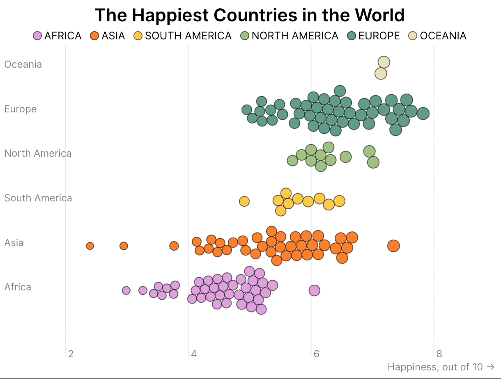
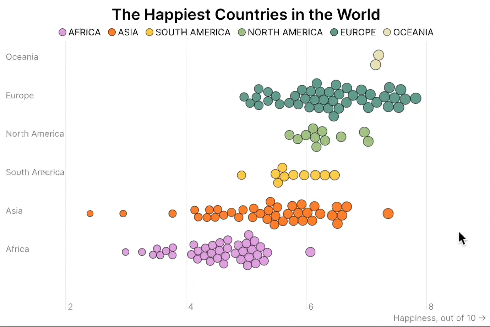
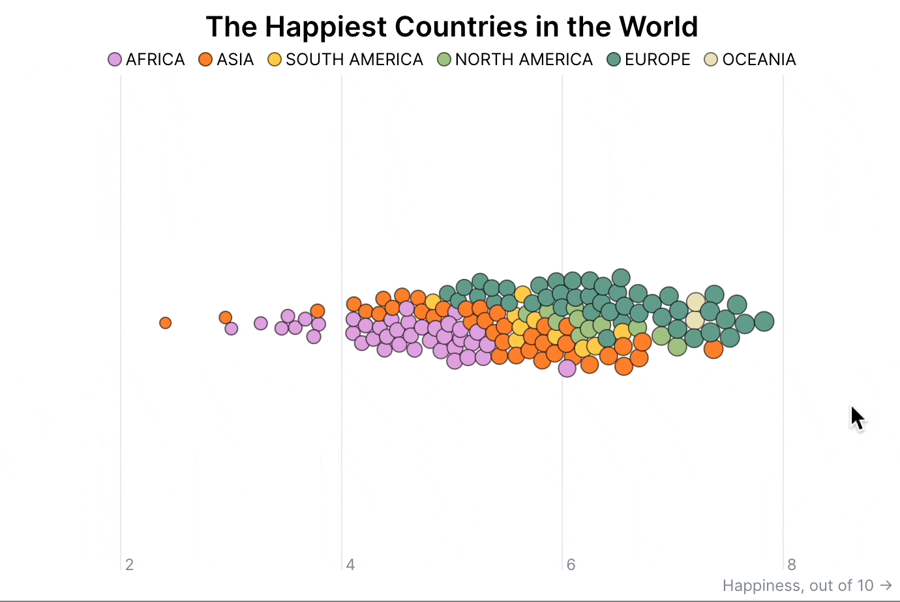

import Embed from "~/components/Embed";
import TopPageMargin from "~/components/TopPageMargin";
import Blockquote from "~/components/Blockquote";
import Highlight from "~/components/Highlight";

<TopPageMargin />

In the last lesson, we added a tooltip to our beeswarm chart. 

<Embed title="thk042" module="02" lesson="05" />

In this lesson, we'll add a few more interactivity features. In particular:

* We'll add hover events to the legend that filter the chart.
* We'll add a click event that toggles the chart between grouping countries together or by continent.

## Filtering the chart with the legend

Let's start by adding hover events to the legend.

Similar to setting `hovered` for individual elements, we'll instantiate a new variable called `hoveredContinent` that sets within `Legend.svelte`, and affects the appearance of circles in `App.svelte`. Because this variable will be referenced and interacted with in both components, we'll want to make it a [component binding](https://svelte.dev/tutorial/component-bindings). 

After instantiating the variable in `App.svelte`, we'll pass it to our `<Legend />` component, but with `bind:` in front of it. This tells Svelte that we want to bind the variable to the component, and that we want to update the variable when the component updates.

```html
<Legend {colorScale} bind:hoveredContinent />
```

Now, we can import the variable in `Legend.svelte`, and create our `on:mouseover` and `on:mouseleave` events.

```html
<script>
    export let colorScale;
    export let hoveredContinent;

    $: console.log(hoveredContinent)
</script>

<div class='legend' on:mouseleave={() => (hoveredContinent = null)}>
  {#each colorScale.domain() as continent}
      <p on:mouseover={() => (hoveredContinent = continent)}>
          <span style="background-color: {colorScale(continent)}" />
          {continent}
      </p>
  {/each}
</div>
```

If you look at the console, you'll see that `hoveredContinent` updates as we update our hover.

To give feedback to the user's interaction, let's change the appearance of each legend item if it is being hovered over. 

We'll do this by adding a new class, called `unhovered`, to elements that are not being hovered over.

```html
<div class='legend' on:mouseleave={() => (hoveredContinent = null)}>
  {#each colorScale.domain() as continent}
      <p on:mouseover={() => (hoveredContinent = continent)}
        class:unhovered={hoveredContinent && hoveredContinent !== continent}>
          <span style="background-color: {colorScale(continent)}" />
          {continent}
      </p>
  {/each}
</div>
```

:::note 

This reads like: "If `hoveredContinent` exists, and `hoveredContinent` is not equal to `continent`, then add the `unhovered` class to the element."

:::

Now, we can adjust the style of `.unhovered` elements using CSS.

And to prevent abrupt transitions, let's add a CSS transition on all `p` elements. Finally, let's add a `cursor: pointer` to make this interaction more obvious.

```css
.unhovered {
    opacity: 0.3;
}

p {
    /* Alongside other styling for p elements */
    transition: opacity 300ms ease;
    cursor: pointer;
}
```

### Adjusting circle styling from the legend

Now that we have our legend interactions sorted, let's use the same `hoveredContinent` to adjust circle styling in the same way. 

Back in `App.svelte`, we'll edit our existing `stroke` and `opacity` attributes to account for our new `hoveredContinent` variables. If `hoveredContinent` exists and matches the circle's continent, we'll emphasize that one and de-emphasize others.

For instance, for `opacity`, that would look like this:

```html
<!-- In addition to other attributes -->
<circle
    opacity={hovered || hoveredContinent
            ? hovered === node || hoveredContinent === node.continent
              ? 1
              : 0.3
            : 1}
/>
```

We'll do the same thing for `stroke`.

```html
<!-- In addition to other attributes -->
<circle
    stroke={hovered || hoveredContinent
            ? hovered === node || hoveredContinent === node.continent
                ? "black"
                : "transparent"
            : "#00000090"}
/>
```

Voila. Now, we're able to see which continents are in focus according to the legend interaction.



You may be asking: "why do we need these hover interactions? Aren't the circles already sorted by continent?" Yes. Until...

## Allow the user to group all countries together

Our final step of interaction will be a click event that toggles the chart between grouping countries together or by continent.

We'll create a new variable in `App.svelte` called `groupByContinent`, which we'll initially set to `false`. When the user clicks on the chart, we'll toggle `groupByContinent`. (We'll also unhover any specific countries that are in focus by setting `hovered` to `null`.)

That's as simple as the following code:

```html
<script>
    // In addition to the other script logic...
    let groupByContinent = false;
</script>

<h1>The Happiest Countries in the World</h1>
<Legend {colorScale} bind:hoveredContinent />
<div
  class="chart-container"
  bind:clientWidth={width}
  on:click={(e) => {
    groupByContinent = !groupByContinent;
    hovered = null;
  }}
>
<!-- Chart content -->
</div>
```

While `groupByContinent` is `true`, our force diagram will group countries by continent. When it's `false`, it will group all countries together. How do we achieve this? We revisit the force diagram logic we created all the way back in lesson 1.

```js
$: {
    simulation
        .force(
        "x",
        forceX()
            .x(d => xScale(d.happiness))
            .strength(0.8)
        )
        .force(
        "y",
        forceY()
            .y(d => yScale(d.continent))
            .strength(0.2)
        )
        .force("collide", forceCollide().radius(d => radiusScale(d.happiness)))
        .alpha(0.3)
        .alphaDecay(0.0005)
        .restart();
}
```

This is a big block of code, but all we need to focus on is the following:

```js
.force(
    "y",
    forceY()
        .y(d => yScale(d.continent))
        .strength(0.2)
    )
```

Because this is where we sort our circles by continent. 

We'll change this to:

```js
.force(
    "y",
    forceY()
        .y(d =>
        groupByContinent
            ? yScale(d.continent)
            : innerHeight / 2
        )
        .strength(0.2)
    )
```

This is simply a fancy way of saying "if `groupByContinent` is `true`, then sort by continent; otherwise, sort by the center of the chart."

Now, we can toggle between grouping by continent and grouping all countries together.



Let's polish up a couple of things about this interaction. 

First, the y-axis labels remain present even when we group all countries together. This makes no sense.

Let's pass `groupByContinent` to our `AxisY` component and hide the y-axis labels when `groupByContinent` is `false`.

In `App.svelte`:

```html
<AxisY {yScale} {groupByContinent} />
```

And in `AxisY.svelte`:

```html
<script>
  export let yScale;
  export let groupByContinent;

  $: ticks = yScale.domain();
</script>

<g class='axis y'>
    {#each ticks as tick, index}
        {#if groupByContinent}
            <g class='tick'>
                <text y={yScale(tick)} >{tick}</text>
            </g>
        {/if}
    {/each}
</g>
```

Although this works, it is abrupt. Let's add a nice `transition:fade` to each element, and delay each slightly:

```html
<!-- After importing { fade } from "svelte/transition" -->
<g class='axis y'>
    {#each ticks as tick, index}
        {#if groupByContinent}
            <g class='tick' in:fade={{delay: index * 100}} out:fade={{duration: 200}}>
                <text y={yScale(tick)}>{tick}</text>
            </g>
        {/if}
    {/each}
</g>
```



### Prevent clicking on circles

The final bit of weird behavior occurs when we click on a circle directly. Users might want to click on a circle thinking it would have an effect other than grouping, so let's prevent clicks on circles from doing anything.

In `App.svelte`, we'll add an `on:click` handler to our circles that stops other events via `stopImmediatePropagation`.

```html
<circle
    on:click={(e) => {
        e.stopImmediatePropagation();
    }}
/>
```

Now, when we click on a circle, nothing occurs. Here is our basically complete chart:

<Embed title="uxfemc" module="02" lesson="06" />
