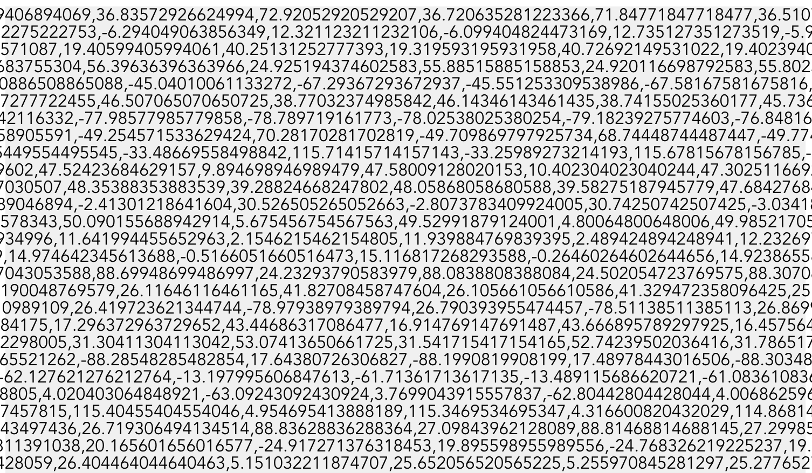

import Embed from "~/components/Embed";
import TopPageMargin from "~/components/TopPageMargin";

<TopPageMargin />

The first step in creating any map is plotting countries. In most maps, we have a set of values that we want to plot **according to their geography**, usually in some recognizable shape like a country.

In order to render our countries, we'll use the popular D3 module [`d3-geo`](https://github.com/d3/d3-geo). This module simplifies the process of turning complex country shapes into SVG elements which can be rendered in the browser.

:::note

You can see some visualization projects that use `d3-geo` on [Observable](https://observablehq.com/collection/@d3/d3-geo).

:::

To make a map (without using any data, yet), we will follow a few simple steps, that will be shared across any `d3-geo` project:

1. Create a projection function
2. Create a path generator
3. Render the country paths
4. Add a globe

But before we get started, we'll need to import a few files and libraries that will be used in any `d3-geo` project. Those include:

- `world-110m.json`, which is a GeoJSON file containing the coordinates of the world's countries. [You can download it here](https://unpkg.com/world-atlas@1.1.4/world/110m.json). (After installing, place it in your `src/data/` folder.)
- `topojson-client`: a library that will help us convert the GeoJSON file into a format that `d3-geo` can use. You can install it in your terminal, by running `npm install topojson-client`.

In the `<script>` tag at the top of `App.svelte`, add the following imports:

```js
import world from "$data/world-110m.json";
import * as topojson from "topojson-client";
```

:::note

Recall that `world-110m.json` is hosted locally, so we are referencing its path, while `topojson-client` is installed as a dependency, so we are referencing its name from npm.

:::

Now that we have those two files imported, we can continue with basic setup, by retrieving the countries and borders present within the GeoJSON file. Right under our imports, we'll write:

```js
let countries = topojson.feature(world, world.objects.countries).features;
let borders = topojson.mesh(world, world.objects.countries, (a, b) => a !== b);
```

Don't stress about memorizing this code. You'll use it in nearly every `d3-geo` project, so copying across projects is sufficient.

---

Go ahead and `console.log(countries)` and you'll see an array of 177 objects that look like this:


Let's break down what's in here, as understanding the structure of each country object will help us as we progress:

- `type`: the type of object, which is always `Feature`
- `id`: the country's [ISO 3166-1 alpha-3 code](https://en.wikipedia.org/wiki/ISO_3166-1_alpha-3)
- `properties`: an object which, in our file, is empty
- `geometry`: an object containing the coordinates of the country's borders (in an array)

And so each object represents a country, which has both metadata (the `id` and `properties`) and a shape (the `geometry`).

In our case, we'll be using the country's `id` to link to our data (as an ISO code is a unique identifier and more reliable than a country name), and the `geometry` to render the country's borders.

For fun, we can go ahead and see what happens if we just try to render the coordinates of the first country in our array:

```js
{#each countries as country}
  <p>{country.geometry.coordinates}</p>
{/each}
```

Congrats! You've made your first map!



Kidding (obviously). This code printed the coordinates, in text form, for every country in our data.

We do not want to print the coordinates directly, but instead **convert them to actual paths**. To do so, we'll need to create a geographic **projection**, and then a **path generator**.

## 1. Create a projection function

When we talk about maps created by `d3-geo`, we could be talking about any number of **projections**. Projections can be thought of as _how a map is presented_, including both its shape, level of granularity, and its angle. There are many projections, including some incredibly fun ones:

<div style={{ display: 'flex', flexWrap: 'wrap', gap: '1rem', marginBottom: '1rem' }}>

<a href="https://github.com/d3/d3-geo-projection#geoGingery"
target="\_blank" rel="noopener noreferrer"  
 style={{ width: 'calc(50% - 1rem)', boxShadow: '1px 1px 10px rgba(0,0,0,.15)', borderRadius: '5px' }}>


</a>

<a href="https://github.com/d3/d3-geo-projection#geoCollignon"
target="\_blank" rel="noopener noreferrer"  
 style={{ width: 'calc(50% - 1rem)', boxShadow: '1px 1px 10px rgba(0,0,0,.15)', borderRadius: '5px' }}>


</a>

<a href="https://github.com/d3/d3-geo-projection#geoBonne"
target="\_blank" rel="noopener noreferrer"  
 style={{ width: 'calc(50% - 1rem)', boxShadow: '1px 1px 10px rgba(0,0,0,.15)', borderRadius: '5px' }}>


</a>

<a href="https://github.com/d3/d3-geo-projection#geoBerghaus"
target="\_blank" rel="noopener noreferrer"  
 style={{ width: 'calc(50% - 1rem)', boxShadow: '1px 1px 10px rgba(0,0,0,.15)', borderRadius: '5px' }}>


</a>

</div>

Here's a fun view transitioning between the most common globe projections:

<iframe width="100%" height="510" frameborder="0"
  src="https://observablehq.com/embed/@d3/projection-transitions?cells=viewof+context"></iframe>

But in this course, we'll be using a pretty simple one: the **orthographic projection**. This projection closely resembles the simplest globe possible.


:::note

Why do we need to create the projection first? Because our path generator, which we'll create next, will use the projection to convert our coordinates into paths. If a projection looks different, so too will the paths that we generate.

:::

In order to create our orthographic projection, we'll use `d3.geoOrthographic()`. The structure of this function is similar to D3 scales, which we've used before:

```js
import { geoOrthographic } from "d3-geo";

$: projection = geoOrthographic()
  .scale(...) // How big the projection is
  .rotate(...) // How the projection is rotated
  .translate(...); // Where the projection is centered
```

For now, we'll pass some naive values to these functions, and then we'll come back to them later:

```js
let width = 400,
  height = 400;

$: projection = geoOrthographic()
  .scale(width / 2)
  .rotate([0, 0])
  .translate([width / 2, height / 2]);
```

## 2. Create a path generator

Now that we have a projection, we can create a path generator. This generator will take our coordinates and convert them into SVG paths, which we can then render on the page.

We'll use `d3.geoPath()`, which takes a projection as its only argument:

```js
import { geoOrthographic, geoPath } from "d3-geo"; // geoPath is new!

let width = 400;
$: height = width; // Because it is a circle, and we want it to update anytime width changes

$: projection = geoOrthographic()
  .scale(width / 2)
  .rotate([0, 0, 0])
  .translate([width / 2, height / 2]);

$: path = geoPath(projection); // This is new!
```

:::note

We're instantiating `projection` and `path` with the reactive dollar label so that they will automatically be responsive, when we get to that step.

:::

Now, if we `console.log()` the `borders` object passed into our path generator, we see a super long string that looks like this:

```svg
M328.75615181043236,79.08120754608592L329.84569748456477,78.54540605469695L329.963377632799,76.96492114428182L331.0492593777575,77.04412135278179L331.3840726129556,76.53219912442812L332.6142016059866,76.78799761242227L335.1571019320487,78.18428405698725L336.4976784058658,78.48908591917072L339.70941183528896,...
```

The astute among you may have noticed that this string is actually an [SVG path](https://developer.mozilla.org/en-US/docs/Web/SVG/Element/path)! This is because the `geoPath()` function converts our coordinates into SVG paths.

Let's use this path to render a path on the page.

## 3. Render the country paths

As with former charts, we'll use an `svg` element to render our map. Immediately within the SVG, we'll pass in our path as the `d` attribute of a `path` element:

```html
<svg width={width} height={height}>
  <path d={path(borders)} />
</svg>
```

Nice! We've got a globe:


Right now our borders resemble a zebra, due to their odd fill patterns. We can fix that by adjusting the paths' `fill` and `stroke` attributes:

```html
<svg width="{width}" height="{height}">
  <path d="{path(borders)}" fill="none" stroke="black" />
</svg>
```

That's better! Now our countries borders are appearing correctly. (Continent outlines are not yet visible, but they'll be made clear once we add fill attributes to our country and our globe.)


If you rotated the globe (using, for example, `.rotation([90, 0])`), you would see other countries as well.

We've rendered the borders of our countries, but we haven't yet rendered the countries themselves. Let's do that next.

Whereas the borders are a single path, the countries are a collection of paths. We can render these paths in an `{#each}` loop, by passing in the `countries` array we created earlier.

```jsx
<svg width="{width}" height="{height}">
  <!-- Countries -->
  {#each countries as country}
    <path d={path(country)} fill="lightgreen" stroke="none" />
  {/each}

  <!-- Borders -->
  <path d={path(borders)} fill="none" stroke="white" />
</svg>
```


:::note

Curious why we pass in a separate `borders` path, rather than just applying a `stroke` to each country?

The strokes of adjacent countries would overlap, creating a messy appearance. By separating the borders into their own path, we can ensure that they're rendered on top of the countries.

:::

## 4. Add a globe

Finally, let's add a globe in the background. We'll use a `circle` element to render the globe, and we'll use the `fill` attribute to give it a blue color.

Recall that we've already created variables for our chart's `width` and `height` (they are the same, because its a circle).

Given that a `circle` accepts an `r` attribute, we can use these variables to set the radius of our globe. And so that the circle is centered on the page, we'll use the `cx` and `cy` attributes to set the center of the circle.

We'll create our circle element as the first child of our SVG element (so that it appears behind the countries and borders):

```html
<svg>
  <!-- Globe -->
  <circle r={width / 2} cx={width / 2} cy={height / 2} fill="lightblue" />

  <!-- Countries -->
  {#each countries as country}
    <path d={path(country)} fill="lightgreen" stroke="none" />
  {/each}

  <!-- Borders -->
  <path d={path(borders)} fill="none" stroke="white" />
</svg>
```

Voila! We've made a globe, complete with countries and borders:

<Embed title="0n0h30" module="03" lesson="01" />

## Need help? Further reading

* [Making maps with D3](https://www.d3indepth.com/geographic/)
* [Geo Projections](https://d3-wiki.readthedocs.io/zh_CN/master/Geo-Projections/)
* [geoPath](https://github.com/d3/d3-geo#geoPath)
* [world-atlas](https://github.com/topojson/world-atlas)