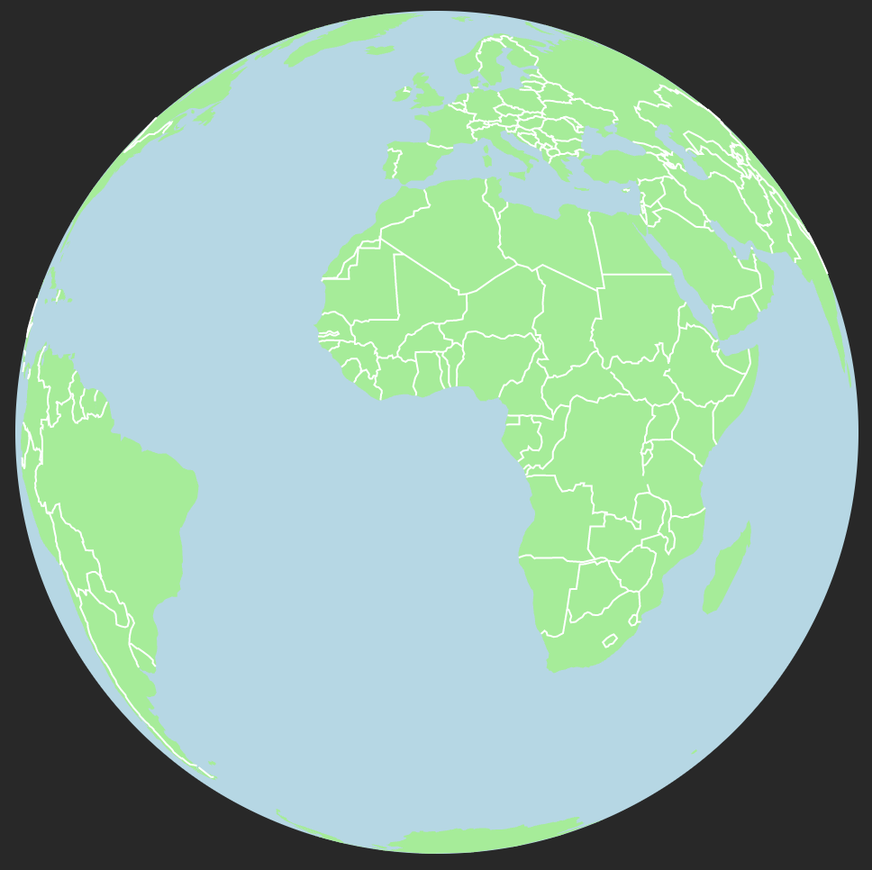
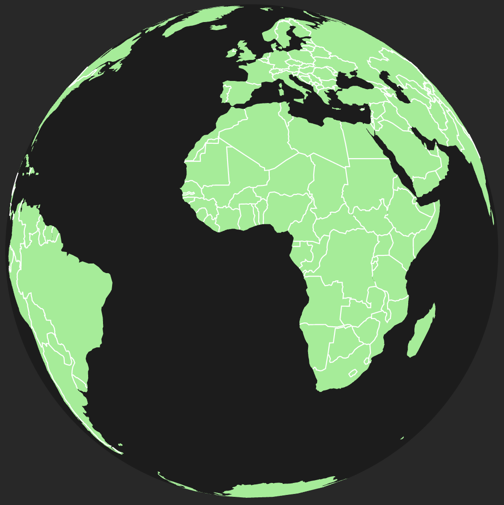
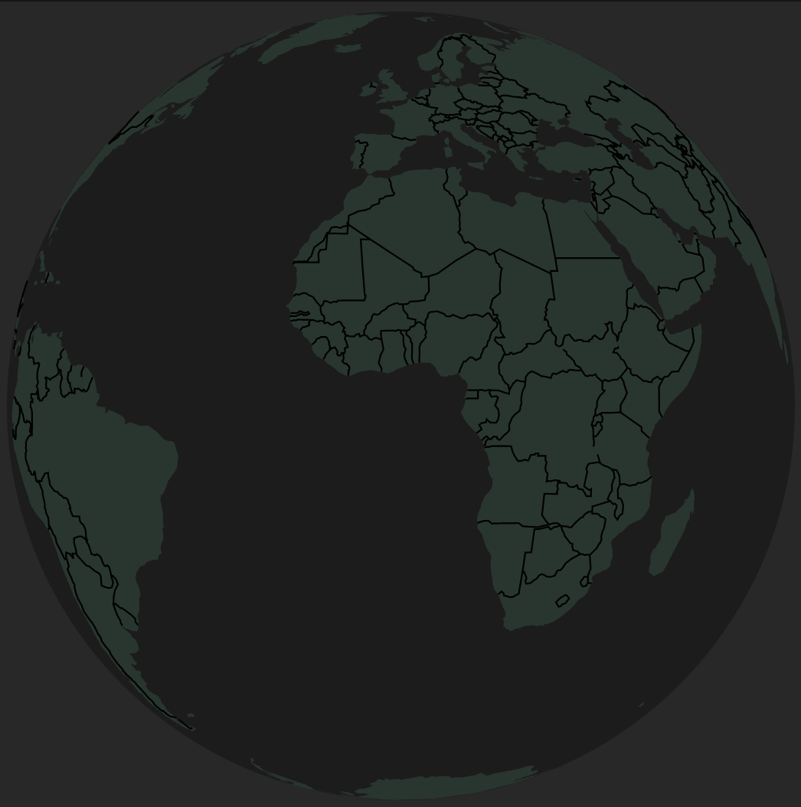

import Embed from "~/components/Embed";
import Highlight from "~/components/Highlight";
import TopPageMargin from "~/components/TopPageMargin";

<TopPageMargin />

We now have a globe that looks nice and is responsive.

<Embed title="0n0h30" module="03" lesson="02" />

Let's take a brief detour to make it look a bit nicer. We'll add a background color, and we'll add a bit of a glow to the globe.

## Adding a background color

Let's add a background color to our entire page, by targeting the `body` element. We'll do this in `App.svelte`, and we'll have to use `:global(body)` because it technically lives outside of `App.svelte`.

```html
<style>
  :global(body) {
    background: rgb(40, 40, 40);
  }
</style>
```

Nice! Now we have a dark background.



## Filling the globe

Let's make our globe match our dark mode theme by replacing our blue fill with something darker. We simply change the `fill` attribute of our `globe` element.

```html
<circle cx={width / 2} height={height / 2} fill='#1C1C1C' />
```



Now our countries feel out of place, so let's adjust the fill of each `path` to something more muted, like <Highlight color="#26362e">#26362e</Highlight>. While doing so, let's also switch the border stroke from white to <Highlight color="#1C1C1C">#1C1C1C</Highlight>.

```jsx
<path d={path(country)} fill="#26362e" stroke="none" />
```

```jsx
<path d={path(borders)} fill="none" stroke="black" />
```

That looks better!



## Bonus: adding a glow

As a bonus, we can add a subtle glow to our globe. (This is obviously optional if you want to skip it.)

We'll need to create an [SVG filter](https://developer.mozilla.org/en-US/docs/Web/SVG/Element/filter) and then apply it to our globe. We can create an SVG drop shadow filter using `feOffset`, `feGaussianBlur`, and `feMerge`. You can read more and see examples [here](https://www.w3schools.com/graphics/svg_feoffset.asp).

:::note

As a note, this is somewhat complex and beyond the scope of this course. For now, we'll just copy and paste the code below.

:::

Because this chunk of code is characteristically distinct from everything else we have, let's place it in a new component, which we'll call `<Glow />`.

```html
<defs>
  <filter id="glow" height="130%">
    <feGaussianBlur in="SourceAlpha" stdDeviation="7.5" />
    <feOffset dx="0" dy="0" result="offsetblur" />
    <feFlood flood-color="rgba(100, 255, 100, .85)" />
    <feComposite in2="offsetblur" operator="in" />
    <feMerge>
      <feMergeNode />
      <feMergeNode in="SourceGraphic" />
    </feMerge>
  </filter>
</defs>
```

Now, import `<Glow />` in `App.svelte`, and add it to the top of the `<svg>` element.

```jsx
<script>
  import Glow from "./Glow.svelte";
</script>

<svg width={width} height={height}>
  <Glow />
  <!-- Chart content goes here -->
</svg>
```

And finally, we can apply the filter to our globe by adding `filter="url(#drop-shadow)"` to the `<circle>` element.

```html
<circle filter="url('#glow')" />
```

You may notice that it looks good, but that the drop shadow is cut off on the edges of the chart. We can fix this a few ways, but for now we'll just add `overflow: visible` to the `<svg>` element.

```css
svg {
  overflow: visible;
}
```

And now, we have a styled globe!

<Embed title="iiq1ti" module="03" lesson="03" />

<!-- TODO: Add help resources -->
