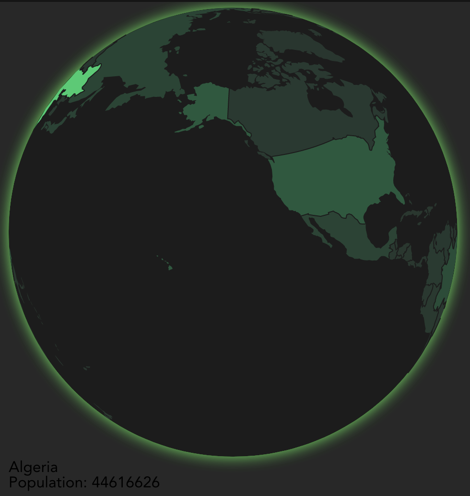
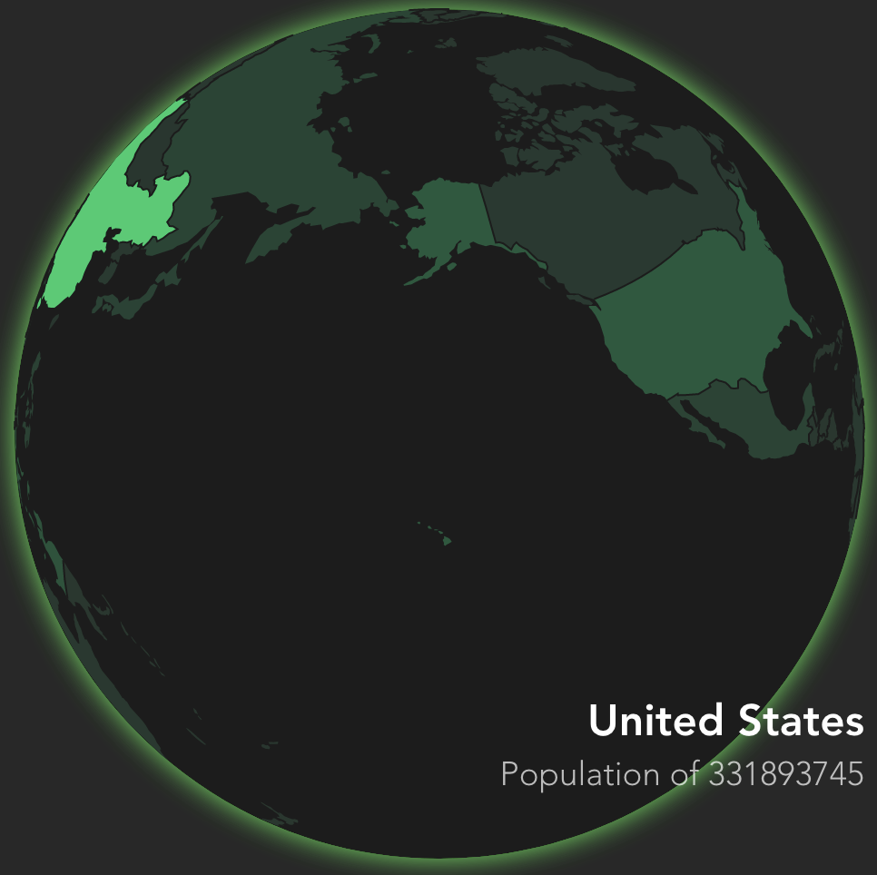

import Embed from "~/components/Embed";
import Highlight from "~/components/Highlight";
import TopPageMargin from "~/components/TopPageMargin";

<TopPageMargin />

We ended last lesson by making our globe rotatable.

<Embed title="oz6pt6" module="03" lesson="05"  />

In this lesson, we'll allow the user to click on a country and see its population. We'll do so by adding a fixed tooltip, and by stopping autorotation on focus.

## Adding a tooltip

The steps required to add a tooltip are not that different from our prior modules. We will add a click event to each country, store the clicked data in a new variable, and display it in a tooltip.

### Click events and storing data

In `App.svelte`, add a click event to each country:

```jsx
  {#each countries as country}
    <path
      d={path(country)}
      fill={colorScale(country.population || 0)}
      stroke="none"
      on:click={() => {
        console.log(country)
      }}
    />
  {/each}
```

Now, when you click on a country, you'll see an object like this:

```json
{
  type: "Feature",
  id: "156",
  properties: Object,
  geometry: Object,
  population: 1412360000,
  country: "China"
}
```

Rather than logging that object, let's store it in a new variable, `tooltipData`.

```jsx
<script>
  // Alongside existing script tag code...
  let tooltipData;
</script>

<!-- Alongside existing markup -->
{#each countries as country}
  <path
    d={path(country)}
    fill={colorScale(country.population || 0)}
    stroke="none"
    on:click={() => {
      tooltipData = country;
    }}
  />
{/each}
```

### Displaying the tooltip

Now that we have `tooltipData`, we can go ahead and render a tooltip. Create a new component in `src/components/` and call it `Tooltip.svelte`. We'll place this at the bottom of our markup in `App.svelte`, **under our SVG element** (because this will be HTML, not SVG).

```jsx
<script>
  // Alongside existing script tag code...
  import Tooltip from "./components/Tooltip.svelte";
</script>

<!-- Alongside existing markup -->
<svg></svg>
<Tooltip data={tooltipData} />
```

Now, in `Tooltip.svelte`, we'll render the tooltip. We'll see if `data.country` exists to determine whether or not to render the tooltip, and we'll use the `data` prop to render the country name and population.

```jsx
<script>
  export let data;
</script>

{#if data?.country}
  <div>
    <h2>{data.country}</h2>
    <h3>Population of {data.population}</h3>
  </div>
{/if}
```

Great! We have a tooltip, it just needs some styling:



In particular, let's make three changes:

1. Place the tooltip in the bottom right corner of the globe
2. Make the tooltip text white
3. Make the country a larger font size

We can do this by adding the following styles in the `<style />` tag of `src/Tooltip.svelte`:

```css
div {
  position: absolute;
  bottom: 30px;
  right: 0;
  text-align: right;
}

h2 {
  font-size: 1.5rem;
  font-weight: 700;
  margin-bottom: 0.25rem;
  color: white;
}

h3 {
  font-size: 1.15rem;
  font-weight: 200;
  color: rgba(255, 255, 255, 0.7);
}
```

Now we have a better looking tooltip:



### Making the tooltip disappear when the user clicks outside of it

We can make the tooltip disappear when the user clicks outside of it by adding a click event to our globe element. Whenever a user clicks on the globe, we'll want to reset `tooltipData` to `null`. We'll do this in `App.svelte`:

```jsx
<circle
  r={width / 2}
  cx={width / 2}
  cy={height / 2}
  fill="#1c1c1c"
  filter="url(#glow)"
  on:click={() => (tooltipData = null)}
/>
```

### Freezing the globe on focus

When the user clicks on a country, we want to 1) pan to that country, 2) stop autorotation, and 3) highlight the country.

#### Pan to the country

First, we'll pan to the country. We'll use the `centroid` function from `d3-geo` to calculate the center of the country. We'll use this to pan to the country.

```jsx
<script>
  // Alongside existing script tag code...
  import { geoPath, geoCentroid } from "d3-geo";

  // Whenever tooltipData changes, calculate the center of the country and rotate to it
  $: if (tooltipData) {
    const center = geoCentroid(tooltipData);
    projection.rotate([-center[0], -center[1]]);
  }
</script>
```

This works, but the transition is abrupt. Rather than updating `projection.rotate()` instantly, let's reuse our existing `xRotation` and `yRotation` variables to animate the transition.

```jsx
// Whenever tooltipData changes, calculate the center of the country and rotate to it
$: if (tooltipData) {
  const center = geoCentroid(tooltipData);
  $xRotation = -center[0];
  $yRotation = -center[1];
}
```

#### Stop autorotation

This works, although the globe continues to rotate despite our new focus. To fix this, we need to stop autorotation in our `timer` function.

```jsx
// In our existing timer
const t = timer(() => {
  if (dragging || tooltipData) return;
  $xRotation += degreesPerSecond;
}, 1);
```

#### Highlight the country

Finally, we'll highlight the country by drawing a new border around it.

:::note

We want to draw a new path, rather than just updating our existing border stroke, so that 1) we can transition the border in ("draw it into place") and 2) it lays on top of all other borders.

:::

Right before our SVG element closes, we'll add a new path element. We'll use the `tooltipData` prop to determine whether or not to render the path.

Finally, we'll use the very cool built-in Svelte transition `draw` to transition the border in.

Note that you'll need to add `import { draw } from "svelte/transition"` in your `App.svelte` script tag.

```jsx
{#if tooltipData}
  {#key tooltipData.id}
    <path
      d={path(tooltipData)}
      fill="transparent"
      stroke="white"
      stroke-width="2"
      pointer-events="none"
      in:draw
    />
  {/key}
{/if}
```

:::note

Here, we add the `{#key}` block so that the path will rerender anytime `tooltipData.id` changes.

:::

### Additional polish

Let's finish this lesson with three small steps:

1. Format the tooltip population
2. Add a transition to the tooltip
3. Add a pointer cursor to each country

#### Formatting the tooltip population

We can use the `d3-format` library to format the population. We'll use the `format` function to format the population as a string with commas. Within `Tooltip.svelte`:

```html
<script>
  import { format } from "d3-format";
  const suffixFormat = (d) => format(".2~s")(d).replace(/G/, "B");
</script>
```

:::note

This function uses `d3.format` to return a newly formatted number in ["decimal notation with an SI prefix,"](https://github.com/d3/d3-format#locale_formatPrefix) but replaces any "G" with "B".

:::

Then, we pass our `population` to the `suffixFormat` function:

```jsx
<h3>Population of {suffixFormat(data.population)}</h3>
```

<!-- TODO: Add help resources  -->

#### Adding a pointer cursor to each country

We can add a pointer cursor to each country by adding a `cursor: pointer` style to the `path` element in `App.svelte`:

```css
path {
  cursor: pointer;
}
```

## Make it accessible

Our final step is to make our globe accessible to keyboard users. We'll do this by adding a `tabIndex` attribute to each country element, and mimicking the click event when the user focuses via keyboard.

```jsx
{#each countries as country}
  <path
    d={path(country)}
    fill={colorScale(country.population || 0)}
    stroke="none"
    on:click={() => (tooltipData = country)}
    on:focus={() => (tooltipData = country)}
    tabIndex="0"
  />
{/each}
```

Now, as you tab throughout, you'll see the tooltip appear as you focus on each country. You can add the following code to your `<style />` tag to hide the CSS outline that appears when you focus on an element:

```css
path:focus {
  outline: none;
}
```

:::note

Typically removing `:focus` styles is bad accessibility practice, but in our case the focused country has its own path outline.

:::

Voila! We've completed this step and now have a fully interactive globe.

<Embed title="nrbxgc" module="03" lesson="06"  />

<!-- TODO: Add help resources -->
