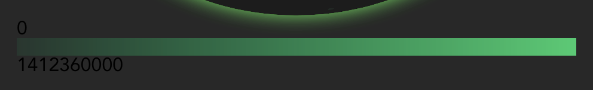

import Embed from "~/components/Embed";
import Highlight from "~/components/Highlight";
import TopPageMargin from "~/components/TopPageMargin";

<TopPageMargin />

We ended last lesson with a fully interactive globe.

<Embed title="nrbxgc" module="03" lesson="06" />

Let's finish up by adding a legend, which will provide context for what each color means. We'll also make it interactive, so that a line will appear at the corresponding position when the user clicks on a country.

We'll begin by creating a new component, `Legend.svelte`, which will be responsible for rendering the legend. It will need to accept two props:

- `colorScale`: the color scale
- `tooltipData`: the data for the tooltip

In `App.svelte`, we'll import the new component and pass it the `colorScale` and `tooltipData` variables. This will live **under** our SVG element, because it will be an HTML element, not an SVG element.

```jsx
<Legend {colorScale} data={tooltipData} />
```

Then, in `Legend.svelte`, we'll accept those props:

```html
<script>
  export let colorScale;
  export let data;
</script>
```

We'll leverage `colorScale`'s domain to get the largest value in our legend, and `colorScale`'s range to actually fill the legend with the correct colors.

On a high level, our legend should have three components:

1. A bar that shows the color scale
2. A line and label that shows the value of the selected data
3. Labels on the left and right that show the min and max values

Let's start with the bar. We'll create a new `<div>` element with a `background` property, which will be a [linear gradient](https://developer.mozilla.org/en-US/docs/Web/CSS/gradient/linear-gradient). In our case, the first color will be the first color in the `colorScale`'s range, and the last color will be the last color in the `colorScale`'s range.

```jsx
<div
  class="bar"
  style:background="linear-gradient(to right, {colorScale.range()[0]}, {colorScale.range()[1]})"
/>
```

You'll notice that nothing appears; that's because we haven't set any dimensions for the bar. Let's do that now. We'll do this in the `<style />` tag:

```css
.bar {
  height: 15px;
  width: 100%;
}
```

Let's add the labels on either side of the bar. To do so, let's wrap our existing bar in another `div`, this time with a class of `.legend`.

```jsx
<div class="legend">
  <span class="label">{colorScale.domain()[0]}</span>
  <div
    class="bar"
    style:background="linear-gradient(to right, {colorScale.range()[0]}, {colorScale.range()[1]})"
  />
  <span class="label">{colorScale.domain()[1]}</span>
</div>
```



Our legend is arranged vertically, because that is the natural order of the document. We will arrange horizontally by making the parent container, `.legend` a Flexbox element. We'll add a `gap` of `6px` to include space between elements.

```css
.legend {
  display: flex;
  gap: 6px;
}
```

Next, let's style the text labels. First, we'll reuse the suffix formatter we used in `Tooltip.svelte`, so that it looks nicer, and then we'll adjust their CSS properties:

```html
<script>
  // Alongside other script code...

  import { format } from "d3-format";
  const suffixFormat = d => format(".2~s")(d).replace(/G/, "B");
<script>

<div class="legend">
  <span class="label">{colorScale.domain()[0]}</span>
  <div
    class="bar"
    style:background="linear-gradient(to right, {colorScale.range()[0]}, {colorScale.range()[1]})"
  />
  <span class="label">{suffixFormat(colorScale.domain()[1])}</span>
</div>
```

And then we add the CSS rules:

```css
.label {
  color: white;
  font-size: 0.85rem;
  user-select: none;
}
```

Now our legend looks much better:


## Adding a reference line

Let's complete our legend by rendering a line when a user selects a country. This will provide reference to that country's population compared to the highest population in our data.

Recall that we imported `tooltipData` (as `data`) in `Legend.svelte`. We can access that data's population, relative to the max, with a function like this (in the `<script />` tag):

```js
$: percentOfMax = (data?.population / colorScale.domain()[1]) * 100;
```

Go ahead and `$: console.log(percentOfMax)` and you'll see that number update in real time.

In our legend, we want to position a line `absolute`ly at that position in the legend bar.

So, we'll add a new child to our existing `.bar`, and call it `.line`.

```html
<div
  class="bar"
  style:background="linear-gradient(to right, {colorScale.range()[0]}, {colorScale.range()[1]})"
>
  {#if percentOfMax}
  <span class="line" style="left: {percentOfMax}%;" />
  {/if}
</div>
```

Again, you'll notice that nothing appears, because `.line` has no dimensions. Let's give it a width and height, and some basic styling:

```css
.line {
  position: absolute;
  top: 0;
  height: 15px;
  width: 2px;
  background: white;
  transition: left 800ms cubic-bezier(1, 0, 0, 1);
}
```

Finally, so that it actually appears, you'll need to make the parent container, `.bar` have a position of `relative`.

```css
.bar {
  height: 15px;
  width: 100%;
  position: relative;
}
```

Great! Now we see our line, and it moves between states.

Finally, let's give it a `transition:fade` so that it fades in and out nicely:

```html
<span class="line" transition:fade style="left: {percentOfMax}%;" />
```

<Embed title="fbvoot" module="03" lesson="07" />
