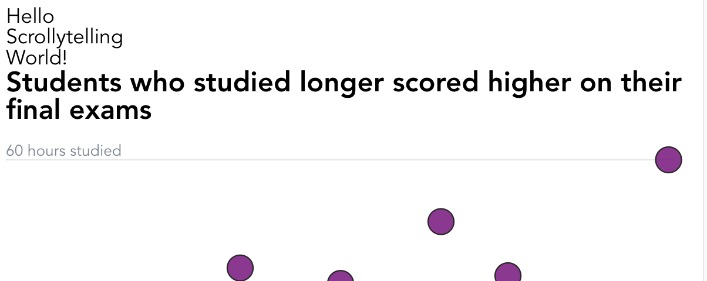

import Embed from "~/components/Embed";
import TopPageMargin from "~/components/TopPageMargin";
import TweetEmbed from "~/components/TweetEmbed";

<TopPageMargin />

As a reminder, the purpose of this module is to create a new scrollytelling article based on our module 1 chart:

<Embed title="ohk8k9" 
        module="01"
        lesson="final" />

In this lesson we'll set up the bare minimum needed to get started with scrollytelling. Rather than reinvent the technical wheel, we'll leverage existing tools. In this case, we'll use Russell Samora's `<Scrolly />` component, which he documents in [this Tweet](https://twitter.com/russellviz/status/1432774653139984387?ref_src=twsrc%5Etfw).

<TweetEmbed>

<blockquote class="twitter-tweet"><p lang="en" dir="ltr">A <a href="https://twitter.com/sveltejs?ref_src=twsrc%5Etfw">@sveltejs</a> scrollytelling component in &lt; 100 lines. <a href="https://twitter.com/SvelteSociety?ref_src=twsrc%5Etfw">@SvelteSociety</a> <a href="https://t.co/l8fOJaiwkX">https://t.co/l8fOJaiwkX</a> <a href="https://t.co/VJclnWSmhT">pic.twitter.com/VJclnWSmhT</a></p>&mdash; Russell Samora @russell@vis.social (@russellviz) <a href="https://twitter.com/russellviz/status/1432774653139984387?ref_src=twsrc%5Etfw">August 31, 2021</a></blockquote> 

</TweetEmbed>

As you can see in the [linked REPL](https://svelte.dev/repl/3d3736e634c9404ea8ec2ef7b87e2053?version=3.42.4), `Scrolly.svelte` is a single component that will use the [Intersection Observer API](https://developer.mozilla.org/en-US/docs/Web/API/Intersection_Observer_API) to update a variable as different elements come into view.

Let's illustrate with the simplest possible example:

```html
<script>
    import Scrolly from "./Scrolly.svelte";
    let value; // 1. value is initially undefined; it will update thanks to <Scrolly />
    $: console.log({ value }) // 2. You can see the value updating in the console
</script>

<Scrolly bind:value> <!-- 3. This is what updates value -->
    {#each ['Hello', 'Scrollytelling', 'World!'] as text, i}
        <div class="step" class:active={value === i}> <!-- 4. Dynamically applies the active class -->
            <div class="step-content">
                <p>{text}</p> 
            </div>
        </div>
    {/each}
</Scrolly>
```

In words:

1. We instantiate a variable with the name `value`. This could be called anything, it just needs to match #3.
2. In the console, we can see `value` updating in real time. The `$:` prefix makes this rerun anytime `value` changes.
3. We create the `<Scrolly />` component, and use `bind:value` to update our `value` variable based on what's happening behind the scenes. Again, this could be called anything (`value`, `step`, `index`, etc.).
4. A class of `active` is dynamically applied to the step that is currently in view.

Go ahead and scroll and watch as the active step visible updates:

<iframe src="https://svelte.dev/repl/e79ece9d5af346748b09a388b9e021a5?version=3.55.1" 
width="100%" height="600px" frameborder="0" />

Let's copy this simple code into our existing project, as a starting point. 

## Setting up `<Scrolly />`

First, we need to import `Scrolly` as a component. [You can download Scrolly.svelte here.](./public/Scrolly.svelte) After its downloaded, place it in a new folder called `helpers/`.

Next, we need to add the component to our `App.svelte` file, and reference it in our markup. Let's go ahead and copy the above example to start (but we'll replace `value` with `currentStep`, as its a more accurate name):

```html
<script>
    import Scrolly from "./helpers/Scrolly.svelte";
    let currentStep;
    console.log({ currentStep })

    // Alongside other script code...
</script>

<!-- Chart markup lives here -->
<Scrolly bind:value={currentStep}>
    {#each ['Hello', 'Scrollytelling', 'World!'] as text, i}
        <div class="step" class:active={currentStep === i}>
            <div class="step-content">
                <p>{text}</p> 
            </div>
        </div>
    {/each}
</Scrolly>
```

The first problem we'll notice is that all steps are visible at once.



In a real article, we want each step to live in its own space, and so we use CSS to make each `.step` nearly the entire screen height.

```css
.step {
    height: 90vh; /* 90 viewport height units, meaning 90% of the screen */
}
```

Great—now only one step is visible at a time. Another problem is we can't tell which step is "active"—in most scrollytelling stories, the active step is in view and visually distinct from others, usually via toggling its opacity.

Let's make the default step semitransparent, and the active one fully opaque:

```css
.step {
    height: 90vh;
    opacity: 0.3;
}

.step.active {
    opacity: 1;
}
```

To make the transition between states smooth, we can also add a transition property.

```css
.step {
    height: 90vh;
    opacity: 0.3;
    transition: opacity 300ms ease;
}

.step.active {
    opacity: 1;
}
```

Now, notice how the steps become transparent or opaque smoothly, once they enter and leave the viewport!

## Place it on top

The remaining issue is that our scrollytelling steps are in a fully separate section than our chart. In reality, scrollytelling looks nice because the reader is able to see **the chart** and **the text** at the same time.

In order to achieve this, we'll need to wrap both our scrollytelling steps and our chart in a single container. We'll wrap them in a `<section />` element. We'll also want our chart to be sticky, so we will wrap it in a new element with a class of `sticky`.

```html
<section>
    <div class='sticky'>
        <!-- .chart-container and its children -->
    </div>
    <div class='steps'>
        <!-- <Scrolly /> and its children--> 
    </div>
</section>
```

At first, nothing will change.

We'll need to use CSS to 1) make our section the `relative` container, 2) make the `.sticky` element stick to it, and 3) make the `.steps` element scrollable. 

```css
section {
    position: relative;
}

.sticky {
    position: sticky;
    top: 0;
}
```

This is working! Let's add a few more CSS rules so that our steps are centered.

```css
.step {
    height: 90vh;
    opacity: 0.3;
    transition: opacity 300ms ease;
    display: flex; /* ✅ */
    justify-content: center; /* ✅ */
    place-items: center; /* ✅ */
}
```

This set of rules makes sure that the each step is centered within its `90vh` height. This set of three rules are commonly used to center elements in CSS.

Next, let's make each individual step have a background of white, and a border of 1px solid black. This will make it easier to see the steps.

```css
.step-content {
    padding: 0.75rem 1rem;
    border: 1px solid black;
    border-radius: 3px;
    background: white;
}
```

You may notice that the steps are sometimes behind the circles. This is because our code doesn't know which to place on top of the other. We can explicitly tell the browser to place the steps on top of the circles by adding a `z-index` property to the `.steps` element (and ensuring it is higher than the `.sticky` element). For z-index to apply, the element must have a `position` property of `relative`, `absolute`, or `fixed`—so we'll apply that to `.steps`.
 
```css
.steps {
    z-index: 2;
    position: relative;
}
``` 

Voila! We have some completed scrollytelling steps, and they are directly on top of our chart.

<Embed title="0yve1y" module="04" lesson="01" />

<!--  ## Need help? Further reading -->