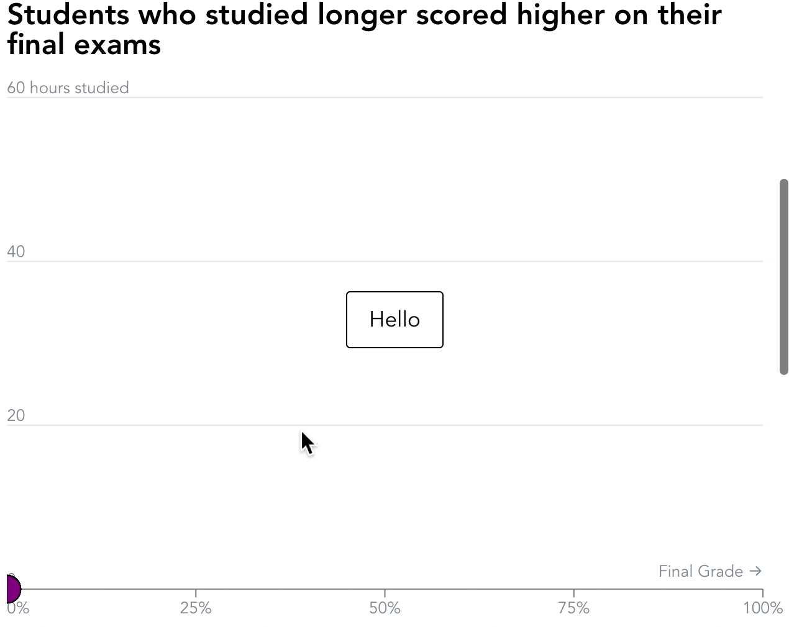
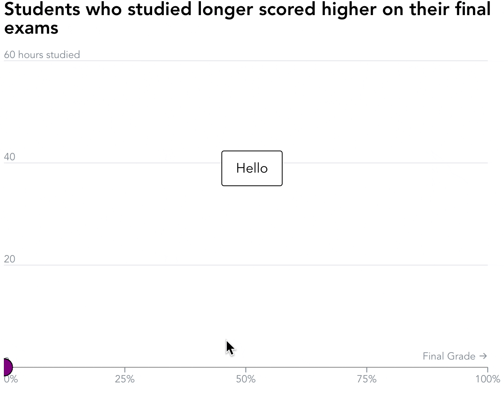
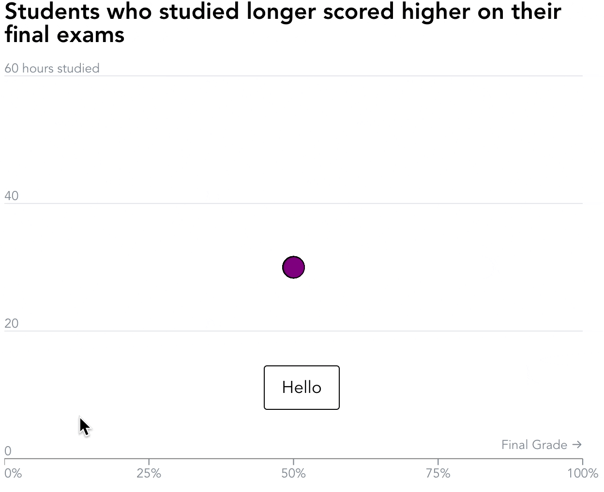

import Embed from "~/components/Embed";
import TopPageMargin from "~/components/TopPageMargin";

<TopPageMargin />

Last lesson, we left off with a set of steps, with only one appearing at a time. 

<Embed title="0yve1y" module="04" lesson="01" />

This lesson, we'll update this code to trigger new behavior when a step comes into view. In particular, we'll add a few new features.

1. Update our data on scroll
2. Transition smoothly between steps
3. Dynamically set `hoveredData` based on the current step

## 1. Update our data on scroll

We'll start by updating our data on scroll. This will allow us to update the data that we're using to create our chart.

Recall that data is currently rendered in `App.svelte`, via an `{#each}` block. Within this `{#each}` block, we are rendering each circle in our chart.

```html
{#each data.sort((a, b) => a.grade - b.grade) as d}
    <circle {...properties} />
{/each}
```

Our immediate step will be to update the data that we're using to render our chart. We'll do this by updating the `data` variable in `App.svelte`.

In Svelte, we can use a *reactive block* to run code whenever a given variable changes. In our case, any time `currentStep` changes, we want to update the data that we're using to render our chart.

```html
<script>
    // Alongside other script code...
    $: {
        if (currentStep === 0) {
            // Update data here
        } else if (currentStep === 1) {
            // Update data here
        } else if (currentStep === 2) {
            // Update data here
        }
    }
</script>
```

To verify that it's working, go ahead and `console.log` something within the steps. You should see the console log update whenever you change the step.

We don't want to `console.log` anything, though. Instead, we want to update the data that we're using to render our chart. We'll do this by updating the `data` variable.

But first, we'll create a new variable, called `initialData`, for our current data, and `renderedData`, for the data that we'll use to render our chart.

```html
<script>
    // Alongside other script code...
    let initialData = data.sort((a, b) => a.grade - b.grade);
    let renderedData = initialData;

    $: { 
        if (currentStep === 0) {
            // Set both x (grade) and y (hours) to 0
            renderedData = initialData.map(d => ({ ...d, hours: 0, grade: 0 }));
        } else if (currentStep === 1) {
            // Set y (hours) to 0
            renderedData = initialData.map(d => ({ ...d, hours: 0 }));
        } else if (currentStep === 2) {
            // Set all data to default
            renderedData = initialData;
        }
    }
</script>
```

:::note 

We're using the `map` method to create a new array, and then using the spread operator to copy the properties of each object in the array. You can read more about this in the MDN documentation for [map](https://developer.mozilla.org/en-US/docs/Web/JavaScript/Reference/Global_Objects/Array/map) and [spread](https://developer.mozilla.org/en-US/docs/Web/JavaScript/Reference/Operators/Spread_syntax).

:::

Now, let's place our `renderedData` variable in our `{#each}` block, instead of `data`.

```html
{#each renderedData as d}
    <circle {...properties} />
{/each>
```

Go ahead and scroll, and we'll see our data update!



## 2. Transition smoothly between steps

The most immediate problem with our output is that the transitions between steps are **abrupt**. We want to add a transition between steps, so that the data updates smoothly.

In order to do so, we only need to add one line of code to our CSS in `App.svelte`.

```css
circle {
    transition: cx 500ms ease, cy 500ms ease;
}
```

Yes, it is that simple! But remember that our `circle` elements already had a transition on their `r` and `opacity` attribute. So, we will chain these transitions with commas.

```css
circle {
    transition: r 300ms ease, 
        opacity 500ms ease, 
        cx 500ms ease, 
        cy 500ms ease;
}
```

### Optional: Adjust your easings

If you feel so inclined, you can adjust the easings for our `cx` and `cy` transition, making for a fully-customized ease. You can browse through different easings on [easings.net](https://easings.net/). For our circles, I really like [easeInOutQuart](https://easings.net/#easeInOutQuart), so I'll update my code to use that.

```css
circle {
    transition: r 300ms ease, 
        opacity 500ms ease, 
        cx 500ms cubic-bezier(0.76, 0, 0.24, 1), 
        cy 500ms cubic-bezier(0.76, 0, 0.24, 1);
}
```

:::note 

Read more about custom easing functions and `cubic-bezier` on [MDN](https://developer.mozilla.org/en-US/docs/Web/CSS/transition-timing-function).

:::

Now, our transitions are smooth!



### Transition from the center

Now that we know how to transition, let's adjust our initial circle positions to transition from the center of the chart. (Right now, they transition from the bottom left, which is a bit ugly.)

We'll do this in the reactive block we created earlier. Rather than returning `0` for `hours` and `grade`, we'll return the center of the chart.

But how do we calculate the center of the chart? Well, we have an `xScale` and a `yScale`, and each of them have a `domain` property. This domain returns the minimum and maximum values of that particular scale. So, by taking the average of the minimum and maximum values, we can get the center of the chart.

```html
<script>
    // Alongside other script code...
    $: X_MIDPOINT = (xScale.domain()[0] + xScale.domain()[1]) / 2;
    $: Y_MIDPOINT = (yScale.domain()[0] + yScale.domain()[1]) / 2;

    $: console.log({ X_MIDPOINT, Y_MIDPOINT });
</script>
```

In your console you should see `{X_MIDPOINT: 50, Y_MIDPOINT: 30}`. This means that our midpoint is at `50` for `x` and `30` for `y`.

:::note 

Yes, you might have been able to deduce that the midpoint is `50` and `30` by looking at our axes directly. But, this is a good example of a **robust** solution that would work if our axes were to change.

:::

Now that we have our midpoints, we can use it in our reactive block. We'll simply replace existing references of `0` with `X_MIDPOINT` and `Y_MIDPOINT` (when referring to `grade` and `hours`, respectively).

```html
<script>
    // Alongside other script code...
    $: X_MIDPOINT = (xScale.domain()[0] + xScale.domain()[1]) / 2;
    $: Y_MIDPOINT = (yScale.domain()[0] + yScale.domain()[1]) / 2;

    $: {
        if (currentStep === 0) {
            renderedData = initialData
                .map(d => 
                    ({ ...d, 
                        hours: Y_MIDPOINT, 
                        grade: X_MIDPOINT 
                    }));
        } else if (currentStep === 1) {
            renderedData = initialData
                .map(d => ({ ...d, hours: Y_MIDPOINT }));
        } else if (currentStep === 2) {
            renderedData = initialData;
        }
    }
</script>
```

Now, our circles transition from the center of the chart!



## 3. Dynamically set `hoveredData` based on the current step

Our behavior is almost complete! The only thing left is to dynamically set `hoveredData` based on the current step. This is just another example of using `currentStep` to update something in our chart.

We'll do this in the reactive block we created earlier. In the final step, we'll set `hoveredData` to a random element in `renderedData`. In any other step, it will be reset to `null`.

```html
<script>
    // Alongside other script code...
    $: {
        if (currentStep === 0) {
            renderedData = initialData
                .map(d => ({ ...d, 
                    hours: Y_MIDPOINT, 
                    grade: X_MIDPOINT }));
            hoveredData = null; // ✅
        } else if (currentStep === 1) {
            renderedData = initialData.map(d => ({ ...d, hours: Y_MIDPOINT }));
            hoveredData = null; // ✅
        } else if (currentStep === 2) {
            renderedData = initialData;
            hoveredData = renderedData[13]; // ✅
        }
    }
</script>
```

Now, as you scroll into step 3, you'll see that the first circle is highlighted!

### Final cleanup

You may notice that we can't hover over any circles in our chart. This is because our `.steps` container is on top of our chart, and its intercepting all hover events. We can apply a CSS rule to make it so that these pointer events are ignored:

```css
.steps {
    pointer-events: none;
}
```

Now, we can hover over our circles! But we probably don't want to see the tooltip when we hover over circles in steps 0 and 1 (because in those steps, the circles are not meaningfully arranged). Let's update our existing `on:mouseover` and `on:focus` events to only show the tooltip when `currentStep` is on step 2 or beyond.

```html
<!-- Alongside other attributes -->
<circle 
    on:mouseover={() => (currentStep >= 2 ? hoveredData = d : null)}
    on:focus={() => (currentStep >= 2 ? hoveredData = d : null)}
    ...
/>
```

<Embed title="5dggtr" module="04" lesson="02" />

<!-- ## Need help? Further reading -->