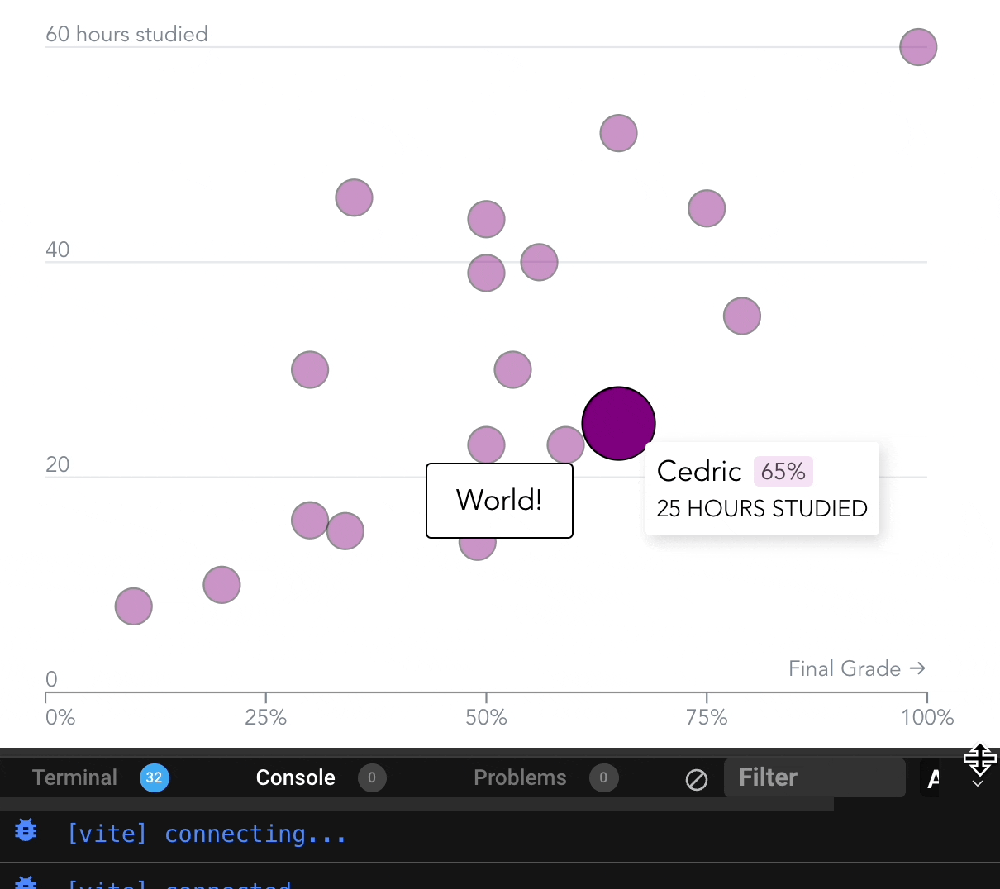

import Embed from "~/components/Embed";
import TopPageMargin from "~/components/TopPageMargin";

<TopPageMargin />

We have a mostly completed scrollytelling chart.

<Embed title="9yb0fq" module="04" lesson="03" />
  
But scrollytelling is always contained within **an article**, so it's worth taking some time to see how we can make our chart fit nicely in a larger project.

We'll do three things:

1. Add surrounding text
2. Make our chart vertically responsive
3. Style our chart so it looks visually distinct

## 1. Add surrounding text

A scrollytelling piece will place a chart within a broader article—usually, some prose will introduce the chart, and then prose will resume after the chart finishes. We'll add some text to our page to simulate this.

Let's create a new component—`SampleText.svelte`—for our text. Within `SampleText.svelte`, we'll add some text. (You can make this text whatever you'd like—the below is generated from [Dylan Ipsum](https://www.dylanlyrics.app/).)

```html
<p>Well, if you, my love, must think that-a-way. I’m sure your mind is roamin’. I’m sure your heart is not with me. But with the country to where you’re goin’.</p>
<p>Jokerman dance to the nightingale tune. Bird fly high by the light of the moon. Oh, oh, oh, Jokerman.</p>
<p>I’m walkin’ down that long, lonesome road, babe. Where I’m bound, I can’t tell. But goodbye’s too good a word, gal. So I’ll just say fare thee well. I ain’t sayin’ you treated me unkind. You could have done better but I don’t mind. You just kinda wasted my precious time. But don’t think twice, it’s all right.</p>
```

Now, let's import this component into `App.svelte`. We'll add it above our chart, and below our chart.

```html
<script>
    // Alongside existing script code...
    import SampleText from "./SampleText.svelte";
</script>

<SampleText />
<section>
    <!-- Chart and scrollytelling steps -->
</section>
<SampleText />
```


We can now see our text, but it could use some styling. In particular, there is no space between the paragraphs. The following style, added in `SampleText.svelte`, will space out our paragraphs.

```css
p:not(:last-of-type) {
    margin-bottom: 1rem;
}
```

This reads like it is written: every paragraph that is not the last paragraph should have a bottom margin of `1rem`.

Let's also move our title, which is currently within our chart itself, to the top of the article.

We'll find the `<h1 />` tag in our `.sticky` element, and move it to the top of our markup. Our markup will now look like this:

```html
<h1>Students who studied longer scored higher on their final exams</h1>
<SampleText />
<section>
<div class='sticky'>
    <!-- Chart -->
</div>
<div class='steps'>
    <!-- Scrollytelling steps -->
</div>
</section>
<SampleText />
```

Finally, let's add some vertical margin to our article title, so it sticks out.

```css
h1 {
    margin: 0.5rem 0 1rem 0;
}
```

Let's take a look at our article so far:


The most immediate issue is that our article is too wide. The best way to fix this is to wrap our article in a container (we'll use a `<main />` element), and then apply a max-width to that container.

```html
<main>
    <!-- Article -->
</main>

<style>
    main {
        max-width: 768px;
        margin: auto;
        padding: 8px;
    }
</style>
```

:::note 

In the above style, we are forcing our `main` tag (which is wrapped around the entire article) to remain under 768px. By adding [`margin: auto`](https://www.w3schools.com/css/tryit.asp?filename=trycss_align_container), we are centering the element. And applying `padding: 8px` adds a bit of space around the edges of the article.

:::

Great! Now our article is centered, and has a bit of space around it, enhancing its readability.

## 2. Make our chart vertically responsive

Our chart is currently fixed to a height of 400px. In our scrollytelling article, this looks a bit odd. We need to make our chart responsive to the height of the viewport.

We'll use the same patterns we've used for horizontal responsiveness: binding our height to a variable, and using that variable in our scales and chart dimensions.

Let's start by binding our height to a variable. In our `.chart-container` element, where we already bind our width to a variable, we'll add a `bind:clientHeight` directive.

```html
<div
  class="chart-container"
  bind:clientWidth={width}
  bind:clientHeight={height}
>
  <!-- Chart-->
</div>
```

At first, nothing will change. That's because our existing `innerHeight` variable is instantiated with `let`, and so it's not updating. We will replace our `let` instantiation with the reactive dollar label:

```js
$: innerHeight = height - margin.top - margin.bottom;
```

We'll need to do the same for `yScale`.

```js
$: yScale = scaleLinear()
    .domain([0, max(data, d => d.hours)])
    .range([innerHeight, 0]);
```

Go ahead and refresh, and then resize your screen. You'll see something worrying: an infinite resize on the vertical dimension.


There is some infinite loop happening here. The safest way to handle this is to determine the chart height with its parent container. We'll do this by applying new CSS rules to our `.sticky` element.

```css
.sticky {
  position: sticky; /* Make the element sticky */
  height: 90vh; /* 90% of the viewport height */
  top: 5vh; /* (100vh - 90vh) / 2 */
  width: 100%; /* Full width */
  margin-bottom: 1rem; /* Add some space between the chart and the text */
}
```

Here's what we're doing, step by step:

1. We're making the element sticky, so it will stick to the top of the viewport as we scroll.
2. We're setting the height to 90% of the viewport height. This will make the chart container responsive to the height of the viewport.
3. We're setting the top to 5% of the viewport height (it was previously `0`). This will center the chart container vertically. (We're taking the difference between 100% and 90%, and dividing it by 2.) This makes our chart centered on the vertical dimension.
4. We're setting the width to 100%. This will make the chart container responsive to the width of the viewport.
5. We're adding a bottom margin to the chart container. This will add some space between the chart and the text.

This alone will not handle our infinite resize loop. The reason is somewhat complicated. Although `.sticky` has an assigned `height`, it's child `.chart-container` is not constrained by that height. You can verify this by looking at each element in the inspector:


In order to make sure that `.chart-container` is constrained by `.sticky`'s height, we'll need to add a `height: 100%` rule to `.chart-container`. We'll do the same for `width`.

```css
.chart-container {
  height: 100%;
  width: 100%;
}
```

Now, go ahead and resize and watch the magic happen!



### Optional: Add a `max-width` and `max-height` to our chart

We can also add a `max-width` and `max-height` to our chart. This will ensure that our chart will not get too large, even if the viewport is very large.

```css
.chart-container {
  height: 100%;
  width: 100%;
  max-width: 700px;
  max-height: 450px;
}
```

If you decide to do this, you'll also need to update the styles of `.sticky` so that the chart is centered.

```css
.sticky {
  position: sticky;
  height: 90vh;
  top: 5vh;
  width: 100%;
  margin-bottom: 1rem;
  display: flex; /* ✅ */
  align-items: center; /* ✅ */
  justify-content: center; /* ✅ */
}
```

## 3. Style our chart so it looks visually distinct

Our chart is looking pretty good, but it's not visually distinct from the rest of the article. In particular, our chart would benefit from a background, a border, and a box shadow, so that it "pops" compared to the rest of the article.

Let's add a background, border, and box shadow to our chart container.

```css
.chart-container {
  height: 100%;
  width: 100%;
  max-width: 700px;
  max-height: 450px;
    
  background: white; /* ✅ */
  box-shadow: 1px 1px 30px rgba(252, 220, 252, 1); /* ✅ */
  border: 1px solid plum; /* ✅ */
  border-radius: 6px; /* ✅ */
}
```

This adds a white background, a light purple box shadow, and a darker purple border. We also add a border radius to soften the corners.

Nice! Now our chart sticks out, but the chart looks constrained within. We can just increase our `margin` object properties, to add some space around the chart.

```js
const margin = { top: 25, right: 25, bottom: 30, left: 10 };
```

Beautiful! Now our chart is visually distinct, and it's responsive to the viewport. It fits nicely within a broader project.

<Embed title="flu6td" module="04" lesson="04" />

<!-- ## Need help? Further reading -->