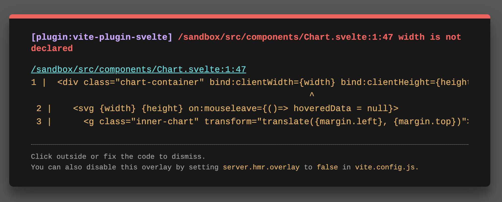
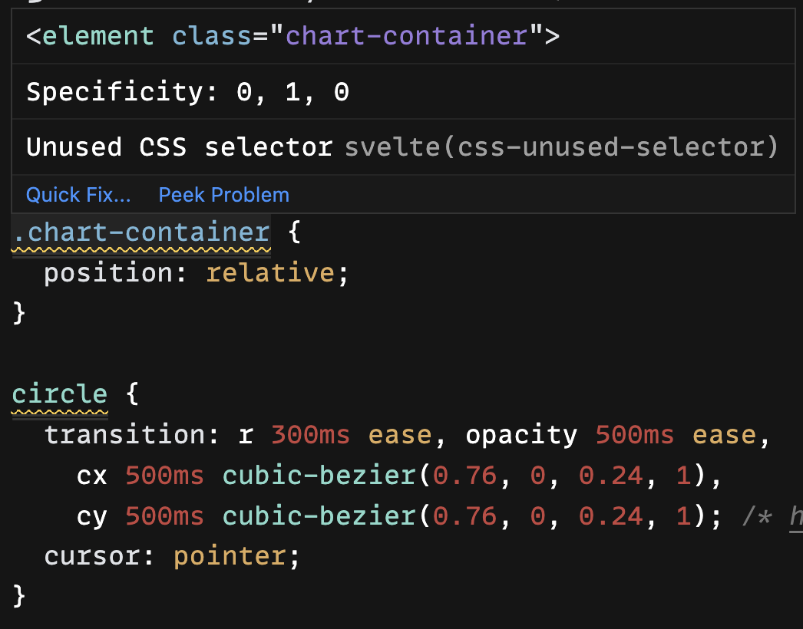

import Embed from "~/components/Embed";
import TopPageMargin from "~/components/TopPageMargin";

<TopPageMargin />

Our scrollytelling project is now complete! But we can make our codebase a bit cleaner with some componentization. Our `App.svelte` file has a lot going on, and we can make it more readable by breaking it up into smaller components. (Note that this is technically optional, as our project is *working*; but its good practice to make our code as readable as possible.)

Let's identify what's happening in `App.svelte`, so we can see what we can break out into components.

1. Initial chart logic, rendering, and style
2. Scroll handling and step rendering
3. Hover logic and rendering

Let's split up our code into these three sections. We'll start by moving the initial chart logic into a new component, `Chart.svelte`.

## 1. Initial chart logic, rendering, and style

We'll start by moving the initial chart logic into a new component, `Chart.svelte`. 

Go ahead and copy your `.sticky` div (and everything within) to this new file.

This component will need all chart-related code passed as props. The easiest way to find the needed props is to paste in our markup, and see what the compiler complains is missing.



Handle these one by one, by passing in the missing variable as a prop.

```html
<script>
  export let width;
  export let height;
  export let currentStep;
  export let hoveredData;
  export let margin;
  export let innerWidth;
  export let innerHeight;
  export let yScale;
  export let xScale;
  export let renderedData;
  export let radius;
</script>
```

The tricky part here is that some props are *read-only*, meaning they don't need to be changed by the component. But others need to pass information back up to the parent component (child-to-parent communication). These variables include anything that we "set" or otherwise modify in `Chart.svelte`: `width`, `height`, and `hoveredData`. In order to update those in `App.svelte`, we'll add the following syntax in the component markup:

```html
<Component bind:variable={variable} />
```

So in our case, our `Chart.svelte` markup will look like this:

```html
<Chart
  {margin}
  {currentStep}
  {innerWidth}
  {innerHeight}
  {yScale}
  {xScale}
  {renderedData}
  {radius}
  bind:width={width}
  bind:height={height}
  bind:hoveredData={hoveredData}
/>
```

:::note

We set `width` and `height` in the `.chart-container` element via our dimension bindings, and we set `hoveredData` to `null` in the `on:mouseleave` event handler.

:::

Once you handle those imports, you'll also notice that we're missing the components `AxisX` and `AxisY`. Let's move their imports from `App.svelte` into `Chart.svelte`.

```html
<script>
  import AxisX from "$components/AxisX.svelte";
  import AxisY from "$components/AxisY.svelte";
  import Tooltip from "$components/Tooltip.svelte";
</script>
```

Now, the issue is **styles**. Certain CSS properties need to be copied over to `Chart.svelte`. We can do this by copying the relevant CSS properties into the `<style>` tag of `Chart.svelte`. (One way to identify which ones to copy is to see which ones are highlighted in the editor as "unused".)



Let's move those styles to `Chart.svelte`

```html
<style>
  :global(.tick text, .axis-title) {
    font-weight: 400;
    font-size: 12px;
    fill: hsla(212, 10%, 53%, 1);
  }

  .sticky {
    position: sticky;

    top: 0;
    z-index: 1;

    height: 95vh;
    width: 100%;
    top: 2.5vh;
    margin-bottom: 1rem;

    /* Optional */
    display: flex;
    align-items: center;
    justify-content: center;
  }

  .chart-container {
    position: relative;
    width: 100%;
    height: 100%;

    background: white;
    box-shadow: 1px 1px 30px rgba(252, 220, 252, 1);
    border: 1px solid plum;
    border-radius: 6px;

    /* Optional */
    max-width: 700px;
    max-height: 450px;
  }

  circle {
    transition: r 300ms ease, opacity 500ms ease,
      cx 500ms cubic-bezier(0.76, 0, 0.24, 1),
      cy 500ms cubic-bezier(0.76, 0, 0.24, 1); /* https://easings.net/#easeInOutQuart */
    cursor: pointer;
  }
</style>
```

Beautiful! Our `Chart.svelte` component is now complete. Let's move on to the next section.

## 2. Scroll handling and step rendering

Next, let's mimic the process for our steps and scroll handling. We'll create a new component, `Steps.svelte`, and move all of the step-related code into it. 

Begin by moving the steps-related markup, which includes the `.steps` container and everything within it.

```html
<div class="steps">
  <Scrolly bind:value={currentStep}>
    {#each ["Hello", "Scrollytelling", "World!"] as text, i}
      <div class="step" class:active={currentStep === i}>
        <div class="step-content">
          <p>{text}</p>
        </div>
      </div>
    {/each}
  </Scrolly>
</div>
```

Then, you'll notice we need two things: 1) to bind `currentStep` upstream, and 2) to pass in the `Scrolly` component. We'll do this by adding the following to our `Steps.svelte` script tag:

```html
<script>
  import Scrolly from "../helpers/Scrolly.svelte";
  export let currentStep;
</script>
```

And back in `App.svelte` (after importing the `Steps` component), we accept the `currentStep` prop:

```html
<script>
  import Steps from "$components/Steps.svelte";
</script>

<Steps bind:currentStep={currentStep} />
```

Finally, we'll move our classes: everything related to scrollytelling will be moved to `Steps.svelte`:

```html
<style>
  .step {
    height: 90vh;
    opacity: 0.3;
    transition: opacity 300ms ease;
    display: flex;
    justify-content: center;
    place-items: center;
  }

  .step.active {
    opacity: 1;
  }

  .steps {
    z-index: 2;
    position: relative;
    pointer-events: none;
  }

  .step-content {
    padding: 0.75rem 1rem;
    border: 1px solid black;
    border-radius: 3px;
    background: white;
  }
</style>
```

Voila! We've reduced the length of `App.svelte` significantly, and it is now under 100 lines of code.

<Embed title="lsj9gh" module="04" lesson="final" />
